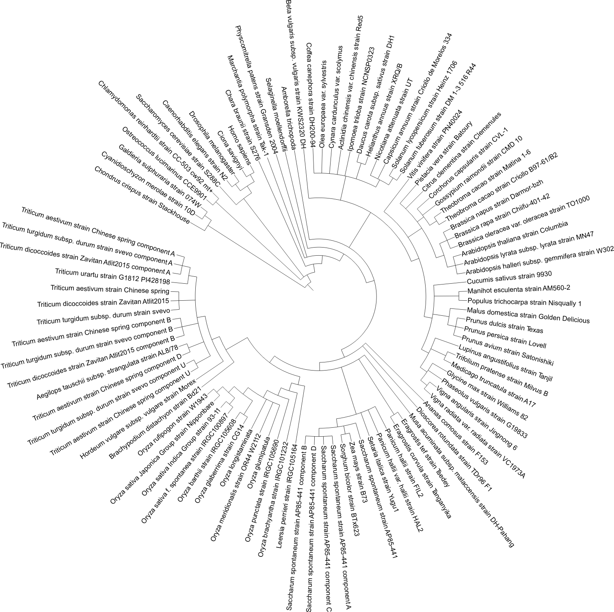

# Scripting analyses of genomes in Ensembl Plants

This repo contains code examples for interrogating Ensembl Plants from your own scripts,
and for masking & annotating [repeats](./repeats) in plant genomes.

[](https://travis-ci.com/Ensembl/plant-scripts)

- [Repeat masking and annotation](#repeat-masking-and-annotation)
- [List of recipes](#list-of-recipes)
- [Dependencies of recipes](#dependencies-of-recipes)
    - [FTP](#ftp)
    - [MySQL](#mysql)
    - [Perl](#perl)
    - [Python](#python)
	- [R](#r)
- [Phylogenomics](#phylogenomics)
- [Species tree](#species-tree)
- [Citation](#citation)

## Repeat masking and annotation

See examples and documentation in folder [repeats](./repeats/).

If you want to annotate repeats you must first run: 

    make install_repeats


## List of recipes

These are the recipes in this repository, obtained with grep -P "^## \w\d+" recipes/example*:

```
exampleAPI.pl:## A1) Load the Registry object with details of genomes available
exampleAPI.pl:## A2) Check which analyses are available for a species
exampleAPI.pl:## A3) Get soft masked sequences from Arabidopsis thaliana
exampleAPI.pl:## A4) Get BED file with repeats in chr4
exampleAPI.pl:## A5) Find the DEAR3 gene
exampleAPI.pl:## A6) Get the transcript used in Compara analyses
exampleAPI.pl:## A7) Find all orthologues of a gene
exampleAPI.pl:## A8) Get markers mapped on chr1D of bread wheat
exampleAPI.pl:## A9) Find all syntelogues among rices
exampleAPI.pl:## A10) Print all translations for otherfeatures genes

exampleBiomart.R:## B1) Check plant marts and select dataset
exampleBiomart.R:## B2) Check available filters and attributes
exampleBiomart.R:## B3) Download GO terms associated to genes
exampleBiomart.R:## B4) Get Pfam domains annotated in genes
exampleBiomart.R:## B5) Get SNP consequences from a selected variation source

exampleCRAM.pl:## C1) Find RNA-seq CRAM files for a genome assembly

exampleFTP.sh:## F1) Download peptide sequences in FASTA format
exampleFTP.sh:## F2) Download CDS nucleotide sequences in FASTA format
exampleFTP.sh:## F3) Download transcripts (cDNA) in FASTA format
exampleFTP.sh:## F4) Download soft-masked genomic sequences
exampleFTP.sh:## F5) Upstream/downstream sequences
exampleFTP.sh:## F6) Get mappings to UniProt proteins
exampleFTP.sh:## F7) Get indexed, bgzipped VCF file with variants mapped
exampleFTP.sh:## F8) Get precomputed VEP cache files
exampleFTP.sh:## F9) Download all homologies in a single TSV file, several GBs
exampleFTP.sh:## F10) Download UniProt report of Ensembl Plants, 
exampleFTP.sh:## F11) Retrieve list of new species in current release
exampleFTP.sh:## F12) Get current plant species tree (cladogram)

exampleMySQL.sh:## S1) Check currently supported Ensembl Genomes (EG) core schemas,
exampleMySQL.sh:## S2) Count protein-coding genes of a particular species
exampleMySQL.sh:## S3) Get stable_ids of transcripts used in Compara analyses 
exampleMySQL.sh:## S4) Get variants significantly associated to phenotypes
exampleMySQL.sh:## S5) Get Triticum aestivum homeologous genes across A,B & D subgenomes
exampleMySQL.sh:## S6) Count the number of whole-genome alignments of all genomes 
exampleMySQL.sh:## S7) Extract all the mutations and consequences for a selected wheat line
exampleMySQL.sh:## S8) Get annotated repeated sequences from selected species

exampleREST:## R1) Create a HTTP client and a helper functions 
exampleREST:## R2) Get metadata for all plant species 
exampleREST:## R3) Find features overlapping genomic region
exampleREST:## R4) Fetch phenotypes overlapping genomic region
exampleREST:## R5) Find homologues of selected gene
exampleREST:## R6) Get annotation of orthologous genes/proteins
exampleREST:## R7) Fetch variant consequences for multiple variant ids
exampleREST:## R8) Check consequences of SNP within CDS sequence
exampleREST:## R9) Retrieve variation sources of a species
exampleREST:## R10) Get soft-masked upstream sequence of gene in otherfeatures track
exampleREST:## R11) Get all species under a given taxonomy clade
exampleREST:## R12) transfer coordinates across genome alignments between species

exampleVEP.sh:## V1) Download, install and update VEP
exampleVEP.sh:## V2) Unpack downloaded cache file & check SIFT support 
exampleVEP.sh:## V3) Predict effect of variants 
exampleVEP.sh:## V4) Predict effect of variants for species not in Ensembl
```

A few more advanced scripts for phylogenomic studies are documented in repository [plant_tools](https://github.com/Ensembl/plant_tools/tree/master/phylogenomics)

### Dependencies of recipes

Some of the scripts depend on additional software packages, see below to learn how to install them.

#### FTP

The examples for bulk downloads from the FTP site require the software [wget](https://www.gnu.org/software/wget/), which is usually installed on most Linux distributions. For macOS it is available on [Homebrew](https://brew.sh). For Windows it ships with [MobaXterm](https://mobaxterm.mobatek.net).

#### MySQL

The examples for SQL queries to Ensembl Genomes database servers require the [MySQL](https://www.mysql.com) client. Depending on your Linux flavour this package can be named *mysql-client* or simply *mysql*.

#### Perl

As listed in [cpanfile](./files/cpanfile), several modules are required for the REST examples: [JSON](https://metacpan.org/pod/JSON), [JSON::XS](https://metacpan.org/pod/JSON::XS) and [HTTP::Tiny](https://metacpan.org/pod/HTTP::Tiny). 

Provided you have [cpanm](https://metacpan.org/pod/App::cpanminus) installed on your system, you can get this dependencies with

    make install_REST

The dependencies for the ensembl VEP ([DBI](https://metacpan.org/pod/DBI), [DBD::mysql](https://metacpan.org/pod/DBD::mysql) and [Archive::Zip](https://metacpan.org/pod/Archive::Zip), together with those used by recipes using the Ensembl Perl API, can be installed with

    make install_ensembl

Ensembl API installation instructions can be found [here](http://plants.ensembl.org/info/docs/api/api_installation.html), or if you use git [here](http://plants.ensembl.org/info/docs/api/api_git.html). There is also a debugging [guide](http://plants.ensembl.org/info/docs/api/debug_installation_guide.html), which lists some extra dependencies that might not have, such as modules [DBI](https://metacpan.org/pod/DBI) and [DBD::mysql](https://metacpan.org/pod/DBD::mysql). Note that your local Ensembl API should match the version of the current Ensembl release.

#### Python

The REST recipes written in python require library [requests](https://pypi.org/project/requests), which can be installed with:

    make install_REST

#### R

For the BioMart recipes you will need BioConductor package [biomaRt](http://www.bioconductor.org/packages/release/bioc/html/biomaRt.html) (read more [here](http://plants.ensembl.org/info/data/biomart/biomart_r_package.html)). For the REST recipes two core packages are required: [httr](https://cran.r-project.org/web/packages/httr) and [jsonlite](https://cran.r-project.org/web/packages/jsonlite). All these can be installed with:

    Rscript install_R_deps.R

## Phylogenomics

See examples and documentation in folder [phylogenomics](./phylogenomics/).

If you want to run any of those scripts you must first run:

    make install_REST

## Species tree



*Fig. 1. Species tree of Ensembl Plants release 47 obtained with recipe F12. Figure generated with [iTOL](https://itol.embl.de)*

## Citation

<!-- to be added chapter citation -->

[](https://doi.org/10.5281/zenodo.4121769)
