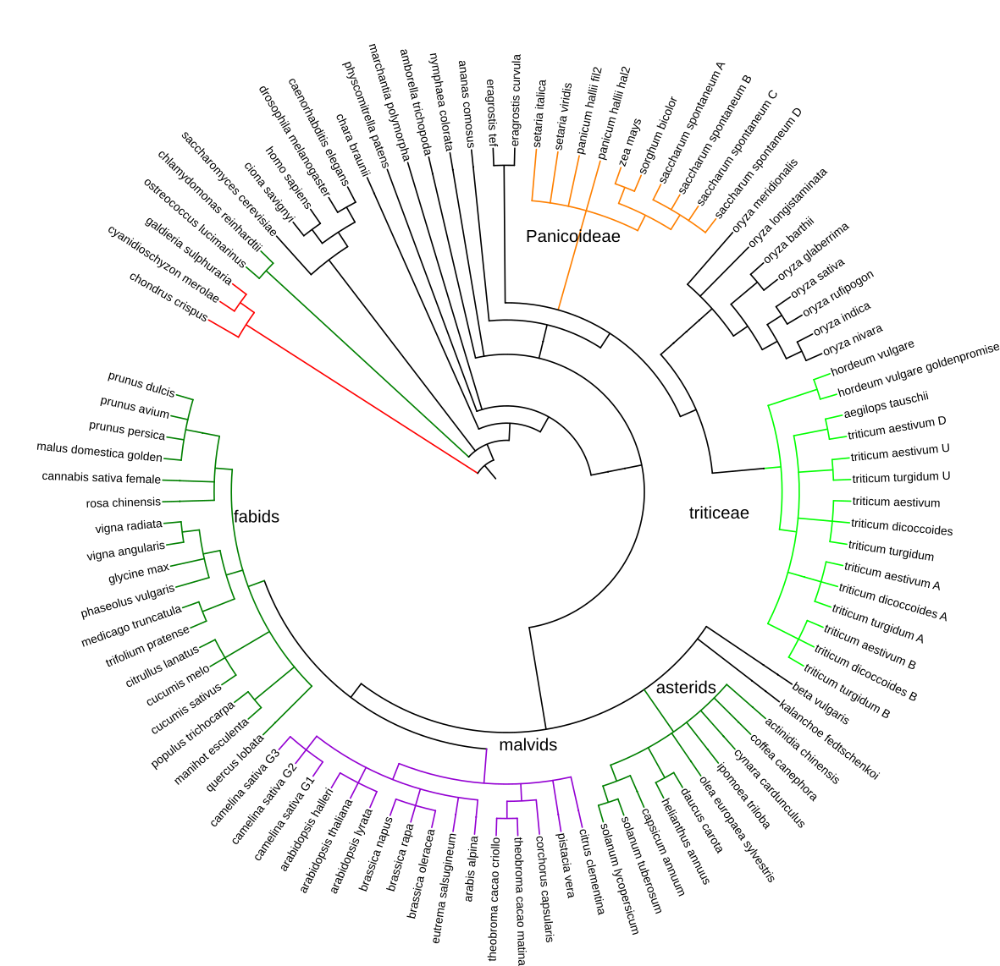

# plant_tools

This repository contains scripts and documentation written in [Ensembl Plants](http://plants.ensembl.org)

Check the source code at folder [demo_user_scripts/](./demo_user_scripts/) to learn how to carry out programmatic analyses of plant genomes with Ensembl Plants.

Scripts and protocols used during the release cycle, for internal use, are in folder [production](./production/)

*Fig. 1. Species tree of Ensembl Plants release 49, figure generated with [iTOL](https://itol.embl.de)*
