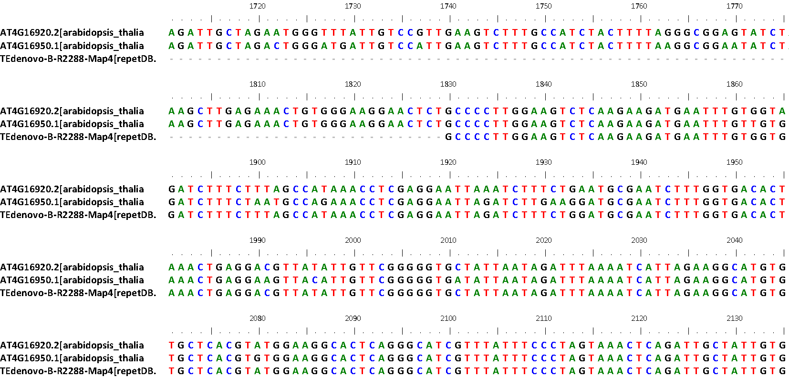

# nrTEplants

This document explains how to produce a library of non-redundant transposable elements (TE) found in plants and annotated in the following libraries, contained in FASTA format in folder [repeats/](./repeats/): 

|library|files downloaded|sequences|publication|
|-------|----------------|---------|-----------|
|[TREP](http://botserv2.uzh.ch/kelldata/trep-db)|http://botserv2.uzh.ch/kelldata/trep-db/downloads/trep-db_nr_Rel-19.fasta.gz|4162||
|[SINEbase](http://sines.eimb.ru)|http://sines.eimb.ru/banks/SINEs.bnk|60|https://www.ncbi.nlm.nih.gov/pubmed/23203982|
|[REdat](https://pgsb.helmholtz-muenchen.de/plant/recat)|ftp://ftpmips.helmholtz-muenchen.de/plants/REdat/mipsREdat_9.3p_ALL.fasta.gz|61730|https://www.ncbi.nlm.nih.gov/pubmed/23203886|
|[RepetDB](http://urgi.versailles.inra.fr/repetdb/begin.do)|Exported all Viridiplantae in i) FASTA and ii) TSV formats|33416|https://www.ncbi.nlm.nih.gov/pubmed/30719103|
|[EDTArice](https://github.com/oushujun/EDTA)|https://github.com/oushujun/EDTA/blob/master/database/rice6.9.5.liban|2431|https://europepmc.org/article/MED/31843001|
|[EDTAmaize](https://github.com/oushujun/EDTA)|https://github.com/oushujun/EDTA/blob/master/database/maizeTE11122019|1362|
|[SoyBaseTE](https://www.soybase.org/soytedb)|https://www.soybase.org/soytedb/#bulk|38664|http://www.biomedcentral.com/1471-2164/11/113|
|[TAIR10_TE](https://www.arabidopsis.org)|https://www.arabidopsis.org/download_files/Genes/TAIR10_genome_release/TAIR10_transposable_elements/TAIR10_TE.fas|31189||
|[SunflowerTE](https://www.sunflowergenome.org/annotations-data)|https://www.sunflowergenome.org/annotations-data/assets/data/annotations/transposons/Ha412v1r1_transposons_v1.0.fasta.gz|73627|https://onlinelibrary.wiley.com/doi/full/10.1111/j.1365-313X.2012.05072.x|
|[SUNREP](pgagl.agr.unipi.it/sequence-repository)|http://pgagl.agr.unipi.it/wp-content/uploads/Plantgenetgenomlab/sunrep_1_0.zip|47441|https://bmcgenomics.biomedcentral.com/articles/10.1186/1471-2164-14-686|
|MelonTE||1560|https://bmcgenomics.biomedcentral.com/articles/10.1186/1471-2164-14-686|
|[RosaTE](https://iris.angers.inra.fr/obh/downloads)|https://iris.angers.inra.fr/obh/downloads/OBDH_1.0_TE.gff3.gz|355304|


## cDNA sequences

In order to gauge the overlap between TE libraries and coding sequences, transcripts from the best annotated plant species in Ensembl Plants were also downloaded with script [ens_sequences.pl](../../compara/ens_sequences.pl). The obtained nucleotide files were also put in folder [repeats/](./repeats/). Check the [README.txt](./repeats/README.txt) file there for details.

## Clustering sequences

All TE sequences and cDNA were clustered with [GET_HOMOLOGUES-EST](https://github.com/eead-csic-compbio/get_homologues). This software runs BLASTN and the MCL algorithm, and computes coverage by combining local alignments. 

```
cd ~/soft/github

git clone https://github.com/eead-csic-compbio/get_homologues.git
```

Now, in file *get_homologues-est.pl* modify lines [L36-7](https://github.com/eead-csic-compbio/get_homologues/blob/04d3937fff2331705ef4d713f932b630a245a368/get_homologues-est.pl#L36):
```
set my $MAXSEQLENGTH = 55000;
set my $MINSEQLENGTH = 90;
```

Sequence clustering can be done with the following commands:
```
# default sequence identity = 95%
# default alignment coverage = 75% of shortest sequence in pair
# OMCL algorithm
# skip redundant sequences within TE/cDNA lib overlap>100bp with no mismatches
perl get_homologues-est.pl -d repeats -m cluster -M -t 0 -i 100 &> log.M

# produce pangenome matrix in folder all_clusters
perl compare_clusters.pl -d repeats_est_homologues/RosaTE_isoover100_0taxa_algOMCL_e0_ -o all_clusters -m -n &> log.compare

# intersection output directory: all_clusters
# intersection size = 994349 clusters

# pangenome_file = all_clusters/pangenome_matrix_t0.tab transposed = all_clusters/pangenome_matrix_t0.tr.tab
# pangenome_genes = all_clusters/pangenome_matrix_genes_t0.tab transposed = all_clusters/pangenome_matrix_genes_t0.tr.tab

# compute intersections among TE and cDNA libraries
perl parse_pangenome_matrix.pl -m all_clusters/pangenome_matrix_t0.tab -s -x

# intersection pangenome matrix: all_clusters/pangenome_matrix_t0__intersection.tab
# mean %cluster intersection: 4.00

# heatmap of cluster intersection
./plot_matrix_heatmap.sh -i pangenome_matrix_t0__intersection.tab -t "cDNAs from EG46 plants vs TE libraries" -o pdf -H 20 -W 31

# count how many clusters do not contain TEs
perl parse_pangenome_matrix.pl -m all_clusters/pangenome_matrix_t0.tab -A repeats/cdna.list -B repeats/TE.list -a

# finding genes which are absent in B ...
# file with genes absent in B (527506): all_clusters/pangenome_matrix_t0__pangenes_list.txt
```
The produced output includes files [log.M](./log.M), pangenomes matrices in folder [all_clusters/](./all_clusters/) and [pangenome_matrix_t0__intersection_heatmap.png](./pics/pangenome_matrix_t0__intersection_heatmap.png). 

## Align TE clusters and annotate Pfam domains

We now concentrate on the subset of 174426 clusters containing TE sequences. Note that 8910 clusters contain TE and cDNA sequences, and are thus called *mixed clusters*:



*Fig. 1. Cluster with two Arabidopsis thaliana cDNA sequences (AT4G16920.2 and AT4G16950.1) and transposable element TEdenovo-B-R2288-Map4 from library repetDB.Mar2020. These sequences contain Pfam domain [PF00931](https://pfam.xfam.org/family/PF00931), NB-ARC, which is part of NLR defense proteins.  Figure generated with [Bioedit](https://www.researchgate.net/publication/258565830_BioEdit_An_important_software_for_molecular_biology) from cluster [269_AT4G16920.2.fna](./TE_alignments/269_AT4G16920.2.fna)*

The next scripts were used to annotate Pfam domains encoded in sequences within these clusters:

```
perl annot_TEs.pl all_clusters/pangenome_matrix_genes_t0.tr.tab &>log.annot

perl get_ambiguous_Pfam_domains.pl log.annot control_pos.list control_neg_NLR.list > Pfam.tsv

# positive Pfam domains = 22
# negative Pfam domains = 43
# TEclusters=174426
# mixedclusters=8910

```
 
The resulting TSV file [Pfam.tsv](./Pfam.tsv) summarizes mixed clusters in terms of Pfam domains called after translating sequences in 6 frames. This TSV file contains 10 columns: *domain, totclusters, occurrences, totseqs, TElibs, cDNAlibs, potgenes, frac_potgenes, notes, clusters*. We'll test *TElibs* > 6 && *frac_potgenes* <= 0.00 as predictors of Pfam domains truly related to TEs, which are domains:

* identified in at least 6 different clusters from different TE libraries (6 replicates)
* with fraction of sequences marked as Potential Host Gene in [RepetDB](http://urgi.versailles.inra.fr/repetdb/begin.do) <= 0.00

## Removing ambiguous TE sequences

Two lists of Pfam domains were curated as controls. 
File [control_pos.list](./control_pos.list) contains a set of Pfam domains contained in coding sequences of bona fide TEs. 
Instead, file [control_neg_NLR.list](./control_neg_NLR.list) contains Pfam domains of NLR genes, curated by Carla Filippi. NLR genes are known to be often masked when masking repeated sequences in genomes (see https://www.nature.com/articles/s41477-018-0264-0) and are common accessory genes in plant pangenomes (https://doi.org/10.3389/fpls.2017.00184 , https://www.nature.com/articles/s41467-017-02292-8).

Both files were used to compute the performance of removing TE sequences clustered with PHGs:

```
#TP = True positive = correctly identified
#FP = False positive = incorrectly identified
#TN = True negative = correctly rejected
#FN = False negative = incorrectly rejected

# check positive control, these are
grep positive_control Pfam.tsv | wc
22
perl -F"\t" -lane 'print if($F[4]>=6 && $F[7]==0 && $F[8] eq 'positive_control')' Pfam.tsv | wc
20

TP = 20
FN =  2

# check negative control
grep negative_control Pfam.tsv | wc
38
perl -F"\t" -lane 'print if($F[4]>=6 && $F[7]==0 && $F[8] eq 'negative_control')' Pfam.tsv | wc
2

TN = 36
FP =  2

sensitivity = TP / (TP + FN) = 20 / (20 + 2) = 0.909
specificity = TN / (TN + FP) = 36 / 36 + 2) = 0.947
```

Based on this benchmark, a list of TE sequences (clusters) to be removed was compiled:
```
# clusters to remove from TE bona finde list
perl -F"\t" -lane 'if($F[4]<6 ||$F[7]>0){ foreach $cl (split(/,/,$F[9])){print $cl}}' Pfam.tsv | sort -u > clusters2remove.list

wc clusters2remove.list
3189

# and the equivalent list of Pfam domains
perl -F"\t" -lane 'if($F[4]<6 ||$F[7]>0){ print "$F[0]"}' Pfam.tsv > Pfam2remove.list
wc Pfam2remove.list
1632
```

## Producing a nonredundant TE library

Finally, a non-redundant library of plant TEs was produced as follows:

```
./select_TE_clusters.pl log.annot clusters2remove.list nrTEplantsApril2020.fna > log.select

...
# clusters=171104 sequences=171104
sunflowerTE     58071
mipsREdat_9.3p_ALL      39509
repetDB.Mar2020 26006
SoyBaseTE       21766
TAIR10_TE       21056
rice6.9.5.liban 1844
melonV4_teannot_refTEs  1171
maizeTE11122019 805
trep-db_nr_Rel-19       789
SINEs.plants    44
sunrep1.0       43
```

Check log.select for the complete report of the resulting nr library.

## Clustering sequences from TE libraries with CD-HIT

In order to put the previous results in context, a similar clustering experiment, including only TEs and no cDNAs, was carried out with [CD-HIT](http://weizhongli-lab.org/cd-hit):

```
zcat ../repeats/repetDB.Mar2020.fna.gz ../repeats/trep-db_nr_Rel-19.fasta.gz \
	../repeats/SINEs.plants.fna.gz ../repeats/mipsREdat_9.3p_ALL.fasta.gz \
	../repeats/maizeTE11122019.fna.gz ../repeats/rice6.9.5.liban.fna.gz \
	../repeats/TAIR10_TE.fna.gz ../repeats/SoyBaseTE.fna.gz ../repeats/sun* \
	../repeats/melonV4_teannot_refTEs.fa.gz ../repeats/RosaTE.fna.gz > all.fna

~/soft/cd-hit-v4.8.1-2019-0228/cd-hit-est -i all.fna -c 0.95 -T 8 -o TE.nr.fna

...
total seq: 648648
longest and shortest : 60212 and 11
Total letters: 1575037386
Sequences have been sorted
...

   648648  finished     561996  clusters
```
