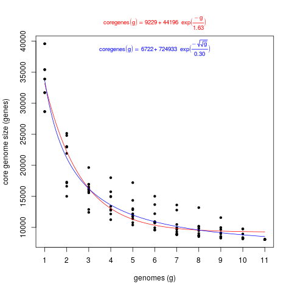
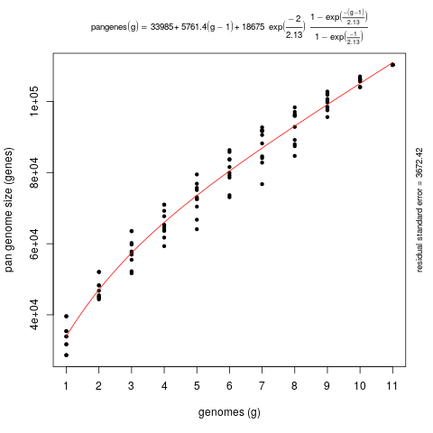
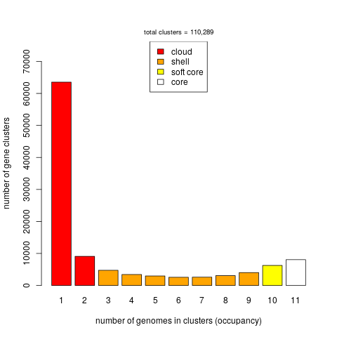

# Compara

These scripts interrogate Ensembl Genomes Compara through [REST endpoints](https://rest.ensembl.org) and 
the FTP site.

The scripts in folder API/ use directly the [Perl API](https://www.ensembl.org/info/docs/api/index.html).

## Documentation and examples

Run any of the scripts with argument -h to get instructions and examples.

### pangene_analysis.pl

Script pangene_analysis.pl can be used to analyse a clade-specific pan-gene set, with several options:

```
usage: pangene_analysis.pl [options]

-c NCBI Taxonomy clade of interest         (required, example: -c Brassicaceae or -c 3700)
-f output folder                           (required, example: -f myfolder)
-r reference species_name to name clusters (required, example: -r arabidopsis_thaliana)
-l list supported species_names            (optional, example: -l)
-d Ensembl division                        (optional, default: -d Plants)
-o outgroup species_name                   (optional, example: -o brachypodium_distachyon)
-i ignore species_name(s)                  (optional, example: -i selaginella_moellendorffii -i ...)
-L allow low-confidence orthologues        (optional, by default these are skipped)
-v verbose                                 (optional, example: -v

The following options are only available for some clades:

-G min Gene Order Conservation [0:100]  (optional, example: -G 75)
   see modules/Bio/EnsEMBL/Compara/PipeConfig/EBI/Plants/ProteinTrees_conf.pm
   at https://github.com/Ensembl/ensembl-compara

-W min Whole Genome Align score [0:100] (optional, example: -W 75)
   see ensembl-compara/scripts/pipeline/compara_plants.xml
   at https://github.com/Ensembl/ensembl-compara

Read about GOC and WGA at:
https://www.ensembl.org/info/genome/compara/Ortholog_qc_manual.html
```

These examples generate results in folders [Brassicaceae](./Brassicaceae) and [Oryza](./Oryza) and 
produce the following log files: [Brassicaceae.log](./Brassicaceae.log) and [Oryza.log](./Oryza.log).
The output folders contain pan-gene clusters, pangenome matrices in several formats and also a matrix of
Percent Conserved Sequences (POCP), computed for the fraction of clusters shared by pairs of taxa being compared:
```
perl pangene_analysis.pl -c Oryza -f Oryza -r oryza_sativa > Oryza.log
perl pangene_analysis.pl -r arabidopsis_thaliana -c Brassicaceae -f Brassicaceae > Brassicaceae.log
```

Those files can be used to produce pan-gene plots for instance with scripts from 
[GET-HOMOLOGUES](https://github.com/eead-csic-compbio/get_homologues).

```
get_homologues-est/plot_pancore_matrix.pl -f core_both -i core_gene.tab

get_homologues-est/plot_pancore_matrix.pl -f pan -i pan_gene.tab

get_homologues-est/parse_pangenome_matrix.pl -m pangenome_matrix.tab -s 

get_homologues-est/plot_matrix_heatmap.sh -i POCP.matrix.tab

```

\\
*Fig. 1. Core-gene plot of 11 Oryza species, generated with get_homologues-est/plot_pancore_matrix.pl*

\\
*Fig. 2. Pan-gene plot of 11 Oryza species, generated with get_homologues-est/plot_pancore_matrix.pl*

\\
*Fig. 3. Occupancy of pan-gene clusters of 11 Oryza species, generated with get_homologues-est/parse_pangenome_matrix.pl*


### single-copy_core_genes.pl

Instead, single-copy_core_genes.pl can be used to obtain single-copy core genes present within a clade. 
Example calls include:

```
 perl ./single-copy_core_genes.pl -c Brassicaceae -f Brassicaceae
 perl ./single-copy_core_genes.pl -c Brassicaceae -f Brassicaceae -t cdna -o theobroma_cacao
 perl ./single-copy_core_genes.pl -f poaceae -c 4479 -r oryza_sativa -WGA 75
 perl ./single-copy_core_genes.pl -f all -c 33090 -m all -r physcomitrella_patens

```

