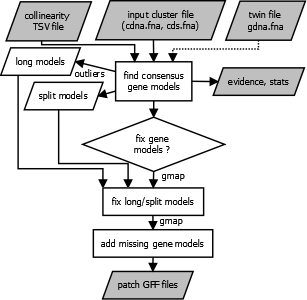
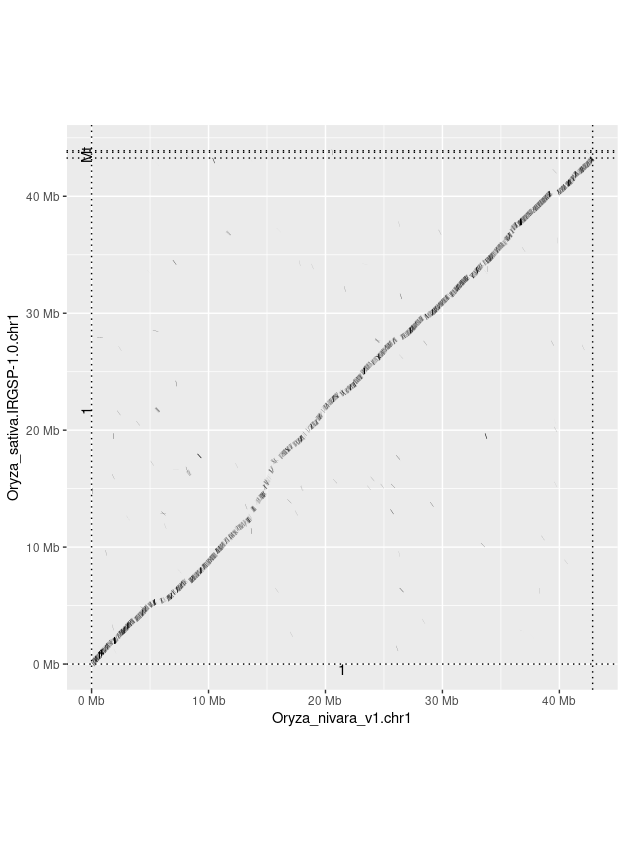

# Pan-gene analysis

The script *get_pangenes.pl* computes whole genome alignments (WGA) to define 
clusters of collinear, orthologous genes/features annotated in GFF files. Such
clusters define pangenes across a pangenome.
Several WGA algorithms are available and some parameters are customizable.
It is designed to process (in a multicore computer or HPC cluster) files
contained in a directory (-d), so that new .fna & .gff files can be added
while conserving previous results.

This script calls [_cut_sequences.pl](./_cut_sequences.pl), 
[_collinear_genes.pl](./_collinear_genes.pl) and 
[_cluster_analysis.pl](./_cluster_analysis.pl)
and produces different types of output:

 1) clusters of CDS (nucl & pep) and cDNA sequences of collinear genes (FASTA)
 2) pangenome matrices that summarize the genome occupancy of clusters
 3) matrix of % conserved sequences that summarize shared clusters across genomes
 4) optionally (-c) matrices with core- and pangene set growth simulations

## Table of contents

- [Objective](#objective)
- [How it works](#how-it-works)
	- [Transformation of gene coordinates](#transformation-of-gene-coordinates)
	- [Overlap calculation](#overlap-calculation)
	- [Pairwise genome comparisons](#pairwise-genome-comparisons)
	- [From pairs of genes to clusters](#from-pairs-of-genes-to-clusters)
	- [Parameters](#parameters)
	- [Dependencies](#dependencies)
	- [Command-line options](#command-line-options)
- [Example 1: default core pangene set analysis](#example-1-default-core-pangene-analysis)
- [Example 2: pangene and Presence-Absence Variation (PAV) analysis](#example-2-pangene-and-Presence-Absence-Variation-PAV-analysis)
- [Example 3: splitting genome in chromosomes](#example-3-splitting-genome-in-chromosomes)
- [Example 4: using GSAlign instead of minimap2](#example-4-using-GSAlign-instead-of-minimap2)
- [Example 5: simulation of pangene set growth](#example-5-simulation-of-pangene-set-growth)
- [Inspection of result files](#inspection-of-result-files)
- [Plotting the results](#plotting-the-results)
- [Sequence alignments of clusters](#sequence-alignments-of-clusters)
- [Quality metrics of clusters](#quality-metrics-of-clusters)
- [Evidence supporting clusters](#evidence-supporting-clusters)
- [Whole genome alignment evidence](#whole-genome-alignment-evidence)
- [Plotting the genome context of a pangene cluster](#plotting-the-genome-context-of-a-pangene-cluster)
- [Remediating pangene models with check_evidence-pl](#remediating-pangene-models-with-check_evidencepl)
- [Pangene analysis with GFF patches](#pangene-analysis-with-GFF-patches)
- [Dotplots of gene-based whole-genome alignments](#dotplots)
- [Troubleshooting](#troubleshooting)
- [Funding](#funding)
- [Citation](#citation)


## Objective

The main task of these scripts is to cluster collinear/orthologous genes 
across a set of genomes (or pangenome) so that pangenes can be defined:


*Figure 1. Graphical summary of pangene set analysis.*

|occupancy class|definition|
|:--------------|:---------|
|core|Genes contained in all considered genomes/taxa.|
|soft-core|Genes contained in 95% of the considered genomes/taxa.|
|cloud|Genes present only in a few genomes/taxa, generally 1 or 2. The cutoff is defined as the class next to the most populated non-core class.|
|shell|Remaining genes, present in several genomes/taxa.|

*Table 1. Definitions of occupancy classes for pangenes, 
taken from [GET_HOMOLOGUES](http://eead-csic-compbio.github.io/get_homologues/manual). 
Accessory genes include both shell and cloud genes.*


## How it works

The next flowchart shows the three main tasks of the pipeline:


*Figure 2. Pipeline flowchart.*

By default it performs the required tasks serially, but it 
can also run in parallel on a cluster both with options -m cluster (see more about this below)
and -m dryrun, if you prefer to paste your commands in batches directly.

Note that each of the three scripts called by get_pangenes.pl 
(cut_sequences.pl, _collinear_genes.pl & _cluster_analysis.pl) create their own logfiles.

### Transformation of gene coordinates 
The second block of the flow aligns genome sequences (in pairs A & B) and uses 
the resulting alignments to transform gene coordinates:
 


*Figure 3. Whole Genome Alignment (WGA) and gene mapping.*

### Overlap calculation

This is how the overlap of genes is computed (with bedtools intersect) to call collinear pairs:


*Figure 4. How gene overlap is computed.*

The overlap value is computed from WGA coordinates (subject) and gene coordinates from 
the source GFF file (query). Note that the WGA alignment might be partial, thus the estimated
overlap ratio could be actually smaller if the subject GFF coordinates were used.
Note that overlaps can be also computed among gene models annotated in one assembly and 
matching genomic segments from others.

### Pairwise genome comparisons

Collinear pairs are internally stored in Compara-like TSV files, with 1-based coordinates, that look like this:

    gene_stable_id	protein_stable_id	species	overlap	homology_type	homology_gene_stable_id	homology_protein_stable_id	homology_species	overlap	dn	ds	goc_score	wga_coverage	is_high_confidence	coordinates
    gene:BGIOSGA002569      gene:BGIOSGA002569      Oryza_indica.ASM465v1.chr1      6223    ortholog_collinear      gene:ONIVA01G00100      gene:ONIVA01G00100	Oryza_nivara_v1.chr1    6223    NULL    NULL    NULL    100.00  1       1:30219-36442(+);1:104920-116326(+)
    Oryza_indica.ASM465v1.chr1:1:217360-222398:+    segment Oryza_indica.ASM465v1.chr1      5038    segment_collinear       gene:ONIVA01G00180      gene:ONIVA01G00180      Oryza_nivara_v1.chr1    5038    NULL    NULL    NULL    100.00  1       1:217360-222398(+);1:155040-165322(+)
    gene:BGIOSGA002594      gene:BGIOSGA002594      Oryza_indica.ASM465v1.chr1      3838    segment_collinear       Oryza_nivara_v1.chr1:1:178848-182686:+  segment Oryza_nivara_v1.chr1    3838    NULL    NULL    NULL    100.00  1       1:246911-252389(+);1:178848-182686(+)

### From pairs of genes to clusters 

TSV files are merged and sorted by gene and overlap. The resulting file is used to drive the construction 
of clusters from pairs of collinear genes as follows:


*Figure 5. Clustering sequences from pairs of collinear genes. 
Option -N controls the max distance (in genes) among sequences of same species in a cluster.*


### Parameters

A few parameters are encoded as variables in the scripts and their values printed to log files.
Here I list the most important ones, they can be changed by editing the script source if needed:

|script|variable|value|meaning|
|:-----|:-------|:----|:------|
|get_pangenes.pl|$MINGFFLEN|100|min length of sequences of features (cdna, cds) extracted from input GFF files|
|get_pangenes.pl|$NOFSAMPLESREPORT|20|number of samples while simulating pangene growth with -c|
|_collinear_genes.pl|MINIMAPPARS|--secondary=no --cs -x asm20 -r1k,5k|minimap2 settings|
|_collinear_genes.pl|$GSALIGNPARS|-sen -no_vcf -fmt 1|GSAlign settings|
|_collinear_genes.pl|$BEDINTSCPAR|-wo -f XXX -F XXX -e|bedtools intersect parameters, XXX replaced with user selected overlap [0-1]|
|_collinear_genes.pl|$MINMASKLEN|1000000|mask longer (intergenic, repetitive) fragments with -H|
|_collinear_genes.pl|$GENEMARGIN|5000|do not mask gene margins|
|_collinear_genes.pl|$MINALNLEN|100|min alignment length when mapping & transforming gene coords on WGA|
|_cluster_analysis.pl|$MINEDGESTOMERGE|0.75|ratio of edges connecting two clusters so they can be merged|
|check_evidence.pl|$GMAPARAMS|-t 1 -2 -z sense_force -n 1 -F|gmap settings|
|check_evidence.pl|$MAXSEGMENTSIZE|100000|max length of genomic segment containing candidate split genes|
|check_evidence.pl|$MINPAIRPECNONOUTLIERS|0.25|min %pairs of genes from same species among non-outliers, used to correct long gene models|
|check_evidence.pl|$MINLIFTIDENTITY|90.0|min % of identity of gmap CDS/cDNA to genome alignments to be considered|
|check_evidence.pl|$MINFIXOVERLAP|0.75|min overlap [0-1] of mapped genes to fix long/split gene models|
|_dotplot.pl|$MINCONTIGSIZE|100000|min length of chrs/contigs to be considered for dotplot|

### Dependencies

In addition to Perl, these scripts require:

* https://github.com/lh3/minimap2 
* https://github.com/gpertea/gffread
* https://bedtools.readthedocs.io/en/latest/

Assuming *bedtools* are installed in most settings,
and that gcc & g++ compilers are available,
the remaining dependencies can be installed on Ubuntu/Debian in folder bin/ with:

    # does not require root privileges
    cd ../..
    make install_pangenes

Note this will also download a test rice dataset. You can test everything is in place with:

    perl pangenes/get_pangenes.pl -v
    make test_pangenes

This should print something like this:

    Checking required binaries and data sources, set in pangeneTools.pm or in command line:
      EXE_MINIMAP : OK (path:/home/contrera/plant-scripts/pangenes/../lib/minimap2/minimap2)
      EXE_BEDTOOLS : OK (path:bedtools)
      EXE_GFFREAD : OK (path:/home/contrera/plant-scripts/pangenes/bin/gffread/gffread)
      EXE_COLLINEAR : OK (path:/home/contrera/plant-scripts/pangenes/_collinear_genes.pl)
      EXE_CUTSEQUENCES : OK (path:/home/contrera/plant-scripts/pangenes/_cut_sequences.pl)
      EXE_CLUSTANALYSIS : OK (path:/home/contrera/plant-scripts/pangenes/_cluster_analysis.pl)
      EXE_GZIP : OK (path:gzip)
      EXE_BZIP2 : OK (path:bzip2)
      EXE_SORT : OK (path:sort)


In addition to minimap2, two other genome aligners have been integrated:

|software|flag|source|installation instructions|notes|
|:-------|:---|:-----|:------------------------|-----|
|GSAlign (benchmarked) | -g | https://doi.org/10.1186/s12864-020-6569-1 | cd ../.. && make [install_gsalign](https://github.com/Ensembl/plant-scripts/blob/a39066be76b687f46229264e8e8b995f1a857af9/Makefile#L75) | requires gcc compiler |
|Wfmash (experimental) | -w | https://github.com/ekg/wfmash | cd ../.. && make [install_wfmash](https://github.com/Ensembl/plant-scripts/blob/a39066be76b687f46229264e8e8b995f1a857af9/Makefile#L71) | requires sudo & g++ compiler |

### Command-line options

See all options with:

    perl get_pangenes.pl -h


## Example 1: default core pangene analysis

If the installation was succesfull you should have a copy of a test dataset.
You can browse it with:

    ls ../files/test_rice/

You should see a FASTA file and a matching GFF file for each genome. 
Note that each pair of files has a common prefix, which is the name of each genome. 
See for example:

    Oryza_sativa.IRGSP-1.0.chr1.fa.gz
    Oryza_sativa.IRGSP-1.0.chr1.gff.gz

In order to analyze these files and define a **core** pangene set you can start with:

    perl get_pangenes.pl -d ../files/test_rice

Note that you can use *-m cluster* or *-m dryrun* to run tasks in parallel,
this is recommended for large or multiple genomes. 
Please read how to set up your HPC environment 
[here](http://eead-csic-compbio.github.io/get_homologues/manual-est/manual-est.html#SECTION00033000000000000000). 
A sample configuration file for a LSF cluster can be found is provided ([HPC.conf.sample](./HPC.conf.sample)), 
it should be renamed as +HPC.conf+ for it to work.

While computing WGA alignments you can tell the script to split each genome 
in chromosomes and align only homologous chromosomes. Please use option *-s*
for this, which requires a [regular expression](https://perlmaven.com/regex-cheat-sheet). 
For instance, use *-s '\d+'* to split in chromosomes named with natural numbers. 

The output of the test looks like this:

```
$ perl get_pangenes.pl -d ../files/test_rice

# get_pangenes.pl -d ../files/test_rice -o 0 -r 0 -t all -c 0 -z 0 -I 0 -m local -w 0 -g 0 -O 0.5 -Q 50 -N 5 -s '' -H 0 -W '' -G '' -B '' -S '' -n 4 -R 0

# version 09032023
# results_directory=pangenes/test_rice_pangenes
# parameters: MINGFFLEN=100

# checking input files...
# uncompressing ../files/test_rice/Oryza_indica.ASM465v1.chr1.fa.gz
# uncompressing ../files/test_rice/Oryza_indica.ASM465v1.chr1.gff3.gz
# ../files/test_rice/Oryza_indica.ASM465v1.chr1.fa.gz 45.84MB genes=5292
# uncompressing ../files/test_rice/Oryza_nivara_v1.chr1.fa.gz
# uncompressing ../files/test_rice/Oryza_nivara_v1.chr1.gff3.gz
# ../files/test_rice/Oryza_nivara_v1.chr1.fa.gz 41.54MB genes=5143
# uncompressing ../files/test_rice/Oryza_sativa.IRGSP-1.0.chr1.fa.gz
# uncompressing ../files/test_rice/Oryza_sativa.IRGSP-1.0.chr1.gff.gz
# ../files/test_rice/Oryza_sativa.IRGSP-1.0.chr1.fa.gz 42.56MB genes=5271

# 3 genomes, 15706 genes

# done

# taxa considered = 3 genes = 15706

# mask=Oryza_nivara_v1chr1_alltaxa_5neigh_algMmap_split_ (_5neigh_algMmap_split)


# indexing genomes ...
...
# done


# running pairwise genome alignments ...
...
# done

# sorting collinearity results...

# WGA summary (N50, %mapped genes in blocks of 3+)
31792.0 79.7 Oryza_indica.ASM465v1.chr1
33230.0 80.3 Oryza_nivara_v1.chr1
34983.0 83.2 Oryza_sativa.IRGSP-1.0.chr1

# clustering sequences ...
# done

# number of clusters = 7804 (core = 3008)

# cluster_list = test_rice_pangenes/Oryza_nivara_v1chr1_alltaxa_5neigh_algMmap_/Oryzanivarav1.chr1.cluster_list
# cluster_directory = test_rice_pangenes/Oryza_nivara_v1chr1_alltaxa_5neigh_algMmap_/Oryzanivarav1.chr1

# percent_conserved_sequences_file = test_rice_pangenes/Oryza_nivara_v1chr1_alltaxa_5neigh_algMmap_/POCS.matrix.tab

# pangene_file (occup) = test_rice_pangenes/Oryza_nivara_v1chr1_alltaxa_5neigh_algMmap_/pangene_matrix.tab
# pangene_file (occup, transposed) = test_rice_pangenes/Oryza_nivara_v1chr1_alltaxa_5neigh_algMmap_/pangene_matrix.tr.tab
# pangene_file (names) = test_rice_pangenes/Oryza_nivara_v1chr1_alltaxa_5neigh_algMmap_/pangene_matrix_genes.tab
# pangene_file (names, transposed) = test_rice_pangenes/Oryza_nivara_v1chr1_alltaxa_5neigh_algMmap_/pangene_matrix_genes.tr.tab


```
In this example, the clusters are stored in folder 

    test_rice_pangenes/Oryza_nivara_v1chr1_alltaxa_5neigh_algMmap_/Oryzanivarav1.chr1

and a text file describing the clusters is also produced

    test_rice_pangenes/Oryza_nivara_v1chr1_alltaxa_5neigh_algMmap_/Oryzanivarav1.chr1.cluster_list

which looks like this:

    cluster gene:ONIVA01G52180 size=3 taxa=3 taxa(gdna)=NA cdnafile: gene:ONIVA01G52180.cdna.fna cdsfile: gene:ONIVA01G52180.cds.fna pepfile: gene:ONIVA01G52180.cds.faa gdnafile: void
    : Oryza_indica.ASM465v1.chr1
    : Oryza_sativa.IRGSP-1.0.chr1
    : Oryza_nivara_v1.chr1
    ... 

Note that up to four types of clusters are generated (cdna, cds, pep & gdna), 
depending on the nature of the gene and also on the existence of WGA alignments 
supporting the alignment of annotated genes from one assembly to genomic segments on another. 

|cluster type|sequence type|definition|notes|
|:-----------|:------------|:---------|:----|
|cdna|nucleotides|transcript/mRNA features in GFF file|Often several for the same gene.|
|cds|nucleotides|CDS features in GFF file|Often several for the same gene. Might be empty on non-coding genes.|
|pep|amino acids|CDS features in GFF file|Often several for the same gene. Might be empty on non-coding genes.|
|gdna|nucleotides|genomic segment in one genome matching a gene model in another|Provided as obvious candidate regions for lifting over genes.|

Clusters are FASTA files like this, and might include **several sequences for the same gene**:

```
$ grep ">" test_rice_pangenes/Oryza_nivara_v1chr1_alltaxa_5neigh_algMmap_/Oryzanivarav1.chr1/gene:ONIVA01G52180.cdna.fna

>transcript:ONIVA01G52180.1 gene:ONIVA01G52180 1:42818942-42824598(-) [Oryza_nivara_v1.chr1]
>transcript:ONIVA01G52180.2 gene:ONIVA01G52180 1:42818942-42824598(-) [Oryza_nivara_v1.chr1]
>transcript:ONIVA01G52180.3 gene:ONIVA01G52180 1:42818944-42824598(-) [Oryza_nivara_v1.chr1]
>transcript:BGIOSGA000001-TA gene:BGIOSGA000001 1:47275570-47278635(-) [Oryza_indica.ASM465v1.chr1]
>transcript:Os01t0978100-01 gene:Os01g0978100 1:43232027-43238506(-) [Oryza_sativa.IRGSP-1.0.chr1]
>transcript:Os01t0978100-02 gene:Os01g0978100 1:43232034-43238012(-) [Oryza_sativa.IRGSP-1.0.chr1]
>transcript:Os01t0978100-03 gene:Os01g0978100 1:43232036-43237974(-) [Oryza_sativa.IRGSP-1.0.chr1]
```

While cdna, cds and pep cluster files contain sequences annotated in the input GFF files,
the gdna FASTA files contain genomic segments from assemblies matching gene models annotated in other
genomes. The latter files are good starting points for lifting over genes, as explained in section
[Lifting over gene models in genomic segment clusters](#lifting-over-gene-models-in-genomic-segment-clusters).

The **gene collinearity evidence** supporting the clusters is summarized in a compressed file
which is added to the output folder of each run of the script. In this example this is:

    test_rice_pangenes/Oryza_nivara_v1chr1_alltaxa_5neigh_algMmap_/mergedpairs.tsv.gz

See section [Evidence supporting clusters](#evidence-supporting-clusters) to learn how to 
extract the evidence for a selected cluster.

The script also produces % of Conserved Sequence (POCS) and pangene matrices,
which look like this:
 
    $ cat test_rice_pangenes/Oryza_nivara_v1chr1_alltaxa_5neigh_algMmap_/POCS.matrix.tab
    genomes	Oryza_nivara_v1.chr1	Oryza_sativa.IRGSP-1.0.chr1	Oryza_indica.ASM465v1.chr1
    Oryza_nivara_v1.chr1	100.00	61.79	60.59
    Oryza_sativa.IRGSP-1.0.chr1	61.79	100.00	62.62
    Oryza_indica.ASM465v1.chr1	60.59	62.62	100.00

And 

    $ head test_rice_pangenes/Oryza_nivara_v1chr1_alltaxa_5neigh_algMmap_/pangene_matrix.tr.tab
    source:test_rice_pangenes/Oryza_nivara_v1chr1_alltaxa_5niegh_algMmap_/Oryzanivarav1.chr1	Oryza_nivara_v1.chr1	Oryza_sativa.IRGSP-1.0.chr1	Oryza_indica.ASM465v1.chr1	
    chrunsorted	NA	NA	NA	
    gene:ONIVA01G52180	1	1	1	
    gene:ONIVA01G52140	1	1	1	
    gene:ONIVA01G52120	1	1	1	
    gene:ONIVA01G52090	1	1	1	
    gene:ONIVA01G52080	1	1	1	
    gene:ONIVA01G52070	1	1	1	
    gene:ONIVA01G52060	1	1	1	
    gene:ONIVA01G52030	1	1	1	

    $ head test_rice_pangenes/Oryza_nivara_v1chr1_alltaxa_5neigh_algMmap_/pangene_matrix_genes.tr.tab
    source:test_rice_pangenes/Oryza_nivara_v1chr1_alltaxa_5neigh_algMmap_/Oryzanivarav1.chr1	Oryza_nivara_v1.chr1	Oryza_sativa.IRGSP-1.0.chr1	Oryza_indica.ASM465v1.chr1	
    chr:unsorted	NA	NA	NA	
    gene:ONIVA01G52180	gene:ONIVA01G52180	gene:Os01g0978100	gene:BGIOSGA000001	
    gene:ONIVA01G52140	gene:ONIVA01G52140	gene:Os01g0977600	gene:BGIOSGA000002	
    gene:ONIVA01G52120	gene:ONIVA01G52120	gene:Os01g0977300	gene:BGIOSGA000003	
    gene:ONIVA01G52090	gene:ONIVA01G52090	gene:Os01g0976900	gene:BGIOSGA000004	
    gene:ONIVA01G52080	gene:ONIVA01G52080	gene:Os01g0976800	gene:BGIOSGA000005	
    gene:ONIVA01G52070	gene:ONIVA01G52070	gene:Os01g0976700	gene:BGIOSGA000006	
    gene:ONIVA01G52060	gene:ONIVA01G52060	gene:Os01g0976600	gene:BGIOSGA000007	
    gene:ONIVA01G52030	gene:ONIVA01G52030	gene:Os01g0976200	gene:BGIOSGA000008	

While POCS matrices summarize the percentage of genes shared by any two annotated genomes, 
pangenome matrices contain the composition of those clusters, named in the first columns. 


## Example 2: pangene and Presence-Absence Variation (PAV) analysis

As opposed to [Example 1](#example-1-default-core-pangene-analysis), 
where only core pangenes where produced, in this example we will build a complete
pangene set with clusters of all occupancy classes (-t 0, see [Table 1](#objective)):

    perl get_pangenes.pl -d ../files/test_rice -t 0

The output is similar to the previous one, 
but saved in a different folder (*Oryza_nivara_v1chr1_0taxa_5neigh_algMmap_*).
The main differences are shown below, note the larger number of clusters:

```
# number of clusters = 7804 (core = 3008)

# cluster_list = test_rice_pangenes/Oryza_nivara_v1chr1_0taxa_5neigh_algMmap_/Oryzanivarav1.chr1.cluster_list
# cluster_directory = test_rice_pangenes/Oryza_nivara_v1chr1_0taxa_5neigh_algMmap_/Oryzanivarav1.chr1

...

# pangene_file (occup, transposed) = test_rice_pangenes/Oryza_nivara_v1chr1_0taxa_5neigh_algMmap_/pangene_matrix.tr.tab
...
# pangene_file (names, transposed) = test_rice_pangenes/Oryza_nivara_v1chr1_0taxa_5neigh_algMmap_/pangene_matrix_genes.tr.tab
```

The last two output files can be easily parsed to discover pangenes with Presence-Absence Variation (PAV).
For instance, to find pangenes that contain gene models from *Oryza_indica.ASM465v1.chr1* and 
*Oryza_sativa.IRGSP-1.0.chr1* but no models from *Oryza_nivara_v1.chr1* you could do:

    perl -lane 'print if($F[1] eq "-" && $F[2] ne "-" && $F[3] ne "-")' test_rice_pangenes/Oryza_nivara_v1chr1_0taxa_5neigh_algMmap_/pangene_matrix_genes.tr.tab | wc -l
    #507

    perl -lane 'print if($F[1] eq "-" && $F[2] ne "-" && $F[3] ne "-")' test_rice_pangenes/Oryza_nivara_v1chr1_0taxa_5neigh_algMmap_/pangene_matrix_genes.tr.tab | head	
    gene:BGIOSGA000032	-	gene:BGIOSGA000032	gene:Os01g0969700	
    gene:BGIOSGA000039	-	gene:BGIOSGA000039	gene:Os01g0968200	
    gene:BGIOSGA000074	-	gene:BGIOSGA000074	gene:Os01g0960300	
    gene:BGIOSGA000085	-	gene:BGIOSGA000085	gene:Os01g0955550	
    gene:BGIOSGA000116	-	gene:BGIOSGA000116	gene:Os01g0947700	
    gene:BGIOSGA000117	-	gene:BGIOSGA000117	gene:Os01g0946800	
    gene:BGIOSGA000118	-	gene:BGIOSGA000118	gene:Os01g0947000	
    gene:BGIOSGA000123	-	gene:BGIOSGA000123	gene:Os01g0946850	
    gene:BGIOSGA000126	-	gene:BGIOSGA000126	gene:Os01g0945600,gene:Os01g0945700,gene:Os01g0945800	
    gene:BGIOSGA000127	-	gene:BGIOSGA000127	gene:Os01g0945300	
 	
As explained earlier, the first column shows the actual cluster names, 
which can be found with different extensions at

    test_rice_pangenes/Oryza_nivara_v1chr1_0taxa_5neigh_algMmap_/Oryzanivarav1.chr1
  

## Example 3: splitting genome in chromosomes

In this example we will split the input genomes in chromosomes and will **limit the alignments
to homologous chromosomes**, which might be what you expect when talking about collinear genes.
This has also the beneficial side-effect of reducing the RAM consumption of the software 
(see also option -H).

In order to identify homologous chromosomes you'll need to pass a 
[regular expression](https://en.wikipedia.org/wiki/Regular_expression) 
as an argument: 

    perl get_pangenes.pl -d ../files/test_rice -s '^\d+$' 

This particular example tells the script to identify chromosomes named with 
a natural number, as done for instance in [Ensembl Plants](https://plants.ensembl.org/index.html).
This matches the nuclear chromosomes in the test data, see:

    grep "^>" test_rice_pangenes/_Oryza*.fna
    test_rice_pangenes/_Oryza_indica.ASM465v1.chr1.fna:>1 dna:chromosome chromosome:ASM465v1:1:1:47283185:1 REF
    test_rice_pangenes/_Oryza_nivara_v1.chr1.fna:>1 dna:chromosome chromosome:Oryza_nivara_v1.0:1:1:42845077:1 REF
    test_rice_pangenes/_Oryza_sativa.IRGSP-1.0.chr1.fna:>1 dna:chromosome chromosome:IRGSP-1.0:1:1:43270923:1 REF
    test_rice_pangenes/_Oryza_sativa.IRGSP-1.0.chr1.fna:>Mt dna:chromosome chromosome:IRGSP-1.0:Mt:1:490520:1 REF
    test_rice_pangenes/_Oryza_sativa.IRGSP-1.0.chr1.fna:>Pt dna:chromosome chromosome:IRGSP-1.0:Pt:1:134525:1 REF

Other possibly useful regexes include '^\d+H$' or 'chr\d+$'.

Any chromosome names that don't match the regex are pooled in a dummy 'unplaced' chromosome.
    
When you run it you'll see a couple differences in the output:

* the number of chrs/contigs parsed in each input FASTA file
* a BED-like pangene matrix 

```
# checking input files...
# re-using test_rice_pangenes/_Oryza_indica.ASM465v1.chr1.fna
# re-using test_rice_pangenes/_Oryza_indica.ASM465v1.chr1.gff
# ../files/test_rice/Oryza_indica.ASM465v1.chr1.fa.gz 45.84MB genes=5292 chrs/contigs=1
# re-using test_rice_pangenes/_Oryza_nivara_v1.chr1.fna
# re-using test_rice_pangenes/_Oryza_nivara_v1.chr1.gff
# ../files/test_rice/Oryza_nivara_v1.chr1.fa.gz 41.54MB genes=5143 chrs/contigs=1
# re-using test_rice_pangenes/_Oryza_sativa.IRGSP-1.0.chr1.fna
# re-using test_rice_pangenes/_Oryza_sativa.IRGSP-1.0.chr1.gff
# ../files/test_rice/Oryza_sativa.IRGSP-1.0.chr1.fa.gz 42.56MB genes=5271 chrs/contigs=1

...
# clusters sorted by position in chr 1 = 7860
...
# pangene_file (BED-like) = test_rice_pangenes/Oryza_nivara_v1chr1_alltaxa_5neigh_algMmap_split_/pangene_matrix.tr.bed
```

The BED file contents should be like this, with genome occupancy in column 5:

    $ head test_rice_pangenes/Oryza_nivara_v1chr1_alltaxa_5neigh_algMmap_split_/pangene_matrix.tr.bed
    #1	NA	NA	gene:BGIOSGA002568	1	0	NA	NA	gene:BGIOSGA002568
    1	4848	11824	gene:ONIVA01G00010	1	+	gene:ONIVA01G00010	NA	NA
    1	43371	62621	gene:ONIVA01G00020	1	+	gene:ONIVA01G00020	NA	NA
    1	62743	64526	gene:ONIVA01G00030	1	+	gene:ONIVA01G00030	NA	NA
    1	64707	65654	gene:ONIVA01G00040	1	+	gene:ONIVA01G00040	NA	NA
    1	68827	69733	gene:ONIVA01G00050	1	+	gene:ONIVA01G00050	NA	NA
    1	73630	75670	gene:ONIVA01G00060	1	+	gene:ONIVA01G00060	NA	NA
    1	78105	78695	gene:ONIVA01G00070	1	+	gene:ONIVA01G00070	NA	NA
    1	98770	99876	gene:ONIVA01G00080	1	-	gene:ONIVA01G00080	NA	NA
    1	100726	101071	gene:ONIVA01G00090	1	-	gene:ONIVA01G00090	NA	NA

As opposed to the other types of matrices (ie pangene_matrix.tab, pangene_matrix_genes.tab,
pangene_matrix.fasta, pangene_matrix.tr.tab, pangene_matrix_genes.tr.tab), which contain only clusters 
of the selected occupancy class ([alltaxa] by default), the **BED-like matrix is complete** as it contains all
clusters, even those not included in the cluster folder for being of less occupancy.

## Example 4: using GSAlign instead of minimap2

In our tests GSAlign produces comparable results to minimap2 but using less RAM.
You can try it out with:

    perl get_pangenes.pl -d ../files/test_rice -g

Note that the output folder is now

    test_rice_pangenes/Oryza_nivara_v1chr1_alltaxa_5neigh_algGSal_

A unique output produce by GSAlign is an Average Nucleotide identitiy (ANI) matrix,
which summarizes the %identity of pairs of aligned genomes:

    $ cat test_rice_pangenes/Oryza_nivara_v1chr1_alltaxa_5neigh_algGSal_/ANI.matrix.tab
    genomes	Oryza_indica.ASM465v1.chr1	Oryza_nivara_v1.chr1	Oryza_sativa.IRGSP-1.0.chr1
    Oryza_indica.ASM465v1.chr1	100.00	97.88	97.47
    Oryza_nivara_v1.chr1	97.88	100.00	96.86
    Oryza_sativa.IRGSP-1.0.chr1	97.47	96.86	100.00


## Example 5: simulation of pangene set growth

A pangene set growth analysis can be performed by adding option -c, which will produce two files
with random-sampling simulations on how the core- and pangene set grow as new genomes are added,
named core_gene.tab and pan_gene.tab

    perl get_pangenes.pl -d ../files/test_rice/ -s '^\d+$' -g -c


```
# genome composition report (samples=6,seed=12345)
## sample 0 (Oryza_nivara_v1.chr1 | 0,1,2,)
# adding Oryza_nivara_v1.chr1: core=5061 pan=5061
# adding Oryza_sativa.IRGSP-1.0.chr1: core=3151 pan=6801
# adding Oryza_indica.ASM465v1.chr1: core=2971 pan=7846
## sample 1 (Oryza_nivara_v1.chr1 | 0,1,2,)
# adding Oryza_nivara_v1.chr1: core=5061 pan=5061
# adding Oryza_sativa.IRGSP-1.0.chr1: core=3151 pan=6801
# adding Oryza_indica.ASM465v1.chr1: core=2971 pan=7846
## sample 2 (Oryza_sativa.IRGSP-1.0.chr1 | 1,2,0,)
# adding Oryza_sativa.IRGSP-1.0.chr1: core=4891 pan=4891
# adding Oryza_indica.ASM465v1.chr1: core=3509 pan=6392
# adding Oryza_nivara_v1.chr1: core=2971 pan=7846
## sample 3 (Oryza_indica.ASM465v1.chr1 | 2,1,0,)
# adding Oryza_indica.ASM465v1.chr1: core=5010 pan=5010
# adding Oryza_sativa.IRGSP-1.0.chr1: core=3509 pan=6392
# adding Oryza_nivara_v1.chr1: core=2971 pan=7846
## sample 4 (Oryza_indica.ASM465v1.chr1 | 2,0,1,)
# adding Oryza_indica.ASM465v1.chr1: core=5010 pan=5010
# adding Oryza_nivara_v1.chr1: core=3427 pan=6644
# adding Oryza_sativa.IRGSP-1.0.chr1: core=2971 pan=7846
## sample 5 (Oryza_sativa.IRGSP-1.0.chr1 | 1,0,2,)
# adding Oryza_sativa.IRGSP-1.0.chr1: core=4891 pan=4891
# adding Oryza_nivara_v1.chr1: core=3151 pan=6801
# adding Oryza_indica.ASM465v1.chr1: core=2971 pan=7846


# pan-gene (number of clusters) = test_rice_pangenes/Oryza_nivara_v1chr1_alltaxa_5neigh_algGSal_split_/pan_gene.tab
# core-gene (number of clusters) = test_rice_pangenes/Oryza_nivara_v1chr1_alltaxa_5neigh_algGSal_split_/core_gene.tab
```

The resulting pan and core gene files look like this:

    $ cat test_rice_pangenes/Oryza_nivara_v1chr1_alltaxa_5neigh_algGSal_split_/pan_gene.tab
    g1	g2	g3	
    5061	6801	7846	
    5061	6801	7846	
    4891	6392	7846	
    5010	6392	7846	
    5010	6644	7846	
    4891	6801	7846	


## Inspection of result files

In addition to the result files described in [Example 1](#example-1-default-core-pangene-analysis),
there are different types of intermediate result files produced by the pipeline.
Probably the most valuable files are those containing collinear gene models
resulting from a pairwise WGA, which are stored in TSV format (see also [Dotplots](#dotplots)).
For instance, let's inspect one such file, in this case produced with the GSal algorithm:

    head test_rice_pangenes/_Oryza_nivara_v1.chr1.Oryza_sativa.IRGSP-1.0.chr1.algGSal.overlap0.5.tsv

    gene:Os01g0100466   gene:Os01g0100466   Oryza_nivara_v1.chr1    1173    segment_collinear   Oryza_sativa.IRGSP-1.0.chr1:1:116866-118039(-)  segment Oryza_sativa.IRGSP-1.0.chr1 1173    NULL    NULL    NULL    100.00  1   NA;1:116866-118039(-)
    ...
    gene:ONIVA01G00100  gene:ONIVA01G00100  Oryza_nivara_v1.chr1    7827    ortholog_collinear  gene:Os01g0100100   gene:Os01g0100100   Oryza_sativa.IRGSP-1.0.chr1 7827    NULL    NULL    NULL    100.00  1   1:104920-116326(+);1:2982-10815(+)
    ...

Note that there are two types of rows: ortholog_collinear and segment_collinear. 
The first type describe a pair of collinear genes from two input taxa, their respective genomic coordinates 
and the length of their overlap in the underlying WGA. 
The second type indicate cases where a gene model in a taxon overlaps a genomic segment in another.
Note also that the **strand of each region** is indicated, which might be useful to spot genes that are inverted/translocated genomic fragments. 

In addition, each of these TSV files have a matching logfile with extension .queue. In our example,
that would be:

    test_rice_pangenes/_Oryza_nivara_v1.chr1.Oryza_sativa.IRGSP-1.0.chr1.algGSal.overlap0.5.tsv.queue

These files also contain useful:

    # WGA blocks: N50 28614 median 2731
    # 28644 genes mapped (75.4% in 3+blocks) ... (2 unmapped)
    ...
    # 29008 genes mapped (76.1% in 3+blocks) ... (reverse, 4 unmapped)
    # 26241 collinear gene pairs , 6561 collinear segments, 1.031 hits/gene

The first line summarizes the length of the blocks that make up the WGA, 
which will be shorter for poor assemblies.
The 2nd and 3rd line indicate how many of the gene models from the two compared 
taxa/annotations were actually mapped in the WGA, in both directions (A->B and B->A).
The 4th line reports how many collinear gene pairs and segments where found, 
and how many hits in the WGA were found on average per gene.

These files can be analyzed in bulk in the terminal for quality control, for instance with:

    grep "collinear gene pairs" *Mmap.overlap0.5.tsv.queue | perl -lane 'print $F[1]' | sort -r


## Plotting the results

Data files produced can be plotted in many ways, for instance in Rstudio,
but can also be conveniently done with help from scripts from software
[GET-HOMOLOGUES](https://github.com/eead-csic-compbio/get_homologues),
which must first be installed as follows 
(manual [here](http://eead-csic-compbio.github.io/get_homologues/manual-est)):

    git clone https://github.com/eead-csic-compbio/get_homologues.git
    perl install.pl

Here are a few examples: 

    get_homologues/plot_pancore_matrix.pl -f core_both -i core_gene.tab

    get_homologues/plot_pancore_matrix.pl -f pan -i pan_gene.tab

    get_homologues/plot_matrix_heatmap.sh -i POCS.matrix.tab -k "Percent Conserved Sequences (POCS)"

    get_homologues/plot_matrix_heatmap.sh -i ANI.matrix.tab -k "Average Nucleotide Identity"

    get_homologues/parse_pangenome_matrix.pl -m pangene_matrix.tab -s

These will produce figures such as these:


*Figure 6. Pangene set growth after pooling 11 Oryza species, generated with get_homologues/plot_pancore_matrix.pl*


*Figure 7. Core-pangene set growth after pooling 11 Oryza species, generated with get_homologues/plot_pancore_matrix.pl.*


*Figure 8. Occupancy of pangene clusters of 11 Oryza species, generated with get_homologues/parse_pangenome_matrix.pl*


## Sequence alignments of clusters 

Multiple alignments can be computed for each cluster FASTA file to determine,
for instance, if there is a conserved gene structure. For instance, we can
align the cDNA cluster gene:ONIVA01G52180.cdna.fna with [clustal-omega](http://www.clustal.org/omega):

    >transcript:Os01t0978100-02 gene:Os01g0978100 1:43232034-43238012(-) [Oryza_sativa.IRGSP-1.0.chr1]
    --------------------------------------------------------------------------------------------------------------------------------------------------------------------------------------------------------------------------------------------------------------------------------------------------------------------------------------------------------------------------------------------------------------------------------------------------------------------------------------------------------------GGGAGGGGATTAGGCAACAAAAGCTCGTCGTCCATCCGCAGATACGGAACTACTCCCCTATCCAACACCTCCGAGTCCGAGCAACGCAAGATGGCGTCGTGGTCGTCGCCCGTCGCCGCCGCCGCCTTGCAGGTCCATTTCGGGTCCTCCTGCTTCTTCTCCGCCCGATCGCCACGACAGACCCTCCTCCTACCACCTCTCGCCCGCAACCCTACACTGACCATCCAGCCCCGGCCCCATCCCTTCCGGAACATCAACTCCTCCTCCTCCTCCAGCTGGATGTGCCACGCCGTCGCCGCCGAGGTCGAGGGCCTCAACATCGCCGACGACGTCACCCAGCTCATCGGCAAGACTCCAATGGTATATCTCAACAACATCGTCAAGGGATGTGTTGCCAATGTCGCTGCTAAGCTCGAGATTATGGAGCCCTGTTGCAGTGTCAAGGACAGGATAGGATACAGTATGATTTCTGATGCGGAAGAGAAAGGCTTGATAACTCCTGGAA------------------------------------------------------AGAGTGTTTTGGTGGAACCAACAAGTGGAAATACAGGCATTGGTCTTGCCTTCATTGCTGCTTCCAGAGGATATAAATTAATATTGACCATGCCTGCATCAATGAGCATGGAGAGAAGAGTTCTACTCAAAGCTTTTGGCGCTGAACTTGTCCTTACTGATGCCGCAAAAGGGATGAAGGGGGCTGTAGATAAGGCTACAGAGATTTTAAATAAGACACCTGATGCCTATATGCTGCAGCAGTTTGACAACCCTGCCAACCCAAAGGTACATTATGAGACTACTGGGCCAGAAATCTGGGAGGATTCTAAAGGGAAGGTGGATGTATTCATTGGTGGAATTGGAACAGGTGGAACAATATCTGGTGCTGGCCGTTTCCTGAAAGAGAAAAATCCTGGAATTAAGGTTATTGGTATTGAGCCTTCTGAGAGTAACATACTCTCTGGTGGAAAACCTGGCCCACATAAGATTCAAGGCATTGGGGCAGGATTTGTTCCAAGGAACTTGGATAGTGAAGTTCTCGATGAAGTGATTGAGATATCTAGTGATGAGGCTGTTGAGACAGCAAAGCAATTGGCTCTTCAGGAAGGATTACTGGTTGGAATTTCATCTGGGGCAGCAGCAGCAGCTGCCATTAAAGTTGCAAAAAGACCAGAAAATGCTGGAAAGTTGGTAGTGGTTGTGTTTCCAAGCTTTGGTGAGAGGTACCTTTCATCTATCCTTTTTCAGTCGATAAGAGAAGAATGTGAGAAGTTGCAACCTGAACCATGAGCCTAACTTCAGTGTTCACAACATCATAATTGTTTCTGAGATTTCTGGCCATTAGTTTTTTTTTTCTGAGAAGTATCATACCACTCCATAGCTGTTTGTTCGATAAATAAAACAGTTACCTTTGCACTTATAATGAGGCTTGTGAGGGTACTGTGAAATTTCTCTGAACATCTTCTACTCTTCTCTTTTATCCTTAAATCAATCTGGGAGCAGTTTGTAATACATACGTAAATTTAAAGCTGGGTGTTTGGTAATTGTAAACAAATGTTTCGAAGAGCCGTGAAACATTATCAATTAGCATGAAGCACTTTAAAAGTGCTTTCCGG-------
    >transcript:ONIVA01G52180.1 gene:ONIVA01G52180 1:42818942-42824598(-) [Oryza_nivara_v1.chr1]
    --------------------------------------------------------------------------------------------------------------------------------------------------------------------------------------------------------------------------------------------------------------------------------------------------------------------------------------------------------------------------------------------------------------------------------------------------------------------------------------------------------------------------------------------------------------------------------------------------------ATGGCGTCGTGGTCGTCGCCCGTCGCCGCCGCCGCCTTGCAGGTCCATTTCGGGTCCTCCTGCTTCTTCTCCGCCCGATCGCCACGACAGACCCTCCTCCTACCACCTCTCGCCCGCAACCCTACACTGACCATCCAGCCCCGGCCCCATCCCTTCCGGAACATCAACTCCTCCTCCTCCTCCAGCTGGATGTGCCACGCCGTCGCCGCCGAGGTCGAGGGCCTCAACATCGCCGACGA---------CCTCATCGGCAAGACTCCAATGGTATATCTCAACAACATCGTCAAGGGATGTGTTGCCAATGTCGCTGCTAAGCTCGAGATTATGGAGCCCTGTTGCAGTGTCAAGGACAGGATAGGATACAGTATGATTTCTGATGCGGAAGAGAAAGGCTTGATAACTCCTGGAA------------------------------------------------------AGAGTGTTTTGGTGGAACCAACAAGTGGAAATACAGGCATTGGTCTTGCCTTCATTGCTGCTTCCAGAGGATATAAATTAATATTGACCATGCCTGCATCAATGAGCATGGAGAGAAGAGTTCTACTCAAAGCTTTTGGCGCTGAACTTGTCCTTACTGATGCCGCAAAAGGGATGAAGGGGGCTGTAGATAAGGCTACAGAGATTTTAAATAAGACACCTGATGCCTATATGCTGCAGCAGTTTGACAACCCTGCCAACCCAAAGGTACATTATGAGACTACTGGGCCAGAAATCTGGGAGGATTCTAAAGGGAAGGTGGATGTATTCATTGGTGGAATTGGAACAGGTGGAACAATATCTGGTGCTGGCCGTTTCCTGAAAGAGAAAAATCCTGGAATTAAGGTTATTGGTATTGAGCCTTCTGAGAGTAACATACTCTCTGGTGGAAAACCTGGCCCACATAAGATTCAAGGCATTGGGGCAGGATTTGTTCCAAGGAACTTGGATAGTGAAGTTCTCGATGAAGTGATTGAGATATCTAGTGATGAGGCTGTTGAGACAGCAAAGCAATTGGCTCTTCAGGAAGGATTACTGGTTGGAATTTCATCTGGGGCAGCAGCAGCAGCTGCCATTAAAGTTGCAAAAAGACCAGAAAATGCTGGAAAGTTGGTAGTGGTTGTGTTTCCAAGCTTTGGTGAGAGGTACCTTTCATCTATCCTTTTTCAGTCGATAAGAGAAGAATGTGAGAAGTTGCAACCTGAACCATGAGC-------------------------------------------------------------------------------------------------------------------------------------------------------------------------------------------------------------------------------------------------------------------------------------------------------------------------------------------
    >transcript:BGIOSGA000001-TA gene:BGIOSGA000001 1:47275570-47278635(-) [Oryza_indica.ASM465v1.chr1]
    --------------------------------------------------------------------------------------------------------------------------------------------------------------------------------------------------------------------------------------------------------------------------------------------------------------------------------------------------------------------------------------------------------------------------------------------------------------------------------------------------------------------------------------------------------------------------------------------------------------------------------------------------------------------------------------------------------------------------------------------------------------------------------------------------------------------------------------------------------------------------------------------------------------------------------------------------------------------------------------------------------------------------------------------------------------------------------------------------------------------------------------------------------------------------------------------------------ATGGAGAGAAGAGTTCTACTCAAAGCTTTTGGCGCTGAACTTGTCCTTACTGATGCCGCAAAAGGGATGAAGGGGGCTGTAGATAAGGCTACAGAGATTTTAAATAAGACACCTGATGCCTATATGCTGCAGCAGTTTGACAACCCTGCCAACCCAAAGGTACATTATGAGACTACTGGGCCAGAAATCTGGGAGGATTCTAAAGGGAAGGTGGATGTATTCATTGGTGGAATTGGAACAGGTGGAACAATATCTGGTGCTGGCCGTTTCCTGAAAGAGAAAAATCCTGGAATTAAGGTTATTGGTATTGAGCCTTCTGAGAGTAACATACTCTCTGGTGGAAAACCTGGCCCACATAAGATTCAAGGCATTGGGGCAGGATTTGTTCCAAGGAACTTGGATAGTGAAGTTCTCGATGAAGTGATTGAGATATCTAGTGATGAGGCTGTTGAGACAGCAAAGCAATTGGCTCTTCAGGAAGGATTACTGGTTGGAATTTCATCTGGGGCAGCAGCAGCAGCTGCCATTAAAGTTGCAAAAAGACCAGAAAATGCTGGAAAGTTGGTAGTGGTTGTGTTTCCAAGCTTTGGTGAGAGGTACCTTTCATCTATCCTTTTTCAGTCGATAAGAGAAGAATGTGAGAAGTTGCAACCTGAACCATGA---------------------------------------------------------------------------------------------------------------------------------------------------------------------------------------------------------------------------------------------------------------------------------------------------------------------------------------------
    >transcript:Os01t0978100-01 gene:Os01g0978100 1:43232027-43238506(-) [Oryza_sativa.IRGSP-1.0.chr1]
    TGGGCCCCACCTTCAGAGAAAACCGCGTCTCCCCAACTTCCACCGCTAATTTCCGCCGCTGGCTTCGTACTTTCCAACTCCACGGCGGTTCGGCGGCGTACGGCGGCGACCCCCGCCGCTTACTCCTCTTCCCTCCTCTCCTCCCACCGGCGGCGCACAGCCGGCCTTCCACCGCAGCGGAGAGGCCGGCGCGCCAACGCTCGGATCCGGCCTCCGCGCCGTGGCCCAAGCGGCGACGGCGACGAGCGGACGACTTGGAGCGGCGTCTCCCCCTTCCTCGTCCGGCCTCCGCGCCGTGGCCCGAGCGGCGACGGCGTCGGGCGGTGCTTTTCAGCTGTGCGCCTGCGCCTGAGCTTCGCTTTTCAGCCAAGAACGGGTGACCAAGTTTGGCCACTCGGTCTTCACTAGGCTACACATGTGGATGAGGACGTGGCACCGAATATGCCGAACATGTGGAGGAGCATTGTAAACGCCTCACAAAAGACCGTACATTAGGGAGGGGATTAGGCAACAAAAGCTCGTCGTCCATCCGCAGATACGGAACTACTCCCCTATCCAACACCTCCGAGTCCGAGCAACGCAAGATGGCGTCGTGGTCGTCGCCCGTCGCCGCCGCCGCCTTGCAGGTCCATTTCGGGTCCTCCTGCTTCTTCTCCGCCCGATCGCCACGACAGACCCTCCTCCTACCACCTCTCGCCCGCAACCCTACACTGACCATCCAGCCCCGGCCCCATCCCTTCCGGAACATCAACTCCTCCTCCTCCTCCAGCTGGATGTGCCACGCCGTCGCCGCCGAGGTCGAGGGCCTCAACATCGCCGACGACGTCACCCAGCTCATCGGCAAGACTCCAATGGTATATCTCAACAACATCGTCAAGGGATGTGTTGCCAATGTCGCTGCTAAGCTCGAGATTATGGAGCCCTGTTGCAGTGTCAAGGACAGGATAGGATACAGTATGATTTCTGATGCGGAAGAGAAAGGCTTGATAACTCCTGGAA------------------------------------------------------AGAGTGTTTTGGTGGAACCAACAAGTGGAAATACAGGCATTGGTCTTGCCTTCATTGCTGCTTCCAGAGGATATAAATTAATATTGACCATGCCTGCATCAATGAGCATGGAGAGAAGAGTTCTACTCAAAGCTTTTGGCGCTGAACTTGTCCTTACTGATGCCGCAAAAGGGATGAAGGGGGCTGTAGATAAGGCTACAGAGATTTTAAATAAGACACCTGATGCCTATATGCTGCAGCAGTTTGACAACCCTGCCAACCCAAAGGTACATTATGAGACTACTGGGCCAGAAATCTGGGAGGATTCTAAAGGGAAGGTGGATGTATTCATTGGTGGAATTGGAACAGGTGGAACAATATCTGGTGCTGGCCGTTTCCTGAAAGAGAAAAATCCTGGAATTAAGGTTATTGGTATTGAGCCTTCTGAGAGTAACATACTCTCTGGTGGAAAACCTGGCCCACATAAGATTCAAGGCATTGGGGCAGGATTTGTTCCAAGGAACTTGGATAGTGAAGTTCTCGATGAAGTGATTGAGATATCTAGTGATGAGGCTGTTGAGACAGCAAAGCAATTGGCTCTTCAGGAAGGATTACTGGTTGGAATTTCATCTGGGGCAGCAGCAGCAGCTGCCATTAAAGTTGCAAAAAGACCAGAAAATGCTGGAAAGTTGGTAGTGGTTGTGTTTCCAAGCTTTGGTGAGAGGTACCTTTCATCTATCCTTTTTCAGTCGATAAGAGAAGAATGTGAGAAGTTGCAACCTGAACCATGAGCCTAACTTCAGTGTTCACAACATCATAATTGTTTCTGAGATTTCTGGCCATTAGTTTTTTTTTTCTGAGAAGTATCATACCACTCCATAGCTGTTTGTTCGATAAATAAAACAGTTACCTTTGCACTTATAATGAGGCTTGTGAGGGTACTGTGAAATTTCTCTGAACATCTTCTACTCTTCTCTTTTATCCTTAAATCAATCTGGGAGCAGTTTGTAATACATACGTAAATTTAAAGCTGGGTGTTTGGTAATTGTAAACAAATGTTTCGAAGAGCCGTGAAACATTATCAATTAGCATGAAGCACTTTAAAAGTGCTTTCCGGATGCTGC
    >transcript:ONIVA01G52180.3 gene:ONIVA01G52180 1:42818944-42824598(-) [Oryza_nivara_v1.chr1]
    --------------------------------------------------------------------------------------------------------------------------------------------------------------------------------------------------------------------------------------------------------------------------------------------------------------------------------------------------------------------------------------------------------------------------------------------------------------------------------------------------------------------------------------------------------------------------------------------------------ATGGCGTCGTGGTCGTCGCCCGTCGCCGCCGCCGCCTTGCAGGTCCATTTCGGGTCCTCCTGCTTCTTCTCCGCCCGATCGCCACGACAGACCCTCCTCCTACCACCTCTCGCCCGCAACCCTACACTGACCATCCAGCCCCGGCCCCATCCCTTCCGGAACATCAACTCCTCCTCCTCCTCCAGCTGGATGTGCCACGCCGTCGCCGCCGAGGTCGAGGGCCTCAACATCGCCGACGA---------CCTCATCGGCAAGACTCCAATGGTATATCTCAACAACATCGTCAAGGGATGTGTTGCCAATGTCGCTGCTAAGCTCGAGATTATGGAGCCCTGTTGCAGTGTCAAGGACAGGATAGGATACAGTATGATTTCTGATGCGGAAGAGAAAGGCTTGATAACTCCTGGAAAGCTCTCACCCAGTGACTTACCATGCATGACATATTACTTTATGCTCTATGCTCAGAGTGTTTTGGTGGAACCAACAAGTGGAAATACAGGCATTGGTCTTGCCTTCATTGCTGCTTCCAGAGGATATAAATTAATATTGACCATGCCTGCATCAATGAGCATGGAGAGAAGAGTTCTACTCAAAGCTTTTGGCGCTGAACTTGTCCTTACTGATGCCGCAAAAGGGATGAAGGGGGCTGTAGATAAGGCTACAGAGATTTTAAATAAGACACCTGATGCCTATATGCTGCAGCAGTTTGACAACCCTGCCAACCCAAAGGTACATTATGAGACTACTGGGCCAGAAATCTGGGAGGATTCTAAAGGGAAGGTGGATGTATTCATTGGTGGAATTGGAACAGGTGGAACAATATCTGGTGCTGGCCGTTTCCTGAAAGAGAAAAATCCTGGAATTAAGGTTATTGGTATTGAGCCTTCTGAGAGTAACATACTCTCTGGTGGAAAACCTGGCCCACATAAGATTCAAGGCATTGGGGCAGGATTTGTTCCAAGGAACTTGGATAGTGAAGTTCTCGATGAAGTGATTGAGATATCTAGTGATGAGGCTGTTGAGACAGCAAAGCAATTGGCTCTTCAGGAAGGATTACTGGTTGGAATTTCATCTGGGGCAGCAGCAGCAGCTGCCATTAAAGTTGCAAAAAGACCAGAAAATGCTGGAAAGTTGGTAGTGGTTGTGTTTCCAAGCTTTGGTGAGAGGTACCTTTCATCTATCCTTTTTCAGTCGATAAGAGAAGAATGTGAGAAGTTGCAACCTGAACCATGA---------------------------------------------------------------------------------------------------------------------------------------------------------------------------------------------------------------------------------------------------------------------------------------------------------------------------------------------
    >transcript:Os01t0978100-03 gene:Os01g0978100 1:43232036-43237974(-) [Oryza_sativa.IRGSP-1.0.chr1]
    ----------------------------------------------------------------------------------------------------------------------------------------------------------------------------------------------------------------------------------------------------------------------------------------------------------------------------------------------------------------------------------------------------------------------------------------------------------------------------------------------------------------------------------------------------CAGATACGGAACTACTCCCCTATCCAACACCTCCGAGTCCGAGCAACGCAAGATGGCGTCGTGGTCGTCGCCCGTCGCCGCCGCCGCCTTGCAGGTCCATTTCGGGTCCTCCTGCTTCTTCTCCGCCCGATCGCCACGACAGACCCTCCTCCTACCACCTCTCGCCCGCAACCCTACACTGACCATCCAGCCCCGGCCCCATCCCTTCCGGAACATCAACTCCTCCTCCTCCTCCAGCTGGATGTGCCACGCCGTCGCCGCCGAGGTCGAGGGCCTCAACATCGCCGACGACGTCACCCAGCTCATCGGCAAGACTCCAATGGTATATCTCAACAACATCGTCAAGGGATGTGTTGCCAATGTCGCTGCTAAGCTCGAGATTATGGAGCCCTGTTGCAGTGTCAAGGACAGGATAGGATACAGTATGATTTCTGATGCGGAAGAGAAAGGCTTGATAACTCCTGGAA------------------------------------------------------AGAGTGTTTTGGTGGAACCAACAAGTGGAAATACAGGCATTGGTCTTGCCTTCATTGCTGCTTCCAGAGGATATAAATTAATATTGACCATGCCTGCATCAATGAGCATGGAGAGAAGAGTTCTACTCAAAGCTTTTGGCGCTGAACTTGTCCTTACTGATGCCGCAAAAGGGATGAAGGGGGCTGTAGATAAGGCTACAGAGATTTTAAATAAGACACCTGATGCCTATATGCTGCAGCAGTTTGACAACCCTGCCAACCCAAAGGTACATTATGAGACTACTGGGCCAGAAATCTGGGAGGATTCTAAAGGGAAGGTGGATGTATTCATTGGTGGAATTGGAACAGGTGGAACAATATCTGGTGCTGGCCGTTTCCTGAAAGAGAAAAATCCTGGAATTAAGGTTATTGGTATTGAGCCTTCTGAGAGTAACATACTCTCTGGTGGAAAACCTGGCCCACATAAGATTCAAGGCATTGGGGCAGGATTTGTTCCAAGGAACTTGGATAGTGAAGTTCTCGATGAAGTGATTGAGATATCTAGTGATGAGGCTGTTGAGACAGCAAAGCAATTGGCTCTTCAGGAAGGATTACTGGTTGGAATTTCATCTGGGGCAGCAGCAGCAGCTGCCATTAAAGTTGCAAAAAGACCAGAAAATGCTGGAAAGTTGGTAGTGGTTGTGTTTCCAAGCTTTGGTGAGAGGTACCTTTCATCTATCCTTTTTCAGTCGATAAGAGAAGAATGTGAGAAGTTGCAACCTGAACCATGAGCCTAACTTCAGTGTTCACAACATCATAATTGTTTCTGAGATTTCTGGCCATTAGTTTTTTTTTTCTGAGAAGTATCATACCACTCCATAGCTGTTTGTTCGATAAATAAAACAGTTACCTTTGCACTTATAATGAGGCTTGTGAGGGTACTGTGAAATTTCTCTGAACATCTTCTACTCTTCTCTTTTATCCTTAAATCAATCTGGGAGCAGTTTGTAATACATACGTAAATTTAAAGCTGGGTGTTTGGTAATTGTAAACAAATGTTTCGAAGAGCCGTGAAACATTATCAATTAGCATGAAGCACTTTAAAAGTGCTTTCC---------
    >transcript:ONIVA01G52180.2 gene:ONIVA01G52180 1:42818942-42824598(-) [Oryza_nivara_v1.chr1]
    --------------------------------------------------------------------------------------------------------------------------------------------------------------------------------------------------------------------------------------------------------------------------------------------------------------------------------------------------------------------------------------------------------------------------------------------------------------------------------------------------------------------------------------------------------------------------------------------------------ATGGCGTCGTGGTCGTCGCCCGTCGCCGCCGCCGCCTTGCAGGTCCATTTCGGGTCCTCCTGCTTCTTCTCCGCCCGATCGCCACGACAGACCCTCCTCCTACCACCTCTCGCCCGCAACCCTACACTGACCATCCAGCCCCGGCCCCATCCCTTCCGGAACATCAACTCCTCCTCCTCCTCCAGCTGGATGTGCCACGCCGTCGCCGCCGAGGTCGAGGGCCTCAACATCGCCGACGA---------CCTCATCGGCAAGACTCCAATGGTATATCTCAACAACATCGTCAAGGGATGTGTTGCCAATGTCGCTGCTAAGCTCGAGATTATGGAGCCCTGTTGCAGTGTCAAGGACAGGATAGGATACAGTATGATTTCTGATGCGGAAGAGAAAGGCTTGATAACTCCTGGAAAGCTCTCACCCAGTGACTTACCATGCATGACATATTACTTTATGCTCTATGCTCAGAGTGTTTTGGTGGAACCAACAAGTGGAAATACAGGCATTGGTCTTGCCTTCATTGCTGCTTCCAGAGGATATAAATTAATATTGACCATGCCTGCATCAATGAGCATGGAGAGAAGAGTTCTACTCAAAGCTTTTGGCGCTGAACTTGTCCTTACTGATGCCGCAAAAGGGATGAAGGGGGCTGTAGATAAGGCTACAGAGATTTTAAATAAGACACCTGATGCCTATATGCTGCAGCAGTTTGACAACCCTGCCAACCCAAAGGTACATTATGAGACTACTGGGCCAGAAATCTGGGAGGATTCTAAAGGGAAGGTGGATGTATTCATTGGTGGAATTGGAACAGGTGGAACAATATCTGGTGCTGGCCGTTTCCTGAAAGAGAAAAATCCTGGAATTAAGGTTATTGGTATTGAGCCTTCTGAGAGTAACATACTCTCTGGTGGAAAACCTGGCCCACATAAGATTCAAGGCATTGGGGCAGGATTTGTTCCAAGGAACTTGGATAGTGAAGTTCTCGATGAAGTGATTGAGATATCTAGTGATGAGGCTGTTGAGACAGCAAAGCAATTGGCTCTTCAGGAAGGATTACTGGTTGGAATTTCATCTGGGGCAGCAGCAGCAGCTGCCATTAAAGTTGCAAAAAGACCAGAAAATGCTGGAAAGTTGGTAGTGGTTGTGTTTCCAAGCTTTGGTGAGAGGTACCTTTCATCTATCCTTTTTCAGTCGATAAGAGAAGAATGTGAGAAGTTGCAACCTGAACCATGAGC-------------------------------------------------------------------------------------------------------------------------------------------------------------------------------------------------------------------------------------------------------------------------------------------------------------------------------------------

If you installed [GET-HOMOLOGUES](https://github.com/eead-csic-compbio/get_homologues) earlier,
you can also compute local BLAST alignments, coverage and sequence identity to the longest sequence 
in a cluster as follows:

```
get_homologues/annotate_cluster.pl -f test_rice_pangenes/Oryza_nivara_v1chr1_alltaxa_5neigh_algMmap_/Oryzanivarav1.chr1/gene:ONIVA01G52180.cdna.fna
get_homologues/annotate_cluster.pl -P -f test_rice_pangenes/Oryza_nivara_v1chr1_alltaxa_5neigh_algMmap_/Oryzanivarav1.chr1/gene:ONIVA01G52180.cds.faa
```

## Quality metrics of clusters

In addition to running and inspecting sequence alignments of pangene clusters,
script check_quality.pl can produce quality reports of pangene clusters.
Note it requires the installation of optional software, 
[clustal-omega](http://www.clustal.org/omega)
and [AliStat](https://github.com/thomaskf/AliStat),
which can be done as follows:

    cd ../.. && make install_pangenes_quality

The automatic report includes metrics based on multiple sequence alignment and the corresponding distance matrix.
It can be produced as follows:

    $ perl check_evidence.pl -d test_rice_pangenes/Oryza_nivara_v1chr1_alltaxa_5neigh_algMmap_ -i gene:ONIVA01G50850.cdna.fna

    file	1stisof	occup	seqs	mode_len	SE_len	mode_exons	SE_exons	mode_dist	max_dist	SE_dist	sites	Ca	Cr_max	Cr_min	Cc_max	Cc_min	Cij_max	Cij_min
    gene:ONIVA01G50850.cdna.fna	0	3	6	2067	267.9	10	1.5	0.000000	0.776042	0.000000	2069	0.609554	0.999033	0.092799	0.833333	0.166667	0.880135	0.000000

The metrics Ca, Cr_max, Cr_min, Cc_max, Cc_min, Cij_max, Cij_min constitute the minimum reporting standard
proposed by [AliStat](https://doi.org/10.1093/nargab/lqaa024), where:

    Ca - Completeness score for the alignment
    Cr - Completeness score for individual sequences
    Cc - Completeness score for individual sites
    Cij - Completeness score for pairs of sequences

By default all isoforms are analyzed, but this can be changed with option -I, 
which will take the first isoform found in the GFF file. 
This choice is recorded in the second column of the output.
Also, option -o can be used to save the multiple sequence alignment and distance matrix files in a folder.

## Evidence supporting clusters

In sections [Pairwise genome comparisons](#pairwise-genome-comparisons) and 
[Example 1](#example-1-default-core-pangene-analysis) we saw that collinear gene pairs are stored in TSV files. 
These files summarize the **collinearity evidence** supporting the produced gene clusters.
For each get_pangenes.pl run these files are merged and sorted in a compressed TSV file such as 

    test_rice_pangenes/Oryza_nivara_v1chr1_alltaxa_5neigh_algMmap_/mergedpairs.tsv.gz

It is possible to extract the collinearity evidence supporting selected clusters as follows:

    $ perl check_evidence.pl -d test_rice_pangenes/Oryza_nivara_v1chr1_alltaxa_5neigh_algMmap_ -i gene:ONIVA01G50850.cdna.fna

    # sequence-level stats

    # isoform length in cluster: median=834 mode(s): 1632,846,834,342,205

    # long isoform: transcript:ONIVA01G50800.3 gene:ONIVA01G50800 [Oryza_nivara_v1.chr1] length=1833
    # long isoform: transcript:ONIVA01G50800.1 gene:ONIVA01G50800 [Oryza_nivara_v1.chr1] length=2014
    # long isoform: transcript:ONIVA01G50800.2 gene:ONIVA01G50800 [Oryza_nivara_v1.chr1] length=1884
    # long isoform: transcript:BGIOSGA000067-TA gene:BGIOSGA000067 [Oryza_indica.ASM465v1.chr1] length=1632

    # cluster gene:ONIVA01G50800.cdna.fna genes = 5 (3 taxa)

    # creating database (might take long, first time)
    # done

    #gene_stable_id	protein_stable_id	species	overlap	homology_type	homology_gene_stable_id	homology_protein_stable_id	homology_species	overlap	dn	ds	goc_score	wga_coverage	is_high_confidence	coordinates
    gene:ONIVA01G50800	gene:ONIVA01G50800	Oryza_nivara_v1.chr1	2241	ortholog_collinear	gene:Os01g0960800	gene:Os01g0960800	Oryza_sativa.IRGSP-1.0.chr1	2241	NULL	NULL	NULL	100.00	1	1:41995665-42001336(-);1:42361400-42363627(-)
    gene:ONIVA01G50800	gene:ONIVA01G50800	Oryza_nivara_v1.chr1	834	ortholog_collinear	gene:Os01g0960900	gene:Os01g0960900	Oryza_sativa.IRGSP-1.0.chr1	834	NULL	NULL	NULL	100.00	1	1:41995665-42001336(-);1:42364071-42364905(-)
    gene:BGIOSGA000068	gene:BGIOSGA000068	Oryza_indica.ASM465v1.chr1	1723	ortholog_collinear	gene:ONIVA01G50800	gene:ONIVA01G50800	Oryza_nivara_v1.chr1	1723	NULL	NULL	NULL	100.00	1	1:46437509-46439232(-);1:41995665-42001336(-)
    gene:BGIOSGA000068	gene:BGIOSGA000068	Oryza_indica.ASM465v1.chr1	1723	ortholog_collinear	gene:Os01g0960800	gene:Os01g0960800	Oryza_sativa.IRGSP-1.0.chr1	1723	NULL	NULL	NULL	100.00	1	1:46437509-46439232(-);1:42361400-42363627(-)
    gene:BGIOSGA000067	gene:BGIOSGA000067	Oryza_indica.ASM465v1.chr1	2735	ortholog_collinear	gene:ONIVA01G50800	gene:ONIVA01G50800	Oryza_nivara_v1.chr1	2735	NULL	NULL	NULL	100.00	1	1:46439948-46442683(-);1:41995665-42001336(-)
    gene:BGIOSGA000067	gene:BGIOSGA000067	Oryza_indica.ASM465v1.chr1	834	ortholog_collinear	gene:Os01g0960900	gene:Os01g0960900	Oryza_sativa.IRGSP-1.0.chr1	834	NULL	NULL	NULL	100.00	1	1:46439948-46442683(-);1:42364071-42364905(-)
    
    # gene-level stats
    #len	pairs	overlap	gene_name	species
    5672	4	7533	gene:ONIVA01G50800	Oryza_nivara_v1.chr1
    2736	2	3569	gene:BGIOSGA000067	Oryza_indica.ASM465v1.chr1
    2228	2	3964	gene:Os01g0960800	Oryza_sativa.IRGSP-1.0.chr1
    835	2	1668	gene:Os01g0960900	Oryza_sativa.IRGSP-1.0.chr1
    1724	2	3446	gene:BGIOSGA000068	Oryza_indica.ASM465v1.chr1
    2228	2	3569	median	values

Note this script builds a local BerkeleyDB database the first time is run, which takes a minute, so that subsequent calls run efficiently.


## Whole genome alignment evidence 

While in the previous section we described the evidence for pairs of overlapping gene models,
the primary evidence of this algorithm are actually pairs of aligned genomic segments, 
which are stored in [PAF](https://github.com/lh3/miniasm/blob/master/PAF.md) format. 

The following line, taken from file *_Oryza_sativa.IRGSP-1.0.chr1.Oryza_indica.ASM465v1.chr1.minimap2.paf*,
shows a segment from chr1 in Oryza_sativa.IRGSP-1.0 aligned to a collinear segment in Oryza_indica.ASM465v1. 
The segments have coordinates 1:5902373-6068137 and 1:6345936-6511263, respectively. 
The last column is a CIGAR string that summarizes the actual alignment:

    1 43270923 5902373 6068137 + 1 47283185 6345936 6511263 164108 166011 60 NM:i:2054  ms:i:157821 AS:i:158450 nn:i:151 tp:A:P cm:i:27339 s1:i:157194 s2:i:1845 de:f:0.0050 zd:i:2 rl:i:279032 cs:Z::5*ca:...

As depicted on Figure 3, gene models are placed within aligned collinear genomic segments to
check whether they overlap across. During this process some genes might fail to be mapped.
It is possible to see exactly which ones failed and the actual reason by inspecting the logs.
The following lines, taken from log file *_Oryza_nivara_v1.chr1.Oryza_sativa.IRGSP-1.0.chr1.algMmap.overlap0.5.tsv.queue*,
indicate that 69 genes could not be mapped, and the list below shows some examples:

    # 4665 genes mapped (83.9% in 3+blocks) in _Oryza_sativa.IRGSP-1.0.chr1.Oryza_nivara_v1.chr1.minimap2.gene.mapped.bed (69 unmapped)

    # unmapped: [overlap 54 < 100] 1	30059934	30059987	gene:Os01g0742150	54	+
    # unmapped: [quality 7 < 50] 1	12745558	12747074	gene:Os01g0330200	9999	-	1	12745756	12746807	+114175357	14176363	907	7	1051

This happens in function *query2ref_coords* within _collinear_genes.pl. 
Note that gene models might fail to map for having less than $MINALNLEN = 100 aligned nucleotides 
or for mapping genomic regions aligned with poor quality (parameter -q).

## Plotting the genome context of a pangene cluster

It is often useful to check visually the genomic context of the genes in a pangene cluster.
The script introduced in the previous section can be used for that.
Note that it requires the BED-like pangene matrix obtained as explained in
[Example 3](#example-3-splitting-genome-in-chromosomes) and also the installation of
[pyGenomeViz](https://pypi.org/project/pygenomeviz). This is how you can run it:

    perl check_evidence.pl -d Oryza_nivara_v1chr1_alltaxa_5neigh_algMmap_split_ -i gene:ONIVA01G52020.cds.fna -P -n

After adding option -P the output should now include:

    # write code for plotting cluster genomic context
    # WARN: Cannot get strand of gene:ONIVA01G52010 , will plot as box, re-run get_pangenes.pl with options -t 0 -s
    # log file: gene:ONIVA01G52020.cds.fna.plot.log.tsv

    # plotting script file: gene:ONIVA01G52020.cds.fna.plot.py

    # install if required: pip install pygenomeviz
    # see other installation options at https://pypi.org/project/pygenomeviz

    # run it as: python3 gene:ONIVA01G52020.cds.fna.plot.py

    # will produce: gene:ONIVA01G52020.cds.fna.plot.png

Please follow the instructions to produce the plot. Note that you can change the last line of the 
generated Python script to change the default graphic format (PNG) to others such as PDF o SVG by simply 
changing the extension of the target file from .png to .pdf or .svg .


*Figure 9. Genomic context of cluster gene:ONIVA01G52020.cds.fna, generated with script check_evidence.pl.
Note that several genes might fit in the same slot, due to split gene models or to tandem copies.*


## Remediating pangene models with check_evidence.pl

The *check_evidence.pl* script can also be used to try and fix individual gene models based
on the evidence supporting a pangene cluster. This requires the software 
[GMAP](https://doi.org/10.1093/bioinformatics/bti310),
which is installed by default as explained in section [Dependencies](#dependencies).
Currently, the following fixes have been tested:

|problem|hypothesis|proposed solution|
|:------|:---------|:----------------|
|long gene model|long model actually merges two single genes by mistake/overlapping RNAseq reads|liftover individual consensus models against genomic segment containing long gene|
|split gene model|the real gene is long and was split in 2+ partial genes|liftover consensus (longer) models on genomic segment containing both split models|
|missing gene model|gene model exists but failed to be annotated|liftover consensus models over matching genomic segment, used precomputed clusters with genomic segments, with extension .gdna.fna|



*Figure 10. Flowchart of script check_evidence.pl -f*


The following call shows an example cluster analyzed with argument -f (option -n avoids the TSV evidence to be printed):

    perl check_evidence.pl -d test_rice_pangenes/Oryza_nivara_v1chr1_alltaxa_5neigh_algMmap_/ -i gene:ONIVA01G50800.cdna.fna -f   

    # cluster gene:ONIVA01G50800.cdna.fna genes = 5

    #length	pairs	gene_overlap	gene	species
    5672	4	7533	gene:ONIVA01G50800	Oryza_nivara_v1.chr1
    2228	2	3964	gene:Os01g0960800	Oryza_sativa.IRGSP-1.0.chr1
    1724	2	3446	gene:BGIOSGA000068	Oryza_indica.ASM465v1.chr1
    835	2	1668	gene:Os01g0960900	Oryza_sativa.IRGSP-1.0.chr1
    2736	2	3569	gene:BGIOSGA000067	Oryza_indica.ASM465v1.chr1
    2228	2	3569	median	values

    # long gene model: corrected gene:ONIVA01G50800 [Oryza_nivara_v1.chr1]
    ## replaces gene:ONIVA01G50800 [Oryza_nivara_v1.chr1] source=Oryza_sativa.IRGSP-1.0.chr1 matches=1671 mismatches=9 indels=14
    1	gmap	gene	41995890	41998130	.	-	.	ID=gene:Os01g0960800.path1;Name=gene:Os01g0960800;Dir=sense;old_locus_tag=gene:ONIVA01G50800;
    1	gmap	mRNA	41995890	41998130	.	-	.	ID=gene:Os01g0960800.mrna1;Name=gene:Os01g0960800;Parent=gene:Os01g0960800.path1;Dir=sense;coverage=100.0;identity=97.9;matches=842;mismatches=4;indels=14;unknowns=0
    1	gmap	exon	41997843	41998130	94	-	.	ID=gene:Os01g0960800.mrna1.exon1;Name=gene:Os01g0960800;Parent=gene:Os01g0960800.mrna1;Target=gene:Os01g0960800 1 274 +
    1	gmap	exon	41997615	41997702	100	-	.	ID=gene:Os01g0960800.mrna1.exon2;Name=gene:Os01g0960800;Parent=gene:Os01g0960800.mrna1;Target=gene:Os01g0960800 275 362 +
    1	gmap	exon	41996386	41996516	100	-	.	ID=gene:Os01g0960800.mrna1.exon3;Name=gene:Os01g0960800;Parent=gene:Os01g0960800.mrna1;Target=gene:Os01g0960800 363 493 +
    1	gmap	exon	41995890	41996242	99	-	.	ID=gene:Os01g0960800.mrna1.exon4;Name=gene:Os01g0960800;Parent=gene:Os01g0960800.mrna1;Target=gene:Os01g0960800 494 846 +
    1	gmap	CDS	41997843	41997845	100	-	0	ID=gene:Os01g0960800.mrna1.cds1;Name=gene:Os01g0960800;Parent=gene:Os01g0960800.mrna1;Target=gene:Os01g0960800 272 274 +
    1	gmap	CDS	41997615	41997702	100	-	0	ID=gene:Os01g0960800.mrna1.cds2;Name=gene:Os01g0960800;Parent=gene:Os01g0960800.mrna1;Target=gene:Os01g0960800 275 362 +
    1	gmap	CDS	41996386	41996516	100	-	1	ID=gene:Os01g0960800.mrna1.cds3;Name=gene:Os01g0960800;Parent=gene:Os01g0960800.mrna1;Target=gene:Os01g0960800 363 493 +
    1	gmap	CDS	41996123	41996242	100	-	0	ID=gene:Os01g0960800.mrna1.cds4;Name=gene:Os01g0960800;Parent=gene:Os01g0960800.mrna1;Target=gene:Os01g0960800 494 613 +
    1	gmap	gene	41998576	41999409	.	-	.	ID=gene:Os01g0960900.path1;Name=gene:Os01g0960900;Dir=indeterminate;old_locus_tag=gene:ONIVA01G50800;
    1	gmap	mRNA	41998576	41999409	.	-	.	ID=gene:Os01g0960900.mrna1;Name=gene:Os01g0960900;Parent=gene:Os01g0960900.path1;Dir=indeterminate;coverage=100.0;identity=99.4;matches=829;mismatches=5;indels=0;unknowns=0
    1	gmap	exon	41998576	41999409	99	-	.	ID=gene:Os01g0960900.mrna1.exon1;Name=gene:Os01g0960900;Parent=gene:Os01g0960900.mrna1;Target=gene:Os01g0960900 834 1 .
    1	gmap	CDS	41998576	41999409	99	-	0	ID=gene:Os01g0960900.mrna1.cds1;Name=gene:Os01g0960900;Parent=gene:Os01g0960900.mrna1;Target=gene:Os01g0960900 834 1 .

Arguments -o and -a can be used to append any GFF output to a patch GFF file which can be used downstream (see next section).
Argument -v can be added to increase verbosity and see the raw GMAP alignments used while lifting-over features.
Argument -p might be used to allow partial (not multiple of 3) CDS lifted-over by GMAP.


## Pan-gene analysis with GFF patches

    # locate cluster of interest 
    grep "^>" test_rice_pangenes/Oryza_nivara_v1chr1_alltaxa_5neigh_algMmap_/Oryzanivarav1.chr1/gene:ONIVA01G50620.cdna.fna
    >transcript:ONIVA01G50620.6 gene:ONIVA01G50620 1:41880970-41884290(+) [Oryza_nivara_v1.chr1]
    >transcript:ONIVA01G50620.1 gene:ONIVA01G50620 1:41880970-41888135(+) [Oryza_nivara_v1.chr1]
    >transcript:ONIVA01G50620.2 gene:ONIVA01G50620 1:41880970-41888135(+) [Oryza_nivara_v1.chr1]
    >transcript:ONIVA01G50620.3 gene:ONIVA01G50620 1:41880970-41888135(+) [Oryza_nivara_v1.chr1]
    >transcript:ONIVA01G50620.4 gene:ONIVA01G50620 1:41882945-41888135(+) [Oryza_nivara_v1.chr1]
    >transcript:ONIVA01G50620.5 gene:ONIVA01G50620 1:41882945-41888135(+) [Oryza_nivara_v1.chr1]
    >transcript:Os01t0958200-01 gene:Os01g0958200 1:42238811-42240420(+) [Oryza_sativa.IRGSP-1.0.chr1]
    >transcript:Os01t0958400-01 gene:Os01g0958400 1:42240825-42244043(+) [Oryza_sativa.IRGSP-1.0.chr1]
    >transcript:Os01t0958400-02 gene:Os01g0958400 1:42240837-42244651(+) [Oryza_sativa.IRGSP-1.0.chr1]
    >transcript:Os01t0958400-03 gene:Os01g0958400 1:42240858-42245248(+) [Oryza_sativa.IRGSP-1.0.chr1]
    >transcript:BGIOSGA005213-TA gene:BGIOSGA005213 1:46293601-46294992(+) [Oryza_indica.ASM465v1.chr1]
    >transcript:BGIOSGA005214-TA gene:BGIOSGA005214 1:46296594-46299549(+) [Oryza_indica.ASM465v1.chr1]
 
    # fix a gene model and save GFF patch in folder patch/
    perl check_evidence.pl -d test_rice_pangenes/Oryza_nivara_v1chr1_alltaxa_5neigh_algMmap_/ -i gene:ONIVA01G50620.cdna.fna -f -o patch/

    # copy patch GFF files to same input dir used in original run (Example 1)
    cp patch/*.patch.gff ../files/test_rice/

    # re-run pan-gene analysis using GFF patches
    perl get_pangenes.pl -d ../files/test_rice/ -p -m cluster

    # check how the updated clusters look like
    grep "^>" Oryza_nivara_v1chr1_patch_alltaxa_5neigh_algMmap_/Oryzanivarav1.chr1/gene:Os01g0958200.path1.cdna.fna
    >gene:Os01g0958200.mrna1 gene:Os01g0958200.path1 1:41880969-41882234(+) [Oryza_nivara_v1.chr1]
    >transcript:Os01t0958200-01 gene:Os01g0958200 1:42238811-42240420(+) [Oryza_sativa.IRGSP-1.0.chr1]
    >transcript:BGIOSGA005213-TA gene:BGIOSGA005213 1:46293601-46294992(+) [Oryza_indica.ASM465v1.chr1]

    grep "^>" Oryza_nivara_v1chr1_patch_alltaxa_5neigh_algMmap_/Oryzanivarav1.chr1/gene:Os01g0958400.path1.cdna.fna
    >gene:Os01g0958400.mrna1 gene:Os01g0958400.path1 1:41882957-41886772(+) [Oryza_nivara_v1.chr1]
    >transcript:Os01t0958400-01 gene:Os01g0958400 1:42240825-42244043(+) [Oryza_sativa.IRGSP-1.0.chr1]
    >transcript:Os01t0958400-02 gene:Os01g0958400 1:42240837-42244651(+) [Oryza_sativa.IRGSP-1.0.chr1]
    >transcript:Os01t0958400-03 gene:Os01g0958400 1:42240858-42245248(+) [Oryza_sativa.IRGSP-1.0.chr1]
    >transcript:BGIOSGA005214-TA gene:BGIOSGA005214 1:46296594-46299549(+) [Oryza_indica.ASM465v1.chr1]

## Dotplots

The *_dotplot.pl* script can be used to make a genome-wide dotplot of collinear gene models
resulting from a pairwise WGA, which are stored in TSV format (see relevant [section](#inspection-of-result-files)). 
This can be done in two steps- First, the TSV file must be converted to a PAF file as follows:

    perl _dotplot.pl test_rice_pangenes/_Oryza_nivara_v1.chr1.Oryza_sativa.IRGSP-1.0.chr1.algGSal.overlap0.5.tsv
  
The second step involves executing a few output R lines in order to actually produce the plot below;
note that this requires installing the [pafr](https://cran.r-project.org/package=pafr) R package:

    # $MINCONTIGSIZE = 100000

    # PAF file: test_rice_pangenes/_Oryza_nivara_v1.chr1.Oryza_sativa.IRGSP-1.0.chr1.algGSal.overlap0.5.genes.paf

    # Make a dotplot of aligned models coords with the following R script:

      #https://dwinter.github.io/pafr/articles/Introduction_to_pafr.html
      #install.packages(devtools)
      #devtools::install_github("dwinter/pafr")

      library(pafr, quietly=TRUE)

      pafile = "test_rice_pangenes/_Oryza_nivara_v1.chr1.Oryza_sativa.IRGSP-1.0.chr1.algGSal.overlap0.5.genes.paf"
      ali <- read_paf(pafile)

      dotplot(ali, label_seqs = TRUE, xlab='Oryza_nivara_v1.chr1', ylab='Oryza_sativa.IRGSP-1.0.chr1')



*Figure 11. Dotplot of collinear genes in chr1 of Oryza_nivara_v1 and Oryza_sativa.IRGSP-1.0*

check_evidence.pl check_evidence.pl check_evidence.pl 

## Troubleshooting

The standard output of get_pangenes.pl can inform you about potential errors. For instance, please 
pay attention to the number of genes parsed from each input GFF file. If one of them yields 0 genes,
it might be due to a lack of 'gene' records. This can be fixed with 

    plant-scripts/pangenes/bin/gffread/gffread --keep-genes geneless.gff > genes.gff 

If you encounter an error, or the program stops, it is useful to look for error messages in the logfiles.
As get_pangenes.pl includes 3 other scripts, logs are split in independent files:

|script|example logfile|
|:-----|:-------|
|_cut_sequences.pl|test_rice_pangenes/_Oryza_nivara_v1.chr1.fa.gz.queue|
|_collinear_genes.pl|test_rice_pangenes/_Oryza_indica.ASM465v1.chr1.Oryza_nivara_v1.chr1.algMmap.overlap0.5.tsv.queue|
|_cluster_analysis.pl|test_rice_pangenes/Oryza_nivara_v1chr1_alltaxa_algMmap_.queue|

The main log of get_pangenes.pl might contain error messages such as:
 1125  /homes/bcontreras/panoryza/plant-scripts/pangenes/bin/gffread/gffread --keep-genes BarkeBaRT2v18.gff |less

* EXIT, folder_pangenes/_oryza_sativa_arc.oryza_sativa_chaomeo.algMmap.overlap0.5.patch.tsv does not exist, WGA might have failed or hard drive is still writing it (please re-run). This can happen in HPC cluster jobs due to drive latency issues. The fix is to open the relevant specific log (_collinear_genes.pl in this case) and look for the failing command, which in this example looks like:

    plant-scripts/pangenes/_collinear_genes.pl -sp1 oryza_sativa_arc -fa1 folder_pangenes/_oryza_sativa_arc.fna -gf1 folder_pangenes/_oryza_sativa_arc.patched.gff -sp2 oryza_sativa_chaomeo -fa2 folder_pangenes/_oryza_sativa_chaomeo.fna -gf2 folder_pangenes/_oryza_sativa_chaomeo.patched.gff -out folder_pangenes/_oryza_sativa_arc.oryza_sativa_chaomeo.algMmap.overlap0.5.patch.tsv -p 1 -a 1 -ovl 0.5 -q 50 -wf 0 -gs 0 -A  -c 0 -s '' -M plant-scripts/pangenes/../lib/minimap2/minimap2 -W plant-scripts/pangenes/bin/wfmash/build/bin/wfmash -G ./ -B bedtools -T folder_pangenes/tmp/ -t 4 -i 0 -r 1 -H 0

Then, the failing command should be run locally as follows:

    $ plant-scripts/pangenes/_collinear_genes.pl -sp1 oryza_sativa_arc -fa1 folder_pangenes/_oryza_sativa_arc.fna -gf1 folder_pangenes/_oryza_sativa_arc.patched.gff -sp2 oryza_sativa_chaomeo -fa2 folder_pangenes/_oryza_sativa_chaomeo.fna -gf2 folder_pangenes/_oryza_sativa_chaomeo.patched.gff -out folder_pangenes/_oryza_sativa_arc.oryza_sativa_chaomeo.algMmap.overlap0.5.patch.tsv -p -a -M plant-scripts/pangenes/../lib/minimap2/minimap2 -B bedtools -T folder_pangenes/tmp/ -r

The log of _cluster_analysis.pl might contain warnings like these:

* WARN: merged clusters Horvu_10350_3H01G330600 & Horvu_AKASHIN_3H01G332600 (40,10,4). Explanation: two clusters containing 10 and 4 sequences from different species (disjoint) were merged. A total of 40 collinear gene pairs are supported by WGA evidence. See global variable $MINEDGESTOMERGE above.

* WARN: partially overlapping clusters Horvu_AKASHIN_6H01G414400 & Horvu_MOREX_6H01G446100 (2,3,2): Explanation: two clusters containing 3 and 2 sequences from different species (disjoint) were not merged as only 2 collinear gene pairs are supported by WGA evidence. See global variable $MINEDGESTOMERGE above.

* WARN: conflicting clusters gene:BGIOSGA000012 & gene:BGIOSGA000011 (Oryza_indica). Explanation: two individual clusters have WGA evidence connecting their genes but each have 1+ sequences from the same species, preventing the merge.

* WARN: remove gene:Os01g0531000 from cluster gene:BGIOSGA001469 (46). This happens when a non-neighbor gene is removed from a cluster for having too many intervening genes in between.

## Funding 

This prototype was produced as part of the project "PanOryza: globally coordinated genomes, proteomes and pathways for rice", funded by [BBSRC.NSF/BIO](https://gtr.ukri.org/projects?ref=BB%2FT015691%2F1).


## Citation

A preprint describing this protocol can be found at https://www.biorxiv.org/content/10.1101/2023.01.03.520531v1
