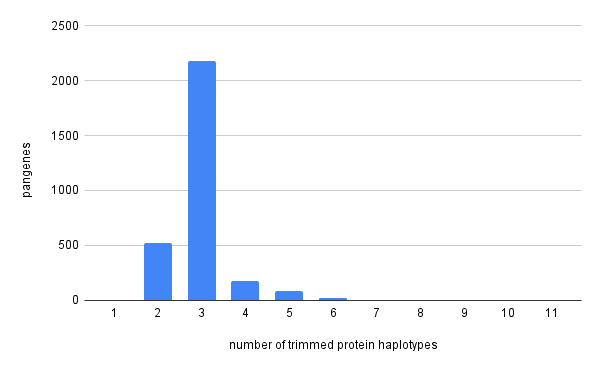
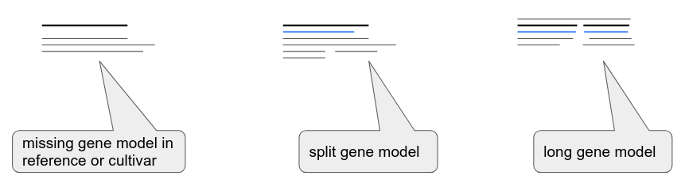
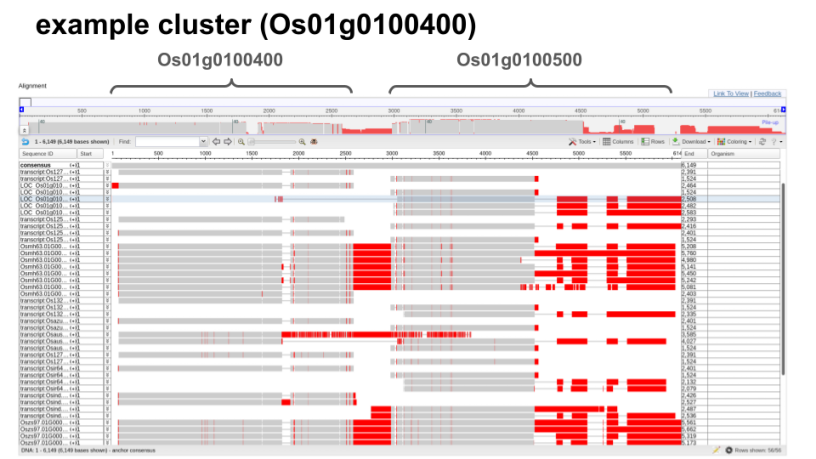

# Pan-gene analysis (GET_PANGENES)

[](https://anaconda.org/bioconda/get_pangenes)

The script *get_pangenes.pl* computes whole genome alignments (WGA) to define 
clusters of collinear, orthologous genes/features annotated in GFF files. Such
clusters define pangenes across a pangenome.
Several WGA algorithms are available and some parameters are customizable.
It is designed to process (in a multicore computer or HPC cluster) files
contained in a directory (-d), so that new .fna & .gff files can be added
while conserving previous results.

This script calls [_cut_sequences.pl](./_cut_sequences.pl), 
[_collinear_genes.pl](./_collinear_genes.pl) and 
[_cluster_analysis.pl](./_cluster_analysis.pl)
and produces different types of output:

 1) clusters of CDS (nucl & pep), cDNA sequences and genomic segments (gdna) of collinear genes (FASTA)
 2) pangene matrices that summarize the genome occupancy of clusters
 3) matrix of % conserved sequences that summarize shared clusters across genomes
 4) optionally (-c) matrices with core- and pangene set growth simulations

## Table of contents

- [Objective](#objective)
- [Definition of pangene](#definition-of-pangene)
- [Command line demo](#command-line-demo)
- [How it works](#how-it-works)
	- [Transformation of gene coordinates](#transformation-of-gene-coordinates)
	- [Overlap calculation](#overlap-calculation)
	- [Pairwise genome comparisons](#pairwise-genome-comparisons)
	- [From pairs of genes to clusters](#from-pairs-of-genes-to-clusters)
	- [Parameters](#parameters)
	- [Dependencies and installation](#dependencies-and-installation)
    - [Runmodes and HPC configuration](#runmodes-and-hpc-configuration)
	- [Command-line options](#command-line-options)
	- [Input file format](#input-file-format)
- [Example 1: default core pangene set analysis](#example-1-default-core-pangene-analysis-and-hpc-settings)
- [Example 2: pangene and Presence-Absence Variation (PAV) analysis](#example-2-pangene-and-Presence-Absence-Variation-PAV-analysis)
- [Example 3: splitting genome in chromosomes](#example-3-splitting-genome-in-chromosomes)
- [Example 4: using GSAlign instead of minimap2](#example-4-using-GSAlign-instead-of-minimap2)
- [Example 5: simulation of pangene set growth](#example-5-simulation-of-pangene-set-growth)
- [Example 6: estimation of haplotype diversity](#example-6-estimation-of-haplotype-diversity)
- [Explaining pangene matrices and other result files](#explaining-pangene-matrices-and-other-result-files)
- [Plotting the results](#plotting-the-results)
- [Sequence alignments of clusters](#sequence-alignments-of-clusters)
- [Quality metrics of clusters](#quality-metrics-of-clusters)
- [Evidence supporting clusters](#evidence-supporting-clusters)
- [Whole genome alignment evidence](#whole-genome-alignment-evidence)
- [Plotting the genome context of a pangene cluster](#plotting-the-genome-context-of-a-pangene-cluster)
- [Remediating pangene models with check_evidence-pl](#remediating-pangene-models-with-check_evidencepl)
- [Pangene analysis with GFF patches](#pangene-analysis-with-GFF-patches)
- [Dotplots of gene-based whole-genome alignments](#dotplots)
- [Matching nucleotide sequences to precomputed pangene clusters](#matching-nucleotide-sequences-to-precomputed-pangene-clusters)
- [Exporting FASTA reference file for mapping](#exporting-fasta-reference-file-for-mapping)
- [Renaming pangenes with stable identifiers](#renaming-pangenes-with-stable-identifiers)
- [Troubleshooting](#troubleshooting)
- [Funding](#funding)
- [Citation](#citation)


## Objective

The main task of these scripts is to cluster collinear/orthologous genes 
across a set of genomes (or pangenome) so that pangenes can be defined:


*Figure 1. Graphical summary of pangene set analysis.*

|occupancy class|definition|
|:--------------|:---------|
|core|Genes contained in all considered genomes/taxa.|
|soft-core|Genes contained in 95% of the considered genomes/taxa.|
|cloud|Genes present only in a few genomes/taxa, generally 1 or 2. The cutoff is defined as the class next to the most populated non-core class.|
|shell|Remaining genes, present in several genomes/taxa.|

*Table 1. Definitions of occupancy classes for pangenes, 
taken from [GET_HOMOLOGUES](http://eead-csic-compbio.github.io/get_homologues/manual). 
Accessory genes include both shell and cloud genes.*

## Definition of pangene

According to our paper <https://doi.org/10.1186/s13059-023-03071-z>, a `pangene` can be defined as follows:
 
    A gene model or allele/haplotype found in some or all individuals of a species in a similar genomic location. 
    A pangene should integrate additional naming schemes, e.g., so that a cluster of gene models can 
    share a common identifier that links back to their original gene identifiers. A pangene set defines 
    our current understanding of the total coding potential of a species and can assist in gene model 
    curation, by providing a pool of possible gene models for assessment.

## [Command line demo]

Please check this [asciinema step-by-step demo](https://asciinema.org/a/W7xVe1112Fl8BImRB5ZW2MWE7) on how to install and run GET_PANGENES on a Debian/Ubuntu linux system.

<!-- 
asciinema rec -t "GET_PANGENES tutorial" get_pangenes.cast
asciinema upload get_pangenes.cast
-->

## How it works

The next flowchart shows the three main tasks of the pipeline:


*Figure 2. Pipeline flowchart.*

Note that each of the three scripts called by get_pangenes.pl 
(cut_sequences.pl, _collinear_genes.pl & _cluster_analysis.pl) create their own logfiles.

### Transformation of gene coordinates 

The second block of the flow aligns genome sequences (in pairs A & B) and uses 
the resulting alignments to transform gene coordinates:
 


*Figure 3. Whole Genome Alignment (WGA) and gene mapping.*

### Overlap calculation

This is how the overlap of genes is computed (with bedtools intersect) to call collinear pairs:


*Figure 4. How gene overlap is computed.*

The overlap value is computed from WGA coordinates (subject) and gene coordinates from 
the source GFF file (query). Note that the WGA alignment might be partial, thus the estimated
overlap ratio could be actually smaller if the subject GFF coordinates were used.
Note that overlaps can be also computed among gene models annotated in one assembly and 
matching genomic segments from others.

### Pairwise genome comparisons

Collinear pairs are internally stored in Compara-like TSV files, with 1-based coordinates, that look like this:

    gene_stable_id	protein_stable_id	species	overlap	homology_type	homology_gene_stable_id	homology_protein_stable_id	homology_species	overlap	dn	ds	goc_score	wga_coverage	is_high_confidence	coordinates
    gene:BGIOSGA002569      gene:BGIOSGA002569      Oryza_indica.ASM465v1.chr1      6223    ortholog_collinear      gene:ONIVA01G00100      gene:ONIVA01G00100	Oryza_nivara_v1.chr1    6223    NULL    NULL    NULL    100.00  1       1:30219-36442(+);1:104920-116326(+)
    Oryza_indica.ASM465v1.chr1:1:217360-222398:+    segment Oryza_indica.ASM465v1.chr1      5038    segment_collinear       gene:ONIVA01G00180      gene:ONIVA01G00180      Oryza_nivara_v1.chr1    5038    NULL    NULL    NULL    100.00  1       1:217360-222398(+);1:155040-165322(+)
    gene:BGIOSGA002594      gene:BGIOSGA002594      Oryza_indica.ASM465v1.chr1      3838    segment_collinear       Oryza_nivara_v1.chr1:1:178848-182686:+  segment Oryza_nivara_v1.chr1    3838    NULL    NULL    NULL    100.00  1       1:246911-252389(+);1:178848-182686(+)

### From pairs of genes to clusters 

TSV files are merged and sorted by gene and overlap. The resulting file is used to drive the construction 
of clusters from pairs of collinear genes as follows:


*Figure 5. Clustering sequences from pairs of collinear genes. 
Option -N controls the max distance (in genes) among sequences of same species in a cluster.*


### Parameters

A few parameters are encoded as variables in the scripts and their values printed to log files.
Here I list the most important ones, they can be changed by using optional parameters 
(or editing the script source in some cases) if needed:

|script|variable|value|meaning|
|:-----|:-------|:----|:------|
|get_pangenes.pl|MINGFFLEN|100|min length of sequences of features (cdna, cds) extracted from input GFF files|
|get_pangenes.pl|NOFSAMPLESREPORT|20|number of samples while simulating pangene growth with -c|
|get_pangenes.pl|GFFACCEPTEDFEATS|gene,mRNA,transcript,exon,CDS|accepted features in input GFF files|
|get_pangenes.pl|GFFVALIDGENEFEAT|gene,mRNA,transcript|features used to call valid genes in input GFF files|
|get_pangenes.pl|MINPERCID|95.0|min percent identity of aligned overlapping genes|
|get_pangenes.pl|MAXDISTNEIGHBORS|2|neighbor genes in a cluster cannot be more than 2 genes away on same strand|
|_collinear_genes.pl|MINIMAPPARS|--secondary=no --cs -x asm20 -r1k,5k|minimap2 settings|
|_collinear_genes.pl|GSALIGNPARS|-sen -no_vcf -fmt 1|GSAlign settings|
|_collinear_genes.pl|BEDINTSCPAR|-wo -f XXX -F XXX -e|bedtools intersect parameters, XXX replaced with user selected overlap [0-1]|
|_collinear_genes.pl|MINMASKLEN|1000000|mask longer (intergenic, repetitive) fragments with -H|
|_collinear_genes.pl|GENEMARGIN|5000|do not mask gene margins|
|_collinear_genes.pl|MINALNLEN|100|min alignment length when mapping & transforming gene coords on WGA|
|_cluster_analysis.pl|MINEDGESTOMERGE|0.75|ratio of edges connecting two clusters so they can be merged|
|check_evidence.pl|GMAPARAMS|-t 1 -2 -z sense_force -n 1 -F|gmap settings|
|check_evidence.pl|MAXSEGMENTSIZE|100000|max length of genomic segment containing candidate split genes|
|check_evidence.pl|MINPAIRPECNONOUTLIERS|0.25|min %pairs of genes from same species among non-outliers, used to correct long gene models|
|check_evidence.pl|MINLIFTIDENTITY|95.0|min % of identity of gmap CDS/cDNA to genome alignments to be considered|
|check_evidence.pl|MINFIXOVERLAP|0.75|min overlap [0-1] of mapped genes to fix long/split gene models|
|_dotplot.pl|MINCONTIGSIZE|100000|min length of chrs/contigs to be considered for dotplot|

### Dependencies and installation

To install it via [bioconda](https://anaconda.org/bioconda/get_pangenes) you can try:

    conda activate bioconda
    conda create -n get_pangenes -c conda-forge -c bioconda get_pangenes
    conda activate get_pangenes

    # or simply
    conda install bioconda::get_pangenes  

The bioconda recipe can be found [here](https://github.com/bioconda/bioconda-recipes/tree/master/recipes/get_pangenes).

Alternatively you can compile it from source, which in addition to Perl requires:

* https://github.com/lh3/minimap2 
* https://github.com/gpertea/gffread
* https://bedtools.readthedocs.io/en/latest/

Assuming *bedtools* are installed in most settings, and that gcc & g++ compilers are available,
the remaining dependencies can be installed on Ubuntu/Debian in folder bin/ with:

    # does not require root privileges
    cd ../..
    make install_pangenes
    # optionally you might also want to try
    make install_gsalign
    make install_pangenes_quality

Note this will also download a test rice dataset. You can test everything is in place with:

    perl pangenes/get_pangenes.pl -v
    # optionally run the rice toy examples
    # make test_pangenes

This should print something like this:

    Checking required binaries and data sources, set in pangeneTools.pm or in command line:
      EXE_MINIMAP : OK (path:plant-scripts/pangenes/../lib/minimap2/minimap2)
      EXE_BEDTOOLS : OK (path:bedtools)
      EXE_GFFREAD : OK (path:plant-scripts/pangenes/bin/gffread/gffread)
      EXE_COLLINEAR : OK (path:plant-scripts/pangenes/_collinear_genes.pl)
      EXE_CUTSEQUENCES : OK (path:plant-scripts/pangenes/_cut_sequences.pl)
      EXE_CLUSTANALYSIS : OK (path:plant-scripts/pangenes/_cluster_analysis.pl)
      EXE_GZIP : OK (path:gzip)
      EXE_BZIP2 : OK (path:bzip2)
      EXE_SORT : OK (path:sort)

In addition to minimap2, two other genome aligners have been tested:

|software|flag|source|installation instructions|notes|
|:-------|:---|:-----|:------------------------|-----|
|GSAlign (benchmarked) | -g | https://doi.org/10.1186/s12864-020-6569-1 | cd ../.. && make [install_gsalign](https://github.com/Ensembl/plant-scripts/blob/a39066be76b687f46229264e8e8b995f1a857af9/Makefile#L75) | requires gcc compiler |
|Wfmash (experimental) | -w | https://github.com/ekg/wfmash | cd ../.. && make [install_wfmash](https://github.com/Ensembl/plant-scripts/blob/a39066be76b687f46229264e8e8b995f1a857af9/Makefile#L71) | requires sudo & g++ compiler |

Regardless of the installation procedure, we suggest checking the
[Runmodes and HPC configuration](https://github.com/Ensembl/plant-scripts/tree/master/pangenes#runmodes-and-hpc-configuration)
section to configure the software for a high-performance computer cluster.


### Runmodes and HPC configuration

By default GET_PANGENES performs the required tasks serially, which equals to option `-m local`,
but it can also run in parallel on a cluster both with options `-m cluster`
and `-m dryrun`, if you prefer to copy and paste your commands in batches directly in the terminal.
This is recommended for large or multiple genomes.

Sample configuration files for LSF and SLURM managers are provided at
([HPC.conf.sample](./HPC.conf.sample)) and
([HPC.conf.sample.slurm](./HPC.conf.sample.slurm)).
Please adapt them, rename them as `HPC.conf` and place them at the same path as `get_pangenes.pl`.

### Command-line options

See all options with:

    perl get_pangenes.pl -h

### Input file format

If the installation was succesfull you should have a copy of a test dataset. You can browse it with:

    ls ../files/test_rice/

This toy dataset comprises three annotated genome assemblies:

|accession|assembly FASTA file|annotation GFF file|
|:--------|:------------------|:------------------|
|Oryza_indica.ASM465v1.chr1|Oryza_indica.ASM465v1.chr1.fa.gz|Oryza_indica.ASM465v1.chr1.gff3.gz|
|Oryza_sativa.IRGSP-1.0|Oryza_sativa.IRGSP-1.0.chr1.fa.gz|Oryza_sativa.IRGSP-1.0.chr1.gff.gz|
|Oryza_nivara_v1.chr1|Oryza_nivara_v1.chr1.fa.gz|Oryza_nivara_v1.chr1.gff3.gz|

As you can see there's a FASTA file and a matching GFF file for each genome.
Each pair of files has a common prefix or accession, which is the name of each genome.

Accepted extensions for FASTA files are `.fna`, `.fa` and `.fasta`, which can all be GZIP-compressed and have also `.gz` appended.
Accepted extensions for GFF files are `.gff` and  `.gff3`. These can also be compressed.

As shown in section [Parameters](#parameters), genes are parsed from GFF files. In order to be called valid,
a gene must include the following GFF features: `gene`, `mRNA` and `transcript`.
Other accepted features include: `exon` and `CDS`.

You can see also a file named `include.split` which shows how a custom subset of accessions can be analyzed with option `-I`.

## Example 1: default core pangene analysis (and HPC settings)

To compute a **core** pangene set out of the test dataset you can start with:

    perl get_pangenes.pl -d ../files/test_rice

Note that you can use `-m cluster` or `-m dryrun` to run tasks in parallel,
section [Runmodes and HPC configuration](#runmodes-and-hpc-configuration).

While computing WGA alignments you can tell the script to split each genome 
in chromosomes and align only homologous chromosomes. Please use option `-s`
for this, which requires a [regular expression](https://perlmaven.com/regex-cheat-sheet). 
For instance, use `-s '\d+'` to split in chromosomes named with natural numbers. 

The output of the test looks like this:

```
$ perl get_pangenes.pl -d ../files/test_rice

# get_pangenes.pl -d ../files/test_rice -o 0 -r 0 -t all -c 0 -z 0 -I 0 -m local -w 0 -g 0 -O 0.5 -Q 50 -N 5 -s '' -H 0 -W '' -G '' -B '' -S '' -n 4 -R 0

# version ...
# results_directory=plant-scripts/pangenes/test_rice_pangenes
# parameters: MINGFFLEN=100 GFFACCEPTEDFEATS=gene,mRNA,transcript,exon,CDS GFFVALIDGENEFEAT=gene,mRNA,transcript

# checking input files...
# re-using plant-scripts/pangenes/test_rice_pangenes/_Oryza_indica.ASM465v1.chr1.fna
# re-using plant-scripts/pangenes/test_rice_pangenes/_Oryza_indica.ASM465v1.chr1.gff
# ../files/test_rice/Oryza_indica.ASM465v1.chr1.fa.gz 45.84MB genes=5292 non-valid=0
# re-using plant-scripts/pangenes/test_rice_pangenes/_Oryza_nivara_v1.chr1.fna
# re-using plant-scripts/pangenes/test_rice_pangenes/_Oryza_nivara_v1.chr1.gff
# ../files/test_rice/Oryza_nivara_v1.chr1.fa.gz 41.54MB genes=5143 non-valid=0
# re-using plant-scripts/pangenes/test_rice_pangenes/_Oryza_sativa.IRGSP-1.0.chr1.fna
# re-using plant-scripts/pangenes/test_rice_pangenes/_Oryza_sativa.IRGSP-1.0.chr1.gff
# ../files/test_rice/Oryza_sativa.IRGSP-1.0.chr1.fa.gz 42.56MB genes=5271 non-valid=0

# 3 genomes, 15706 genes

# done

# taxa considered = 3 genes = 15706

# mask=Oryza_nivara_v1chr1_alltaxa_2neigh_algMmap_split_ (_2neigh_algMmap_split)


# indexing genomes ...
...
# done


# running pairwise genome alignments ...
...
# done

# sorting collinearity results...

# WGA summary (N50, %mapped genes in blocks of 3+)
31792.0 79.7 Oryza_indica.ASM465v1.chr1
33230.0 80.3 Oryza_nivara_v1.chr1
34983.0 83.2 Oryza_sativa.IRGSP-1.0.chr1

# clustering sequences ...
# done

# number of clusters = 7801 (core = 3008)

# cluster_list = test_rice_pangenes/Oryza_nivara_v1chr1_alltaxa_2neigh_algMmap_/Oryzanivarav1.chr1.cluster_list
# cluster_directory = test_rice_pangenes/Oryza_nivara_v1chr1_alltaxa_2neigh_algMmap_/Oryzanivarav1.chr1

# percent_conserved_sequences_file = test_rice_pangenes/Oryza_nivara_v1chr1_alltaxa_2neigh_algMmap_/POCS.matrix.tab

# pangene_file (occup) = test_rice_pangenes/Oryza_nivara_v1chr1_alltaxa_2neigh_algMmap_/pangene_matrix.tab
# pangene_file (occup, transposed) = test_rice_pangenes/Oryza_nivara_v1chr1_alltaxa_2neigh_algMmap_/pangene_matrix.tr.tab
# pangene_file (names) = test_rice_pangenes/Oryza_nivara_v1chr1_alltaxa_2neigh_algMmap_/pangene_matrix_genes.tab
# pangene_file (names, transposed) = test_rice_pangenes/Oryza_nivara_v1chr1_alltaxa_2neigh_algMmap_/pangene_matrix_genes.tr.tab


```
In this example, the clusters are stored in folder 

    test_rice_pangenes/Oryza_nivara_v1chr1_alltaxa_2neigh_algMmap_/Oryzanivarav1.chr1

and a text file describing the clusters is also produced

    test_rice_pangenes/Oryza_nivara_v1chr1_alltaxa_2neigh_algMmap_/Oryzanivarav1.chr1.cluster_list

which looks like this:

    cluster gene:ONIVA01G52180 size=3 taxa=3 taxa(gdna)=NA cdnafile: gene:ONIVA01G52180.cdna.fna cdsfile: gene:ONIVA01G52180.cds.fna pepfile: gene:ONIVA01G52180.cds.faa gdnafile: void
    : Oryza_indica.ASM465v1.chr1
    : Oryza_sativa.IRGSP-1.0.chr1
    : Oryza_nivara_v1.chr1
    ... 

Note that up to four types of clusters are generated (cdna, cds, pep & gdna), 
depending on the nature of the gene and also on the existence of WGA alignments 
supporting the alignment of annotated genes from one assembly to genomic segments on another. 

|cluster type|sequence type|definition|notes|
|:-----------|:------------|:---------|:----|
|cdna|nucleotides|transcript/mRNA features in GFF file|Often several for the same gene.|
|cds|nucleotides|CDS features in GFF file|Often several for the same gene. Might be empty on non-coding genes.|
|pep|amino acids|CDS features in GFF file|Often several for the same gene. Might be empty on non-coding genes.|
|gdna|nucleotides|genomic segment in one genome matching a gene model in another|Provided as obvious candidate regions for lifting over genes.|

Clusters are FASTA files like this, and might include **several sequences for the same gene**:

```
$ grep ">" test_rice_pangenes/Oryza_nivara_v1chr1_alltaxa_2neigh_algMmap_/Oryzanivarav1.chr1/gene:ONIVA01G52180.cdna.fna

>transcript:ONIVA01G52180.1 gene:ONIVA01G52180 1:42818942-42824598(-) [Oryza_nivara_v1.chr1]
>transcript:ONIVA01G52180.2 gene:ONIVA01G52180 1:42818942-42824598(-) [Oryza_nivara_v1.chr1]
>transcript:ONIVA01G52180.3 gene:ONIVA01G52180 1:42818944-42824598(-) [Oryza_nivara_v1.chr1]
>transcript:Os01t0978100-01 gene:Os01g0978100 1:43232027-43238506(-) [Oryza_sativa.IRGSP-1.0.chr1]
>transcript:Os01t0978100-02 gene:Os01g0978100 1:43232034-43238012(-) [Oryza_sativa.IRGSP-1.0.chr1]
>transcript:Os01t0978100-03 gene:Os01g0978100 1:43232036-43237974(-) [Oryza_sativa.IRGSP-1.0.chr1]
>transcript:BGIOSGA000001-TA gene:BGIOSGA000001 1:47275570-47278635(-) [Oryza_indica.ASM465v1.chr1]
```

While cdna, cds and pep cluster files contain sequences annotated in the input GFF files,
the gdna FASTA files contain genomic segments from assemblies matching gene models annotated in other
genomes. The latter files are good starting points for lifting over genes, as explained in section
[Lifting over gene models in genomic segment clusters](#lifting-over-gene-models-in-genomic-segment-clusters).

The **gene collinearity evidence** supporting the clusters is summarized in a compressed file
which is added to the output folder of each run of the script. In this example this is:

    test_rice_pangenes/Oryza_nivara_v1chr1_alltaxa_2neigh_algMmap_/mergedpairs.tsv.gz

See section [Evidence supporting clusters](#evidence-supporting-clusters) to learn how to 
extract the evidence for a selected cluster.

The script also produces % of Conserved Sequence (POCS) and pangene matrices,
which look like this:
 
    $ cat test_rice_pangenes/Oryza_nivara_v1chr1_alltaxa_2neigh_algMmap_/POCS.matrix.tab
    genomes	Oryza_nivara_v1.chr1	Oryza_sativa.IRGSP-1.0.chr1	Oryza_indica.ASM465v1.chr1
    Oryza_nivara_v1.chr1	100.00	61.81	60.62
    Oryza_sativa.IRGSP-1.0.chr1	61.81	100.00	62.65
    Oryza_indica.ASM465v1.chr1	60.62	62.65	100.00

And 

    $ head test_rice_pangenes/Oryza_nivara_v1chr1_alltaxa_2neigh_algMmap_/pangene_matrix.tr.tab
    source:test_rice_pangenes/Oryza_nivara_v1chr1_alltaxa_5niegh_algMmap_/Oryzanivarav1.chr1	Oryza_nivara_v1.chr1	Oryza_sativa.IRGSP-1.0.chr1	Oryza_indica.ASM465v1.chr1	
    chrunsorted	NA	NA	NA	
    gene:ONIVA01G52180	1	1	1	
    gene:ONIVA01G52140	1	1	1	
    gene:ONIVA01G52120	1	1	1	
    gene:ONIVA01G52090	1	1	1	
    gene:ONIVA01G52080	1	1	1	
    gene:ONIVA01G52070	1	1	1	
    gene:ONIVA01G52060	1	1	1	
    gene:ONIVA01G52030	1	1	1	

    $ head test_rice_pangenes/Oryza_nivara_v1chr1_alltaxa_2neigh_algMmap_/pangene_matrix_genes.tr.tab
    source:test_rice_pangenes/Oryza_nivara_v1chr1_alltaxa_2neigh_algMmap_/Oryzanivarav1.chr1	Oryza_nivara_v1.chr1	Oryza_sativa.IRGSP-1.0.chr1	Oryza_indica.ASM465v1.chr1	
    chr:unsorted	NA	NA	NA	
    gene:ONIVA01G52180	gene:ONIVA01G52180	gene:Os01g0978100	gene:BGIOSGA000001	
    gene:ONIVA01G52140	gene:ONIVA01G52140	gene:Os01g0977600	gene:BGIOSGA000002	
    gene:ONIVA01G52120	gene:ONIVA01G52120	gene:Os01g0977300	gene:BGIOSGA000003	
    gene:ONIVA01G52090	gene:ONIVA01G52090	gene:Os01g0976900	gene:BGIOSGA000004	
    gene:ONIVA01G52080	gene:ONIVA01G52080	gene:Os01g0976800	gene:BGIOSGA000005	
    gene:ONIVA01G52070	gene:ONIVA01G52070	gene:Os01g0976700	gene:BGIOSGA000006	
    gene:ONIVA01G52060	gene:ONIVA01G52060	gene:Os01g0976600	gene:BGIOSGA000007	
    gene:ONIVA01G52030	gene:ONIVA01G52030	gene:Os01g0976200	gene:BGIOSGA000008	

While POCS matrices summarize the percentage of genes shared by any two annotated genomes, 
pangenome matrices contain the composition of those clusters, named in the first columns. 


## Example 2: pangene and Presence-Absence Variation (PAV) analysis

As opposed to [Example 1](#example-1-default-core-pangene-analysis), 
where only core pangenes where produced, in this example we will build a complete
pangene set with clusters of all occupancy classes (-t 0, see [Table 1](#objective)):

    perl get_pangenes.pl -d ../files/test_rice -t 0

The output is similar to the previous one, 
but saved in a different folder (*Oryza_nivara_v1chr1_0taxa_2neigh_algMmap_*).
The main differences are shown below, note the larger number of clusters:

```
# number of clusters = 7801 (core = 3008)

# cluster_list = test_rice_pangenes/Oryza_nivara_v1chr1_0taxa_2neigh_algMmap_/Oryzanivarav1.chr1.cluster_list
# cluster_directory = test_rice_pangenes/Oryza_nivara_v1chr1_0taxa_2neigh_algMmap_/Oryzanivarav1.chr1

...

# pangene_file (occup, transposed) = test_rice_pangenes/Oryza_nivara_v1chr1_0taxa_2neigh_algMmap_/pangene_matrix.tr.tab
...
# pangene_file (names, transposed) = test_rice_pangenes/Oryza_nivara_v1chr1_0taxa_2neigh_algMmap_/pangene_matrix_genes.tr.tab
```

The last two output files can be easily parsed to discover pangenes with Presence-Absence Variation (PAV).
For instance, to find pangenes that contain gene models from *Oryza_indica.ASM465v1.chr1* and 
*Oryza_sativa.IRGSP-1.0.chr1* but no models from *Oryza_nivara_v1.chr1* you could do:

    perl -lane 'print if($F[1] eq "-" && $F[2] ne "-" && $F[3] ne "-")' test_rice_pangenes/Oryza_nivara_v1chr1_0taxa_2neigh_algMmap_/pangene_matrix_genes.tr.tab | wc -l
    #508

    perl -lane 'print if($F[1] eq "-" && $F[2] ne "-" && $F[3] ne "-")' test_rice_pangenes/Oryza_nivara_v1chr1_0taxa_2neigh_algMmap_/pangene_matrix_genes.tr.tab | head	
    gene:BGIOSGA000032	-	gene:BGIOSGA000032	gene:Os01g0969700	
    gene:BGIOSGA000039	-	gene:BGIOSGA000039	gene:Os01g0968200	
    gene:BGIOSGA000074	-	gene:BGIOSGA000074	gene:Os01g0960300	
    gene:BGIOSGA000085	-	gene:BGIOSGA000085	gene:Os01g0955550	
    gene:BGIOSGA000116	-	gene:BGIOSGA000116	gene:Os01g0947700	
    gene:BGIOSGA000117	-	gene:BGIOSGA000117	gene:Os01g0946800	
    gene:BGIOSGA000118	-	gene:BGIOSGA000118	gene:Os01g0947000	
    gene:BGIOSGA000123	-	gene:BGIOSGA000123	gene:Os01g0946850	
    gene:BGIOSGA000126	-	gene:BGIOSGA000126	gene:Os01g0945600,gene:Os01g0945700,gene:Os01g0945800	
    gene:BGIOSGA000127	-	gene:BGIOSGA000127	gene:Os01g0945300	
 	
As explained earlier, the first column shows the actual cluster names, 
which can be found with different extensions at

    test_rice_pangenes/Oryza_nivara_v1chr1_0taxa_2neigh_algMmap_/Oryzanivarav1.chr1
  

## Example 3: splitting genome in chromosomes

In this example we will split the input genomes in chromosomes and will **limit the alignments
to homologous chromosomes**, which might be what you expect when talking about collinear genes.
This has also the beneficial side-effect of reducing the RAM consumption of the software 
(see also option -H). We will also request `-t 0` as in 
[example 2](#example-2-pangene-and-Presence-Absence-Variation-PAV-analysis).

In order to identify homologous chromosomes you'll need to pass a 
[regular expression](https://en.wikipedia.org/wiki/Regular_expression) 
as an argument: 

    perl get_pangenes.pl -d ../files/test_rice -t 0 -s '^\d+$' 

This particular example tells the script to identify chromosomes named with 
a natural number, as done for instance in [Ensembl Plants](https://plants.ensembl.org/index.html).
This matches the nuclear chromosomes in the test data, see:

    grep "^>" test_rice_pangenes/_Oryza*.fna
    test_rice_pangenes/_Oryza_indica.ASM465v1.chr1.fna:>1 dna:chromosome chromosome:ASM465v1:1:1:47283185:1 REF
    test_rice_pangenes/_Oryza_nivara_v1.chr1.fna:>1 dna:chromosome chromosome:Oryza_nivara_v1.0:1:1:42845077:1 REF
    test_rice_pangenes/_Oryza_sativa.IRGSP-1.0.chr1.fna:>1 dna:chromosome chromosome:IRGSP-1.0:1:1:43270923:1 REF
    test_rice_pangenes/_Oryza_sativa.IRGSP-1.0.chr1.fna:>Mt dna:chromosome chromosome:IRGSP-1.0:Mt:1:490520:1 REF
    test_rice_pangenes/_Oryza_sativa.IRGSP-1.0.chr1.fna:>Pt dna:chromosome chromosome:IRGSP-1.0:Pt:1:134525:1 REF

Other possibly useful regexes include '^\d+H$' or 'chr\d+$'.

Any chromosome names that don't match the regex are pooled in a dummy 'unplaced' chromosome.
    
When you run it you'll see a couple differences in the output:

* the number of chrs/contigs parsed in each input FASTA file
* a BED-like pangene matrix with 0-based coordinates

```
# checking input files...
# re-using plant-scripts/pangenes/test_rice_pangenes/_Oryza_indica.ASM465v1.chr1.fna
# re-using plant-scripts/pangenes/test_rice_pangenes/_Oryza_indica.ASM465v1.chr1.gff
# ../files/test_rice/Oryza_indica.ASM465v1.chr1.fa.gz 45.84MB genes=5292 non-valid=0 chrs/contigs=1
# re-using plant-scripts/pangenes/test_rice_pangenes/_Oryza_nivara_v1.chr1.fna
# re-using plant-scripts/pangenes/test_rice_pangenes/_Oryza_nivara_v1.chr1.gff
# ../files/test_rice/Oryza_nivara_v1.chr1.fa.gz 41.54MB genes=5143 non-valid=0 chrs/contigs=1
# re-using plant-scripts/pangenes/test_rice_pangenes/_Oryza_sativa.IRGSP-1.0.chr1.fna
# re-using plant-scripts/pangenes/test_rice_pangenes/_Oryza_sativa.IRGSP-1.0.chr1.gff
# ../files/test_rice/Oryza_sativa.IRGSP-1.0.chr1.fa.gz 42.56MB genes=5271 non-valid=0 chrs/contigs=1

...
# clusters sorted by position in chr 1 = 7944
...
# pangene_file (BED-like) = Oryza_nivara_v1chr1_0taxa_2neigh_algMmap_split_/pangene_matrix.tr.bed
```

The BED file contents should be like this, with genome occupancy in column 5:

    $ head test_rice_pangenes/Oryza_nivara_v1chr1_alltaxa_2neigh_algMmap_split_/pangene_matrix.tr.bed
    #1	NA	NA	gene:BGIOSGA002568	1	0	NA	NA	gene:BGIOSGA002568
    1	4847	11824	gene:ONIVA01G00010	1	+	gene:ONIVA01G00010	NA	NA
    1	43370	62621	gene:ONIVA01G00020	1	+	gene:ONIVA01G00020	NA	NA
    1	62742	64526	gene:ONIVA01G00030	1	+	gene:ONIVA01G00030	NA	NA
    1	64706	65654	gene:ONIVA01G00040	1	+	gene:ONIVA01G00040	NA	NA
    1	68826	69733	gene:ONIVA01G00050	1	+	gene:ONIVA01G00050	NA	NA
    1	73629	75670	gene:ONIVA01G00060	1	+	gene:ONIVA01G00060	NA	NA
    1	78104	78695	gene:ONIVA01G00070	1	+	gene:ONIVA01G00070	NA	NA
    1	98769	99876	gene:ONIVA01G00080	1	-	gene:ONIVA01G00080	NA	NA
    1	100725	101071	gene:ONIVA01G00090	1	-	gene:ONIVA01G00090	NA	NA

In cases where two neighbor reference genes are clustered together, the corresponding pangenes appear as 
repeated lines in the BED file. As `MAXDISTNEIGHBORS` increases such blocks might break the ordering in the BED file:

    1       286651  290944  gene:ONIVA01G00370      1       -       gene:ONIVA01G00370      NA      NA
    1       287224  288326  gene:ONIVA01G00380      3       +       gene:ONIVA01G00380      gene:BGIOSGA002602      gene:Os01g0106200
    1       290231  293270  gene:ONIVA01G00380      3       +       gene:ONIVA01G00390      gene:BGIOSGA002602      gene:Os01g0106200
    1       293516  294555  gene:ONIVA01G00400      3       -       gene:ONIVA01G00400      gene:BGIOSGA002552      gene:Os01g0106300

## Example 4: using GSAlign instead of minimap2

In our tests GSAlign produces comparable results to minimap2 but using less RAM.
You can try it out with:

    perl get_pangenes.pl -d ../files/test_rice -g

Note that the output folder is now

    test_rice_pangenes/Oryza_nivara_v1chr1_alltaxa_2neigh_algGSal_

A unique output produce by GSAlign is an Average Nucleotide identitiy (ANI) matrix,
which summarizes the %identity of pairs of aligned genomes:

    $ cat test_rice_pangenes/Oryza_nivara_v1chr1_alltaxa_2neigh_algGSal_/ANI.matrix.tab
    genomes	Oryza_indica.ASM465v1.chr1	Oryza_nivara_v1.chr1	Oryza_sativa.IRGSP-1.0.chr1
    Oryza_indica.ASM465v1.chr1	100.00	97.88	97.47
    Oryza_nivara_v1.chr1	97.88	100.00	96.86
    Oryza_sativa.IRGSP-1.0.chr1	97.47	96.86	100.00


## Example 5: simulation of pangene set growth

A pangene set growth analysis can be performed by adding option -c, which will produce two files
with random-sampling simulations on how the core- and pangene set grow as new genomes are added,
named core_gene.tab and pan_gene.tab

    perl get_pangenes.pl -d ../files/test_rice/ -s '^\d+$' -g -c


```
# genome composition report (samples=6,seed=12345)
## sample 0 (Oryza_nivara_v1.chr1 | 0,1,2,)
# adding Oryza_nivara_v1.chr1: core=5063 pan=5063
# adding Oryza_sativa.IRGSP-1.0.chr1: core=3155 pan=6801
# adding Oryza_indica.ASM465v1.chr1: core=2975 pan=7840
## sample 1 (Oryza_sativa.IRGSP-1.0.chr1 | 1,2,0,)
# adding Oryza_sativa.IRGSP-1.0.chr1: core=4893 pan=4893
# adding Oryza_indica.ASM465v1.chr1: core=3510 pan=6394
# adding Oryza_nivara_v1.chr1: core=2975 pan=7840
## sample 2 (Oryza_nivara_v1.chr1 | 0,1,2,)
# adding Oryza_nivara_v1.chr1: core=5063 pan=5063
# adding Oryza_sativa.IRGSP-1.0.chr1: core=3155 pan=6801
# adding Oryza_indica.ASM465v1.chr1: core=2975 pan=7840
## sample 3 (Oryza_indica.ASM465v1.chr1 | 2,1,0,)
# adding Oryza_indica.ASM465v1.chr1: core=5011 pan=5011
# adding Oryza_sativa.IRGSP-1.0.chr1: core=3510 pan=6394
# adding Oryza_nivara_v1.chr1: core=2975 pan=7840
## sample 4 (Oryza_sativa.IRGSP-1.0.chr1 | 1,0,2,)
# adding Oryza_sativa.IRGSP-1.0.chr1: core=4893 pan=4893
# adding Oryza_nivara_v1.chr1: core=3155 pan=6801
# adding Oryza_indica.ASM465v1.chr1: core=2975 pan=7840
## sample 5 (Oryza_nivara_v1.chr1 | 0,2,1,)
# adding Oryza_nivara_v1.chr1: core=5063 pan=5063
# adding Oryza_indica.ASM465v1.chr1: core=3437 pan=6637
# adding Oryza_sativa.IRGSP-1.0.chr1: core=2975 pan=7840


# pan-gene (number of clusters) = test_rice_pangenes/Oryza_nivara_v1chr1_alltaxa_2neigh_algGSal_split_/pan_gene.tab
# core-gene (number of clusters) = test_rice_pangenes/Oryza_nivara_v1chr1_alltaxa_2neigh_algGSal_split_/core_gene.tab
```

The resulting pan and core gene files look like this:

    $ cat test_rice_pangenes/Oryza_nivara_v1chr1_alltaxa_2neigh_algGSal_split_/pan_gene.tab
    g1	g2	g3	
    5063	6801	7840	
    4893	6394	7840	
    5063	6801	7840	
    5011	6394	7840	
    4893	6801	7840	
    5063	6637	7840


If your pangene set contains a lot of clusters with genes from a single annotated assembly (singletons) it
might be worth checking the growth without those. In that case you can perform the simulation as follows,
requiring pangenes to have occupancy >= 2: 

    perl get_pangenes.pl -d ../files/test_rice/ -s '^\d+$' -g -c -t 2


## Example 6: estimation of haplotype diversity

Pangene clusters can be used to estimate the diversity of haplotypes or alleles of one or more genes.
While this can be done with cDNA FASTA files, haplotypes of coding sequences, particularly those
harboring missense and nonsense mutations, are the easiest to interpret in relation to phenotype.

The commands in this section can be used to compute the haplotype diversity of a pangene set.
They include script `check_quality.pl`, introduced in section 
[Quality metrics of clusters](#quality-metrics-of-clusters),
two optional packages are required:

|software|source|installation instructions|
|:-------|:-----|:------------------------|
|parallel|https://www.gnu.org/software/parallel|sudo apt install parallel|
|trimAl|https://github.com/inab/trimal/releases/tag/v1.5.0|download and save in appropriate folder|

    cd .. && make install_pangenes_quality && cd pangenes

    # select protein FASTA files of pangenes with ideally 4+ taxa, 3 in this toy example
    perl -lne 'if(/\s+taxa=(\d+) \S+ cdnafile: (\S+) \S+ \S+ pepfile: (\S+)/){ print "$3" if($1 >= 3)}' \
        test_rice_pangenes/Oryza_nivara_v1chr1_alltaxa_2neigh_algMmap_/Oryzanivarav1.chr1.cluster_list \
        > test_rice_pangenes/list.diversity.pep.txt

    #wc test_rice_pangenes/list.diversity.pep.txt

    # compute multiple alignments of selected FASTA files with 10 parallel threads,
    # -o is the name of the output folder
    # -I means that only the 1st isoform of each gene model is used,
    cat list.diversity.pep.txt | parallel --gnu -j 10 ./check_quality.pl -d \
        test_rice_pangenes/Oryza_nivara_v1chr1_alltaxa_2neigh_algMmap_ -i {} \
        -n -I -o test_rice_pangenes/diversity.pep ::: &> test_rice_pangenes/log.diversity.pep.I.tsv

    # header of log.diversity.pep.I.tsv
    # file 1stisof occup seqs mode_len SE_len mode_exons SE_exons mode_dist max_dist SE_dist sites Ca Cr_max Cr_min Cc_max Cc_min Cij_max Cij_min

    # run trimAl to define well aligned blocks, in the example located in 
    # folder ~/soft/trimAl_Linux_x86-64 , and save results in new folder trimal.out
    mkdir test_rice_pangenes/trimal.out
    cd test_rice_pangenes/diversity.pep
    for file in *.cds.aln.faa; do ~/soft/trimAl_Linux_x86-64/trimal -keepheader -automated1 -terminalonly -in $file -out ../trimal.out/$file; done
    cd ..

    # count alleles in trimmed blocks
    cd trimal.out
    for file in *.cds.aln.faa; do
        echo -n $file
        perl -ne 'chomp; if(/^>/){ print "\n$_\n" }else{print}' $file | \
            perl -ne 'next if(/^$/);if(/^>.*\[(\S+)\]/){ $tx=$1 } else { $hp{$_}.="$tx,"; $sq{$_}++ }; END{ print "\t".scalar(keys(%sq))."\t"; foreach $s (keys(%sq)){ print "$sq{$s}:$hp{$s};" } }' 
        echo 
    done > ../haplotypes.trimmed.tsv
    cd ../..

The resulting file `test_rice_pangenes/haplotypes.trimmed.tsv` can be used to create a histogram of haplotypes/alleles:

    head -6 test_rice_pangenes/haplotypes.trimmed.tsv

    gene:ONIVA01G00100.cds.aln.faa	3	1:Oryza_indica.ASM465v1.chr1,;1:Oryza_sativa.IRGSP-1.0.chr1,;1:Oryza_nivara_v1.chr1,;
    gene:ONIVA01G00110.cds.aln.faa	3	1:Oryza_sativa.IRGSP-1.0.chr1,;1:Oryza_indica.ASM465v1.chr1,;1:Oryza_nivara_v1.chr1,;
    gene:ONIVA01G00120.cds.aln.faa	3	1:Oryza_indica.ASM465v1.chr1,;1:Oryza_sativa.IRGSP-1.0.chr1,;1:Oryza_nivara_v1.chr1,;
    gene:ONIVA01G00130.cds.aln.faa	3	1:Oryza_indica.ASM465v1.chr1,;1:Oryza_sativa.IRGSP-1.0.chr1,;1:Oryza_nivara_v1.chr1,;
    gene:ONIVA01G00140.cds.aln.faa	3	1:Oryza_nivara_v1.chr1,;1:Oryza_indica.ASM465v1.chr1,;1:Oryza_sativa.IRGSP-1.0.chr1,;
    gene:ONIVA01G00150.cds.aln.faa	2	2:Oryza_nivara_v1.chr1,Oryza_sativa.IRGSP-1.0.chr1,;1:Oryza_indica.ASM465v1.chr1,;

    # histogram, note that clusters with tandem copies might inflate the diversity
    #perl -lane 'print $F[1] if($F[1])' test_rice_pangenes/haplotypes.trimmed.tsv | sort | uniq -c | sort -k2,2n




*Figure 6. Histogram of trimmed protein haplotypes encoded in test pangene set.*


## Explaining pangene matrices and other result files

The main results of the pipeline include a directory (*cluster_dir*) and a list (*cluster_list*) of pangene clusters
and pangene matrices in several formats, which have already been introduced in 
[Example 1](#example-1-default-core-pangene-analysis-and-hpc-settings) and
[Example 3](#example-3-splitting-genome-in-chromosomes).

The different types of pangene matrices that can be produced are summarized in the following tables,
assuming *g* genomes, *n* chromosomes and *p* pangenes with occupancy => numberOfTaxa ([alltaxa] by default).
In these matrices an extra, **artifical chromosome named 'chrunsorted'** is created to accomodate unsorted pangenes.
Note that the contents of these matrices correspond to clustered FASTA sequences in *cluster_dir*.

* If genome was **split in chromosomes** with an optional regular expression, 
as in [Example 3](#example-3-splitting-genome-in-chromosomes),
pangenes are sorted by position along the reference chromosomes when possible:

|filename|dimensions|contents|
|:-------|:---------|:-------|
|pangene_matrix.tr.tab|p+n+2 X g+1|(int) number of genes from genome g<sub>i</sub> in pangene cluster, TSV format, n+1 chromosome blocks|
|pangene_matrix_genes.tr.tab|p+n+2 X g+1|(string) names of genes from genome g<sub>i</sub> in pangene cluster, TSV format, n+1 chromosome blocks|
|pangene_matrix.tr.bed|p X g+6|(string) names of genes from genome g<sub>i</sub> in pangene cluster, BED-like format, non-reference pangenes lack exact coordinates and are commented out with `#`|

BED-like `pangene_matrix.tr.bed` is special for it includes all pangene clusters regardless of their occupancy,
which is useful for [plotting the genomic context of a pangene cluster](#plotting-the-genome-context-of-a-pangene-cluster).

Matrices `pangene_matrix.tab` and `pangene_matrix_genes.tab` are transposed with respect to `pangene_matrix.tr.tab` and `pangene_matrix_genes.tr.tab`; `pangene_matrix.fasta` is a FASTA compressed version of `pangene_matrix.tab`.


* If genome was **not split in chromosomes** all-vs-all chromosome alignments are computed and
pangenes are stacked in the **chromosome 'chrunsorted'**, 
with clusters that include the reference genome first and singletons last.
In this case, a pangene cluster **might contain genes encoded in different chromosomes** from different genomes:

|filename|dimensions|contents|
|:-------|:---------|:-------|
|pangene_matrix.tr.tab|p+2 X g+1|(int) number of genes from genome g<sub>i</sub> in pangene cluster, TSV format|
|pangene_matrix_genes.tr.tab|p+2 X g+1|(string) names of genes from genome g<sub>i</sub> in pangene cluster, TSV format|


### Other result files

There are different types of intermediate result files produced by the pipeline.
Probably the most valuable files are those containing collinear gene models
resulting from a pairwise WGA, which are stored in TSV format (see also [Dotplots](#dotplots)).
For instance, let's inspect one such file, in this case produced with the GSal algorithm:

    head test_rice_pangenes/_Oryza_nivara_v1.chr1.Oryza_sativa.IRGSP-1.0.chr1.algGSal.overlap0.5.tsv

    gene:Os01g0100466   gene:Os01g0100466   Oryza_nivara_v1.chr1    1173    segment_collinear   Oryza_sativa.IRGSP-1.0.chr1:1:116866-118039(-)  segment Oryza_sativa.IRGSP-1.0.chr1 1173    NULL    NULL    NULL    100.00  1   NA;1:116866-118039(-)
    ...
    gene:ONIVA01G00100  gene:ONIVA01G00100  Oryza_nivara_v1.chr1    7827    ortholog_collinear  gene:Os01g0100100   gene:Os01g0100100   Oryza_sativa.IRGSP-1.0.chr1 7827    NULL    NULL    NULL    100.00  1   1:104920-116326(+);1:2982-10815(+)
    ...

Note that there are two types of rows: ortholog_collinear and segment_collinear. 
The first type describe a pair of collinear genes from two input taxa, their respective genomic coordinates 
and the length of their overlap in the underlying WGA. 
The second type indicate cases where a gene model in a taxon overlaps a genomic segment in another.
Note also that the **strand of each region** is indicated, 
which might be useful to spot genes that are inverted/translocated genomic fragments. 

In addition, each of these TSV files have a matching logfile with extension .queue. In our example,
that would be:

    test_rice_pangenes/_Oryza_nivara_v1.chr1.Oryza_sativa.IRGSP-1.0.chr1.algGSal.overlap0.5.tsv.queue

These files also contain useful bits of information such as:

    # WGA blocks: N50 18935 median 3055
    # 4557 genes mapped (68.2% in 3+blocks) ... (19 unmapped)
    ...
    # 4243 genes mapped (60.1% in 3+blocks) ... (reverse, 4 unmapped)
    # 3596 collinear gene pairs , 2057 collinear segments, 1.121 hits/gene


The first line summarizes the length of the blocks that make up the WGA, 
which will be shorter for poor assemblies.
The 2nd and 3rd line indicate how many of the gene models from the two compared 
taxa/annotations were actually mapped in the WGA, in both directions (A->B and B->A).
The 4th line reports how many collinear gene pairs and segments where found, 
and how many hits in the WGA were found on average per gene.

These files can be analyzed in bulk in the terminal for quality control, for instance with:

    grep "collinear gene pairs" test_rice_pangenes/*Mmap.overlap0.5.tsv.queue | perl -lane 'print $F[1]' | sort -r

### tmp/ folder

This is the location of genome alignments in PAF format and genome indices.
These are temporary files that are re-used by future jobs if possible to save computing time.
As the number of input genomes increases, so will the disk space required by `tmp/`.
For instance, the analysis of 22 barley genomes resulted in 956GB of temporary data.
It is perfectly safe to remove/compress this folder if you need to save space, 
but that will mean that previous temporary files need to be computed again.

## Plotting the results

Data files produced can be plotted in many ways, for instance in Rstudio,
but can also be conveniently done with help from scripts from software
[GET-HOMOLOGUES](https://github.com/eead-csic-compbio/get_homologues),
which must first be installed as follows 
(manual [here](http://eead-csic-compbio.github.io/get_homologues/manual-est)):

    git clone https://github.com/eead-csic-compbio/get_homologues.git
    perl install.pl

Here are a few examples: 

    get_homologues/plot_pancore_matrix.pl -f core_both -i core_gene.tab

    get_homologues/plot_pancore_matrix.pl -f pan -i pan_gene.tab

    get_homologues/plot_matrix_heatmap.sh -i POCS.matrix.tab -k "Percent Conserved Sequences (POCS)"

    get_homologues/plot_matrix_heatmap.sh -i ANI.matrix.tab -k "Average Nucleotide Identity"

    get_homologues/parse_pangenome_matrix.pl -m pangene_matrix.tab -s

These will produce figures such as these:


*Figure 7. Pangene set growth after pooling 11 Oryza species, generated with get_homologues/plot_pancore_matrix.pl*


*Figure 8. Core-pangene set growth after pooling 11 Oryza species, generated with get_homologues/plot_pancore_matrix.pl.*


*Figure 9. Occupancy of pangene clusters of 11 Oryza species, generated with get_homologues/parse_pangenome_matrix.pl*


## Sequence alignments of clusters 

Multiple alignments can be computed for each cluster FASTA file to determine,
for instance, if there is a conserved gene structure. For instance, we can
align the cDNA cluster gene:ONIVA01G52180.cdna.fna:

    >transcript:Os01t0978100-02 gene:Os01g0978100 1:43232034-43238012(-) [Oryza_sativa.IRGSP-1.0.chr1]
    --------------------------------------------------------------------------------------------------------------------------------------------------------------------------------------------------------------------------------------------------------------------------------------------------------------------------------------------------------------------------------------------------------------------------------------------------------------------------------------------------------------GGGAGGGGATTAGGCAACAAAAGCTCGTCGTCCATCCGCAGATACGGAACTACTCCCCTATCCAACACCTCCGAGTCCGAGCAACGCAAGATGGCGTCGTGGTCGTCGCCCGTCGCCGCCGCCGCCTTGCAGGTCCATTTCGGGTCCTCCTGCTTCTTCTCCGCCCGATCGCCACGACAGACCCTCCTCCTACCACCTCTCGCCCGCAACCCTACACTGACCATCCAGCCCCGGCCCCATCCCTTCCGGAACATCAACTCCTCCTCCTCCTCCAGCTGGATGTGCCACGCCGTCGCCGCCGAGGTCGAGGGCCTCAACATCGCCGACGACGTCACCCAGCTCATCGGCAAGACTCCAATGGTATATCTCAACAACATCGTCAAGGGATGTGTTGCCAATGTCGCTGCTAAGCTCGAGATTATGGAGCCCTGTTGCAGTGTCAAGGACAGGATAGGATACAGTATGATTTCTGATGCGGAAGAGAAAGGCTTGATAACTCCTGGAA------------------------------------------------------AGAGTGTTTTGGTGGAACCAACAAGTGGAAATACAGGCATTGGTCTTGCCTTCATTGCTGCTTCCAGAGGATATAAATTAATATTGACCATGCCTGCATCAATGAGCATGGAGAGAAGAGTTCTACTCAAAGCTTTTGGCGCTGAACTTGTCCTTACTGATGCCGCAAAAGGGATGAAGGGGGCTGTAGATAAGGCTACAGAGATTTTAAATAAGACACCTGATGCCTATATGCTGCAGCAGTTTGACAACCCTGCCAACCCAAAGGTACATTATGAGACTACTGGGCCAGAAATCTGGGAGGATTCTAAAGGGAAGGTGGATGTATTCATTGGTGGAATTGGAACAGGTGGAACAATATCTGGTGCTGGCCGTTTCCTGAAAGAGAAAAATCCTGGAATTAAGGTTATTGGTATTGAGCCTTCTGAGAGTAACATACTCTCTGGTGGAAAACCTGGCCCACATAAGATTCAAGGCATTGGGGCAGGATTTGTTCCAAGGAACTTGGATAGTGAAGTTCTCGATGAAGTGATTGAGATATCTAGTGATGAGGCTGTTGAGACAGCAAAGCAATTGGCTCTTCAGGAAGGATTACTGGTTGGAATTTCATCTGGGGCAGCAGCAGCAGCTGCCATTAAAGTTGCAAAAAGACCAGAAAATGCTGGAAAGTTGGTAGTGGTTGTGTTTCCAAGCTTTGGTGAGAGGTACCTTTCATCTATCCTTTTTCAGTCGATAAGAGAAGAATGTGAGAAGTTGCAACCTGAACCATGAGCCTAACTTCAGTGTTCACAACATCATAATTGTTTCTGAGATTTCTGGCCATTAGTTTTTTTTTTCTGAGAAGTATCATACCACTCCATAGCTGTTTGTTCGATAAATAAAACAGTTACCTTTGCACTTATAATGAGGCTTGTGAGGGTACTGTGAAATTTCTCTGAACATCTTCTACTCTTCTCTTTTATCCTTAAATCAATCTGGGAGCAGTTTGTAATACATACGTAAATTTAAAGCTGGGTGTTTGGTAATTGTAAACAAATGTTTCGAAGAGCCGTGAAACATTATCAATTAGCATGAAGCACTTTAAAAGTGCTTTCCGG-------
    >transcript:ONIVA01G52180.1 gene:ONIVA01G52180 1:42818942-42824598(-) [Oryza_nivara_v1.chr1]
    --------------------------------------------------------------------------------------------------------------------------------------------------------------------------------------------------------------------------------------------------------------------------------------------------------------------------------------------------------------------------------------------------------------------------------------------------------------------------------------------------------------------------------------------------------------------------------------------------------ATGGCGTCGTGGTCGTCGCCCGTCGCCGCCGCCGCCTTGCAGGTCCATTTCGGGTCCTCCTGCTTCTTCTCCGCCCGATCGCCACGACAGACCCTCCTCCTACCACCTCTCGCCCGCAACCCTACACTGACCATCCAGCCCCGGCCCCATCCCTTCCGGAACATCAACTCCTCCTCCTCCTCCAGCTGGATGTGCCACGCCGTCGCCGCCGAGGTCGAGGGCCTCAACATCGCCGACGA---------CCTCATCGGCAAGACTCCAATGGTATATCTCAACAACATCGTCAAGGGATGTGTTGCCAATGTCGCTGCTAAGCTCGAGATTATGGAGCCCTGTTGCAGTGTCAAGGACAGGATAGGATACAGTATGATTTCTGATGCGGAAGAGAAAGGCTTGATAACTCCTGGAA------------------------------------------------------AGAGTGTTTTGGTGGAACCAACAAGTGGAAATACAGGCATTGGTCTTGCCTTCATTGCTGCTTCCAGAGGATATAAATTAATATTGACCATGCCTGCATCAATGAGCATGGAGAGAAGAGTTCTACTCAAAGCTTTTGGCGCTGAACTTGTCCTTACTGATGCCGCAAAAGGGATGAAGGGGGCTGTAGATAAGGCTACAGAGATTTTAAATAAGACACCTGATGCCTATATGCTGCAGCAGTTTGACAACCCTGCCAACCCAAAGGTACATTATGAGACTACTGGGCCAGAAATCTGGGAGGATTCTAAAGGGAAGGTGGATGTATTCATTGGTGGAATTGGAACAGGTGGAACAATATCTGGTGCTGGCCGTTTCCTGAAAGAGAAAAATCCTGGAATTAAGGTTATTGGTATTGAGCCTTCTGAGAGTAACATACTCTCTGGTGGAAAACCTGGCCCACATAAGATTCAAGGCATTGGGGCAGGATTTGTTCCAAGGAACTTGGATAGTGAAGTTCTCGATGAAGTGATTGAGATATCTAGTGATGAGGCTGTTGAGACAGCAAAGCAATTGGCTCTTCAGGAAGGATTACTGGTTGGAATTTCATCTGGGGCAGCAGCAGCAGCTGCCATTAAAGTTGCAAAAAGACCAGAAAATGCTGGAAAGTTGGTAGTGGTTGTGTTTCCAAGCTTTGGTGAGAGGTACCTTTCATCTATCCTTTTTCAGTCGATAAGAGAAGAATGTGAGAAGTTGCAACCTGAACCATGAGC-------------------------------------------------------------------------------------------------------------------------------------------------------------------------------------------------------------------------------------------------------------------------------------------------------------------------------------------
    >transcript:BGIOSGA000001-TA gene:BGIOSGA000001 1:47275570-47278635(-) [Oryza_indica.ASM465v1.chr1]
    --------------------------------------------------------------------------------------------------------------------------------------------------------------------------------------------------------------------------------------------------------------------------------------------------------------------------------------------------------------------------------------------------------------------------------------------------------------------------------------------------------------------------------------------------------------------------------------------------------------------------------------------------------------------------------------------------------------------------------------------------------------------------------------------------------------------------------------------------------------------------------------------------------------------------------------------------------------------------------------------------------------------------------------------------------------------------------------------------------------------------------------------------------------------------------------------------------ATGGAGAGAAGAGTTCTACTCAAAGCTTTTGGCGCTGAACTTGTCCTTACTGATGCCGCAAAAGGGATGAAGGGGGCTGTAGATAAGGCTACAGAGATTTTAAATAAGACACCTGATGCCTATATGCTGCAGCAGTTTGACAACCCTGCCAACCCAAAGGTACATTATGAGACTACTGGGCCAGAAATCTGGGAGGATTCTAAAGGGAAGGTGGATGTATTCATTGGTGGAATTGGAACAGGTGGAACAATATCTGGTGCTGGCCGTTTCCTGAAAGAGAAAAATCCTGGAATTAAGGTTATTGGTATTGAGCCTTCTGAGAGTAACATACTCTCTGGTGGAAAACCTGGCCCACATAAGATTCAAGGCATTGGGGCAGGATTTGTTCCAAGGAACTTGGATAGTGAAGTTCTCGATGAAGTGATTGAGATATCTAGTGATGAGGCTGTTGAGACAGCAAAGCAATTGGCTCTTCAGGAAGGATTACTGGTTGGAATTTCATCTGGGGCAGCAGCAGCAGCTGCCATTAAAGTTGCAAAAAGACCAGAAAATGCTGGAAAGTTGGTAGTGGTTGTGTTTCCAAGCTTTGGTGAGAGGTACCTTTCATCTATCCTTTTTCAGTCGATAAGAGAAGAATGTGAGAAGTTGCAACCTGAACCATGA---------------------------------------------------------------------------------------------------------------------------------------------------------------------------------------------------------------------------------------------------------------------------------------------------------------------------------------------
    >transcript:Os01t0978100-01 gene:Os01g0978100 1:43232027-43238506(-) [Oryza_sativa.IRGSP-1.0.chr1]
    TGGGCCCCACCTTCAGAGAAAACCGCGTCTCCCCAACTTCCACCGCTAATTTCCGCCGCTGGCTTCGTACTTTCCAACTCCACGGCGGTTCGGCGGCGTACGGCGGCGACCCCCGCCGCTTACTCCTCTTCCCTCCTCTCCTCCCACCGGCGGCGCACAGCCGGCCTTCCACCGCAGCGGAGAGGCCGGCGCGCCAACGCTCGGATCCGGCCTCCGCGCCGTGGCCCAAGCGGCGACGGCGACGAGCGGACGACTTGGAGCGGCGTCTCCCCCTTCCTCGTCCGGCCTCCGCGCCGTGGCCCGAGCGGCGACGGCGTCGGGCGGTGCTTTTCAGCTGTGCGCCTGCGCCTGAGCTTCGCTTTTCAGCCAAGAACGGGTGACCAAGTTTGGCCACTCGGTCTTCACTAGGCTACACATGTGGATGAGGACGTGGCACCGAATATGCCGAACATGTGGAGGAGCATTGTAAACGCCTCACAAAAGACCGTACATTAGGGAGGGGATTAGGCAACAAAAGCTCGTCGTCCATCCGCAGATACGGAACTACTCCCCTATCCAACACCTCCGAGTCCGAGCAACGCAAGATGGCGTCGTGGTCGTCGCCCGTCGCCGCCGCCGCCTTGCAGGTCCATTTCGGGTCCTCCTGCTTCTTCTCCGCCCGATCGCCACGACAGACCCTCCTCCTACCACCTCTCGCCCGCAACCCTACACTGACCATCCAGCCCCGGCCCCATCCCTTCCGGAACATCAACTCCTCCTCCTCCTCCAGCTGGATGTGCCACGCCGTCGCCGCCGAGGTCGAGGGCCTCAACATCGCCGACGACGTCACCCAGCTCATCGGCAAGACTCCAATGGTATATCTCAACAACATCGTCAAGGGATGTGTTGCCAATGTCGCTGCTAAGCTCGAGATTATGGAGCCCTGTTGCAGTGTCAAGGACAGGATAGGATACAGTATGATTTCTGATGCGGAAGAGAAAGGCTTGATAACTCCTGGAA------------------------------------------------------AGAGTGTTTTGGTGGAACCAACAAGTGGAAATACAGGCATTGGTCTTGCCTTCATTGCTGCTTCCAGAGGATATAAATTAATATTGACCATGCCTGCATCAATGAGCATGGAGAGAAGAGTTCTACTCAAAGCTTTTGGCGCTGAACTTGTCCTTACTGATGCCGCAAAAGGGATGAAGGGGGCTGTAGATAAGGCTACAGAGATTTTAAATAAGACACCTGATGCCTATATGCTGCAGCAGTTTGACAACCCTGCCAACCCAAAGGTACATTATGAGACTACTGGGCCAGAAATCTGGGAGGATTCTAAAGGGAAGGTGGATGTATTCATTGGTGGAATTGGAACAGGTGGAACAATATCTGGTGCTGGCCGTTTCCTGAAAGAGAAAAATCCTGGAATTAAGGTTATTGGTATTGAGCCTTCTGAGAGTAACATACTCTCTGGTGGAAAACCTGGCCCACATAAGATTCAAGGCATTGGGGCAGGATTTGTTCCAAGGAACTTGGATAGTGAAGTTCTCGATGAAGTGATTGAGATATCTAGTGATGAGGCTGTTGAGACAGCAAAGCAATTGGCTCTTCAGGAAGGATTACTGGTTGGAATTTCATCTGGGGCAGCAGCAGCAGCTGCCATTAAAGTTGCAAAAAGACCAGAAAATGCTGGAAAGTTGGTAGTGGTTGTGTTTCCAAGCTTTGGTGAGAGGTACCTTTCATCTATCCTTTTTCAGTCGATAAGAGAAGAATGTGAGAAGTTGCAACCTGAACCATGAGCCTAACTTCAGTGTTCACAACATCATAATTGTTTCTGAGATTTCTGGCCATTAGTTTTTTTTTTCTGAGAAGTATCATACCACTCCATAGCTGTTTGTTCGATAAATAAAACAGTTACCTTTGCACTTATAATGAGGCTTGTGAGGGTACTGTGAAATTTCTCTGAACATCTTCTACTCTTCTCTTTTATCCTTAAATCAATCTGGGAGCAGTTTGTAATACATACGTAAATTTAAAGCTGGGTGTTTGGTAATTGTAAACAAATGTTTCGAAGAGCCGTGAAACATTATCAATTAGCATGAAGCACTTTAAAAGTGCTTTCCGGATGCTGC
    >transcript:ONIVA01G52180.3 gene:ONIVA01G52180 1:42818944-42824598(-) [Oryza_nivara_v1.chr1]
    --------------------------------------------------------------------------------------------------------------------------------------------------------------------------------------------------------------------------------------------------------------------------------------------------------------------------------------------------------------------------------------------------------------------------------------------------------------------------------------------------------------------------------------------------------------------------------------------------------ATGGCGTCGTGGTCGTCGCCCGTCGCCGCCGCCGCCTTGCAGGTCCATTTCGGGTCCTCCTGCTTCTTCTCCGCCCGATCGCCACGACAGACCCTCCTCCTACCACCTCTCGCCCGCAACCCTACACTGACCATCCAGCCCCGGCCCCATCCCTTCCGGAACATCAACTCCTCCTCCTCCTCCAGCTGGATGTGCCACGCCGTCGCCGCCGAGGTCGAGGGCCTCAACATCGCCGACGA---------CCTCATCGGCAAGACTCCAATGGTATATCTCAACAACATCGTCAAGGGATGTGTTGCCAATGTCGCTGCTAAGCTCGAGATTATGGAGCCCTGTTGCAGTGTCAAGGACAGGATAGGATACAGTATGATTTCTGATGCGGAAGAGAAAGGCTTGATAACTCCTGGAAAGCTCTCACCCAGTGACTTACCATGCATGACATATTACTTTATGCTCTATGCTCAGAGTGTTTTGGTGGAACCAACAAGTGGAAATACAGGCATTGGTCTTGCCTTCATTGCTGCTTCCAGAGGATATAAATTAATATTGACCATGCCTGCATCAATGAGCATGGAGAGAAGAGTTCTACTCAAAGCTTTTGGCGCTGAACTTGTCCTTACTGATGCCGCAAAAGGGATGAAGGGGGCTGTAGATAAGGCTACAGAGATTTTAAATAAGACACCTGATGCCTATATGCTGCAGCAGTTTGACAACCCTGCCAACCCAAAGGTACATTATGAGACTACTGGGCCAGAAATCTGGGAGGATTCTAAAGGGAAGGTGGATGTATTCATTGGTGGAATTGGAACAGGTGGAACAATATCTGGTGCTGGCCGTTTCCTGAAAGAGAAAAATCCTGGAATTAAGGTTATTGGTATTGAGCCTTCTGAGAGTAACATACTCTCTGGTGGAAAACCTGGCCCACATAAGATTCAAGGCATTGGGGCAGGATTTGTTCCAAGGAACTTGGATAGTGAAGTTCTCGATGAAGTGATTGAGATATCTAGTGATGAGGCTGTTGAGACAGCAAAGCAATTGGCTCTTCAGGAAGGATTACTGGTTGGAATTTCATCTGGGGCAGCAGCAGCAGCTGCCATTAAAGTTGCAAAAAGACCAGAAAATGCTGGAAAGTTGGTAGTGGTTGTGTTTCCAAGCTTTGGTGAGAGGTACCTTTCATCTATCCTTTTTCAGTCGATAAGAGAAGAATGTGAGAAGTTGCAACCTGAACCATGA---------------------------------------------------------------------------------------------------------------------------------------------------------------------------------------------------------------------------------------------------------------------------------------------------------------------------------------------
    >transcript:Os01t0978100-03 gene:Os01g0978100 1:43232036-43237974(-) [Oryza_sativa.IRGSP-1.0.chr1]
    ----------------------------------------------------------------------------------------------------------------------------------------------------------------------------------------------------------------------------------------------------------------------------------------------------------------------------------------------------------------------------------------------------------------------------------------------------------------------------------------------------------------------------------------------------CAGATACGGAACTACTCCCCTATCCAACACCTCCGAGTCCGAGCAACGCAAGATGGCGTCGTGGTCGTCGCCCGTCGCCGCCGCCGCCTTGCAGGTCCATTTCGGGTCCTCCTGCTTCTTCTCCGCCCGATCGCCACGACAGACCCTCCTCCTACCACCTCTCGCCCGCAACCCTACACTGACCATCCAGCCCCGGCCCCATCCCTTCCGGAACATCAACTCCTCCTCCTCCTCCAGCTGGATGTGCCACGCCGTCGCCGCCGAGGTCGAGGGCCTCAACATCGCCGACGACGTCACCCAGCTCATCGGCAAGACTCCAATGGTATATCTCAACAACATCGTCAAGGGATGTGTTGCCAATGTCGCTGCTAAGCTCGAGATTATGGAGCCCTGTTGCAGTGTCAAGGACAGGATAGGATACAGTATGATTTCTGATGCGGAAGAGAAAGGCTTGATAACTCCTGGAA------------------------------------------------------AGAGTGTTTTGGTGGAACCAACAAGTGGAAATACAGGCATTGGTCTTGCCTTCATTGCTGCTTCCAGAGGATATAAATTAATATTGACCATGCCTGCATCAATGAGCATGGAGAGAAGAGTTCTACTCAAAGCTTTTGGCGCTGAACTTGTCCTTACTGATGCCGCAAAAGGGATGAAGGGGGCTGTAGATAAGGCTACAGAGATTTTAAATAAGACACCTGATGCCTATATGCTGCAGCAGTTTGACAACCCTGCCAACCCAAAGGTACATTATGAGACTACTGGGCCAGAAATCTGGGAGGATTCTAAAGGGAAGGTGGATGTATTCATTGGTGGAATTGGAACAGGTGGAACAATATCTGGTGCTGGCCGTTTCCTGAAAGAGAAAAATCCTGGAATTAAGGTTATTGGTATTGAGCCTTCTGAGAGTAACATACTCTCTGGTGGAAAACCTGGCCCACATAAGATTCAAGGCATTGGGGCAGGATTTGTTCCAAGGAACTTGGATAGTGAAGTTCTCGATGAAGTGATTGAGATATCTAGTGATGAGGCTGTTGAGACAGCAAAGCAATTGGCTCTTCAGGAAGGATTACTGGTTGGAATTTCATCTGGGGCAGCAGCAGCAGCTGCCATTAAAGTTGCAAAAAGACCAGAAAATGCTGGAAAGTTGGTAGTGGTTGTGTTTCCAAGCTTTGGTGAGAGGTACCTTTCATCTATCCTTTTTCAGTCGATAAGAGAAGAATGTGAGAAGTTGCAACCTGAACCATGAGCCTAACTTCAGTGTTCACAACATCATAATTGTTTCTGAGATTTCTGGCCATTAGTTTTTTTTTTCTGAGAAGTATCATACCACTCCATAGCTGTTTGTTCGATAAATAAAACAGTTACCTTTGCACTTATAATGAGGCTTGTGAGGGTACTGTGAAATTTCTCTGAACATCTTCTACTCTTCTCTTTTATCCTTAAATCAATCTGGGAGCAGTTTGTAATACATACGTAAATTTAAAGCTGGGTGTTTGGTAATTGTAAACAAATGTTTCGAAGAGCCGTGAAACATTATCAATTAGCATGAAGCACTTTAAAAGTGCTTTCC---------
    >transcript:ONIVA01G52180.2 gene:ONIVA01G52180 1:42818942-42824598(-) [Oryza_nivara_v1.chr1]
    --------------------------------------------------------------------------------------------------------------------------------------------------------------------------------------------------------------------------------------------------------------------------------------------------------------------------------------------------------------------------------------------------------------------------------------------------------------------------------------------------------------------------------------------------------------------------------------------------------ATGGCGTCGTGGTCGTCGCCCGTCGCCGCCGCCGCCTTGCAGGTCCATTTCGGGTCCTCCTGCTTCTTCTCCGCCCGATCGCCACGACAGACCCTCCTCCTACCACCTCTCGCCCGCAACCCTACACTGACCATCCAGCCCCGGCCCCATCCCTTCCGGAACATCAACTCCTCCTCCTCCTCCAGCTGGATGTGCCACGCCGTCGCCGCCGAGGTCGAGGGCCTCAACATCGCCGACGA---------CCTCATCGGCAAGACTCCAATGGTATATCTCAACAACATCGTCAAGGGATGTGTTGCCAATGTCGCTGCTAAGCTCGAGATTATGGAGCCCTGTTGCAGTGTCAAGGACAGGATAGGATACAGTATGATTTCTGATGCGGAAGAGAAAGGCTTGATAACTCCTGGAAAGCTCTCACCCAGTGACTTACCATGCATGACATATTACTTTATGCTCTATGCTCAGAGTGTTTTGGTGGAACCAACAAGTGGAAATACAGGCATTGGTCTTGCCTTCATTGCTGCTTCCAGAGGATATAAATTAATATTGACCATGCCTGCATCAATGAGCATGGAGAGAAGAGTTCTACTCAAAGCTTTTGGCGCTGAACTTGTCCTTACTGATGCCGCAAAAGGGATGAAGGGGGCTGTAGATAAGGCTACAGAGATTTTAAATAAGACACCTGATGCCTATATGCTGCAGCAGTTTGACAACCCTGCCAACCCAAAGGTACATTATGAGACTACTGGGCCAGAAATCTGGGAGGATTCTAAAGGGAAGGTGGATGTATTCATTGGTGGAATTGGAACAGGTGGAACAATATCTGGTGCTGGCCGTTTCCTGAAAGAGAAAAATCCTGGAATTAAGGTTATTGGTATTGAGCCTTCTGAGAGTAACATACTCTCTGGTGGAAAACCTGGCCCACATAAGATTCAAGGCATTGGGGCAGGATTTGTTCCAAGGAACTTGGATAGTGAAGTTCTCGATGAAGTGATTGAGATATCTAGTGATGAGGCTGTTGAGACAGCAAAGCAATTGGCTCTTCAGGAAGGATTACTGGTTGGAATTTCATCTGGGGCAGCAGCAGCAGCTGCCATTAAAGTTGCAAAAAGACCAGAAAATGCTGGAAAGTTGGTAGTGGTTGTGTTTCCAAGCTTTGGTGAGAGGTACCTTTCATCTATCCTTTTTCAGTCGATAAGAGAAGAATGTGAGAAGTTGCAACCTGAACCATGAGC-------------------------------------------------------------------------------------------------------------------------------------------------------------------------------------------------------------------------------------------------------------------------------------------------------------------------------------------

The script `check_evidence.pl`, introduced in section 
[Quality metrics of clusters](#quality-metrics-of-clusters),
calls [clustal-omega](http://www.clustal.org/omega) to perform such alignments.

If you installed [GET-HOMOLOGUES](https://github.com/eead-csic-compbio/get_homologues) earlier,
you can also compute local BLAST alignments, coverage and sequence identity to the longest sequence 
in a cluster as follows:

```
get_homologues/annotate_cluster.pl -f test_rice_pangenes/Oryza_nivara_v1chr1_alltaxa_2neigh_algMmap_/Oryzanivarav1.chr1/gene:ONIVA01G52180.cdna.fna
get_homologues/annotate_cluster.pl -P -f test_rice_pangenes/Oryza_nivara_v1chr1_alltaxa_2neigh_algMmap_/Oryzanivarav1.chr1/gene:ONIVA01G52180.cds.faa
```

## Quality metrics of clusters

In addition to running and inspecting sequence alignments of pangene clusters,
script check_quality.pl can produce quality reports of pangene clusters.
Note it requires the installation of optional software, 
[clustal-omega](http://www.clustal.org/omega)
and [AliStat](https://github.com/thomaskf/AliStat),
which can be done as follows:

    cd .. && make install_pangenes_quality

The automatic report includes metrics based on multiple sequence alignment and the corresponding distance matrix.
It can be produced as follows:

    $ perl check_evidence.pl -d test_rice_pangenes/Oryza_nivara_v1chr1_alltaxa_2neigh_algMmap_ -i gene:ONIVA01G50850.cdna.fna

    file	1stisof	occup	seqs	mode_len	SE_len	mode_exons	SE_exons	mode_dist	max_dist	SE_dist	sites	Ca	Cr_max	Cr_min	Cc_max	Cc_min	Cij_max	Cij_min
    gene:ONIVA01G50850.cdna.fna	0	3	6	2067	267.9	10	1.5	0.000000	0.776042	0.000000	2069	0.609554	0.999033	0.092799	0.833333	0.166667	0.880135	0.000000

The metrics Ca, Cr_max, Cr_min, Cc_max, Cc_min, Cij_max, Cij_min constitute the minimum reporting standard
proposed by [AliStat](https://doi.org/10.1093/nargab/lqaa024), where:

    Ca - Completeness score for the alignment
    Cr - Completeness score for individual sequences
    Cc - Completeness score for individual sites
    Cij - Completeness score for pairs of sequences

By default all isoforms are analyzed, but this can be changed with option -I, 
which will take the first isoform found in the GFF file. 
This choice is recorded in the second column of the output.
Also, option -o can be used to save the multiple sequence alignment and distance matrix files in a folder.

## Evidence supporting clusters

In sections [Pairwise genome comparisons](#pairwise-genome-comparisons) and 
[Example 1](#example-1-default-core-pangene-analysis) we saw that collinear gene pairs are stored in TSV files. 
These files summarize the **collinearity evidence** supporting the produced gene clusters.
For each get_pangenes.pl run these files are merged and sorted in a compressed TSV file such as 

    test_rice_pangenes/Oryza_nivara_v1chr1_alltaxa_2neigh_algMmap_/mergedpairs.tsv.gz

It is possible to extract the collinearity evidence supporting selected clusters as follows:

    $ perl check_evidence.pl -d test_rice_pangenes/Oryza_nivara_v1chr1_alltaxa_2neigh_algMmap_ -i gene:ONIVA01G50850.cdna.fna

    # sequence-level stats

    # isoform length in cluster: median=1239 mode(s): 1823,1239,1179,192

    # short isoform: transcript:ONIVA01G50850.2 gene:ONIVA01G50850 [Oryza_nivara_v1.chr1] length=1067
    # short isoform: transcript:ONIVA01G50860.1 gene:ONIVA01G50860 [Oryza_nivara_v1.chr1] length=192
    # long isoform: transcript:Os01t0961600-01 gene:Os01g0961600 [Oryza_sativa.IRGSP-1.0.chr1] length=2067
    # long isoform: transcript:Os01t0961600-02 gene:Os01g0961600 [Oryza_sativa.IRGSP-1.0.chr1] length=1823

    # cluster gene:ONIVA01G50850.cdna.fna genes = 4 (3 taxa)
    # re-using database

    #gene_stable_id	protein_stable_id	species	overlap	homology_type	homology_gene_stable_id	homology_protein_stable_id	homology_species	overlap	dn	ds	goc_score	wga_coverage	is_high_confidence	coordinates
    gene:ONIVA01G50850	gene:ONIVA01G50850	Oryza_nivara_v1.chr1	4539	ortholog_collinear	gene:Os01g0961600	gene:Os01g0961600	Oryza_sativa.IRGSP-1.0.chr1	4539	NULL	NULL	NULL	100.00	1	1:42029287-42033826(-);1:42393585-42401178(-)
    gene:ONIVA01G50860	gene:ONIVA01G50860	Oryza_nivara_v1.chr1	548	segment_collinear	Oryza_indica.ASM465v1.chr1:1:46475865-46476413(-)	segment	Oryza_indica.ASM465v1.chr1	548	NULL	NULL	NULL	100.00	1	1:42033863-42034305(-);1:46475865-46476413(-)
    gene:ONIVA01G50860	gene:ONIVA01G50860	Oryza_nivara_v1.chr1	442	ortholog_collinear	gene:Os01g0961600	gene:Os01g0961600	Oryza_sativa.IRGSP-1.0.chr1	442	NULL	NULL	NULL	100.00	1	1:42033863-42034305(-);1:42393585-42401178(-)
    gene:BGIOSGA000064	gene:BGIOSGA000064	Oryza_indica.ASM465v1.chr1	4598	ortholog_collinear	gene:Os01g0961600	gene:Os01g0961600	Oryza_sativa.IRGSP-1.0.chr1	4598	NULL	NULL	NULL	100.00	1	1:46471290-46475888(-);1:42393585-42401178(-)
    gene:BGIOSGA000064	gene:BGIOSGA000064	Oryza_indica.ASM465v1.chr1	4538	ortholog_collinear	gene:ONIVA01G50850	gene:ONIVA01G50850	Oryza_nivara_v1.chr1	4538	NULL	NULL	NULL	100.00	1	1:46471290-46475888(-);1:42029287-42033826(-)

    # gene-level stats
    #len	pairs	overlap	gene_name	species
    7594	3	9579	gene:Os01g0961600	Oryza_sativa.IRGSP-1.0.chr1
    4599	2	9136	gene:BGIOSGA000064	Oryza_indica.ASM465v1.chr1
    4540	2	9077	gene:ONIVA01G50850	Oryza_nivara_v1.chr1
    443	1	442	gene:ONIVA01G50860	Oryza_nivara_v1.chr1
    4569	2	9106	median	values

Note this script builds a local BerkeleyDB database the first time is run, which takes a minute, so that subsequent calls run efficiently.


## Whole genome alignment evidence 

While in the previous section we described the evidence for pairs of overlapping gene models,
the primary evidence of this algorithm are actually pairs of aligned genomic segments, 
which are stored in [PAF](https://github.com/lh3/miniasm/blob/master/PAF.md) format. 

The following line, taken from file *tmp/_Oryza_sativa.IRGSP-1.0.chr1.Oryza_indica.ASM465v1.chr1.minimap2.paf*,
shows a segment from chr1 in Oryza_sativa.IRGSP-1.0 aligned to a collinear segment in Oryza_indica.ASM465v1. 
The segments have coordinates 1:5902373-6068137 and 1:6345936-6511263, respectively. 
The last column is a CIGAR string that summarizes the actual alignment:

    1 43270923 5902373 6068137 + 1 47283185 6345936 6511263 164108 166011 60 NM:i:2054  ms:i:157821 AS:i:158450 nn:i:151 tp:A:P cm:i:27339 s1:i:157194 s2:i:1845 de:f:0.0050 zd:i:2 rl:i:279032 cs:Z::5*ca:...

As depicted on Figure 3, gene models are placed within aligned collinear genomic segments to
check whether they overlap across. During this process some genes might fail to be mapped.
It is possible to see exactly which ones failed and the actual reason by inspecting the logs.
The following lines, taken from log file *_Oryza_nivara_v1.chr1.Oryza_sativa.IRGSP-1.0.chr1.algMmap.overlap0.5.id95.tsv.queue*,
indicate that 165 genes could not be confidently mapped, and the list below shows some examples:

    # 4569 genes mapped (85.7% in 3+blocks) in tmp/_Oryza_sativa.IRGSP-1.0.chr1.Oryza_nivara_v1.chr1.minimap2.gene.mapped.bed (165 unmapped)

    # unmapped: [sequence identity 91.949685534591195 < 95] 1 26030520 26031331 gene:Os01g0554400 888 + 91.95
	# unmapped: [quality 37 < 50] 1 34167935 34171573 gene:Os01g0805900 9999 + 1 34170717 34171348 - 111145515 11146146 560 37 631
    # unmapped: [overlap 54 < 100] 1 30059934 30059987 gene:Os01g0742150 53 + 98.89

This happens in function *query2ref_coords* within _collinear_genes.pl. 
Note that gene models might fail to map for having less sequence identity than $MINPERCID = 95 or 
less than $MINALNLEN = 100 aligned nucleotides or
for mapping genomic regions aligned with poor quality (parameter -q).

## Plotting the genome context of a pangene cluster

It is often useful to check visually the genomic context of the genes in a pangene cluster.
The script introduced in the previous section can be used for that.
Note that it requires the BED-like pangene matrix obtained as explained in
[Example 3](#example-3-splitting-genome-in-chromosomes) and also the installation of
[pyGenomeViz](https://pypi.org/project/pygenomeviz). This is how you can run it:

    perl check_evidence.pl -d test_rice_pangenes/Oryza_nivara_v1chr1_alltaxa_2neigh_algMmap_split_ -i gene:ONIVA01G52020.cds.fna -P -n

After adding option -P the output should now include:

    # write code for plotting cluster genomic context
    # WARN: Cannot get strand of gene:ONIVA01G52010 , will plot as box, re-run get_pangenes.pl with options -t 0 -s
    # log file: gene:ONIVA01G52020.cds.fna.plot.log.tsv

    # plotting script file: gene:ONIVA01G52020.cds.fna.plot.py

    # install if required: pip install pygenomeviz
    # see other installation options at https://pypi.org/project/pygenomeviz

    # run it as: python3 gene:ONIVA01G52020.cds.fna.plot.py

    # will produce: gene:ONIVA01G52020.cds.fna.plot.png

Please follow the instructions to produce the plot. Note that you can change the last line of the 
generated Python script to change the default graphic format (PNG) to others such as PDF o SVG by simply 
changing the extension of the target file from .png to .pdf or .svg .


*Figure 10. Genomic context of cluster gene:ONIVA01G52020.cds.fna, generated with script check_evidence.pl.
Note that several genes might fit in the same slot, due to split gene models or to tandem copies.*


## Remediating pangene models with check_evidence.pl

The *check_evidence.pl* script can also be used to try and fix individual gene models based
on the evidence supporting a pangene cluster. This requires the software 
[GMAP](https://doi.org/10.1093/bioinformatics/bti310),
which is installed by default as explained in section [Dependencies and installation](#dependencies-and-installation).
Currently, the following fixes have been tested:

|problem|hypothesis|proposed solution|
|:------|:---------|:----------------|
|long gene model|long model actually merges two single genes by mistake/overlapping RNAseq reads|liftover individual consensus models against genomic segment containing long gene|
|split gene model|the real gene is long and was split in 2+ partial genes|liftover consensus (longer) models on genomic segment containing both split models|
|missing gene model|gene model exists but failed to be annotated|liftover consensus models over matching genomic segment, used precomputed clusters with genomic segments, with extension .gdna.fna|


*Figure 11. Flowchart of script check_evidence.pl -f*



*Figure 12. Remediating gene models by inspecting pangene evidence with script check_evidence.pl*



*Figure 13. Example long pangene. Long gene models from rice cultivars MH63 & ZS97 match two neighbor genes in all other cultivars analyzed. 
cDNA sequences aligned with [clustal-omega](http://www.clustal.org/omega), figure made with https://www.ncbi.nlm.nih.gov/projects/msaviewer*

The following call shows an example cluster analyzed with argument -f (option -n avoids the TSV evidence to be printed):

    perl check_evidence.pl -d test_rice_pangenes/Oryza_nivara_v1chr1_alltaxa_2neigh_algMmap_ -f -i gene:ONIVA01G25360.cds.fna

    # sequence-level stats

    # isoform length in cluster: median=297 mode(s): 297

    # long isoform: transcript:ONIVA01G25360.2 gene:ONIVA01G25360 [Oryza_nivara_v1.chr1] length=408

    # cluster gene:ONIVA01G25360.cds.fna genes = 5 (3 taxa)

    # gene-level stats
    #len	pairs	overlap	gene_name	species
    7935	4	1678	gene:ONIVA01G25360	Oryza_nivara_v1.chr1
    412	2	832	gene:Os01g0606200	Oryza_sativa.IRGSP-1.0.chr1
    422	2	842	gene:BGIOSGA001248	Oryza_indica.ASM465v1.chr1
    436	1	435	gene:BGIOSGA001246	Oryza_indica.ASM465v1.chr1
    412	1	411	gene:BGIOSGA001247	Oryza_indica.ASM465v1.chr1
    422	2	832	median	values

    # FIX PARAMETERS:
    # -p 0 $MINPAIRPECNONOUTLIERS=0.25 $MINLIFTIDENTITY=95 $MINFIXOVERLAP=0.75 $MAXSEGMENTSIZE=100000

    # long gene model: corrected gene:ONIVA01G25360 [Oryza_nivara_v1.chr1]
    ## replaces gene:ONIVA01G25360 [Oryza_nivara_v1.chr1] source=Oryza_indica.ASM465v1.chr1 matches=855 mismatches=18 indels=9
    1	gmap	gene	22440345	22440755	.	-	.	ID=gene:BGIOSGA001247.path1;Name=gene:BGIOSGA001247;Dir=sense;old_locus_tag=gene:ONIVA01G25360;
    1	gmap	mRNA	22440345	22440755	.	-	.	ID=gene:BGIOSGA001247.mrna1;Name=gene:BGIOSGA001247;Parent=gene:BGIOSGA001247.path1;Dir=sense;coverage=100.0;identity=99.0;matches=285;mismatches=3;indels=0;unknowns=0
    1	gmap	exon	22440692	22440755	98	-	.	ID=gene:BGIOSGA001247.mrna1.exon1;Name=gene:BGIOSGA001247;Parent=gene:BGIOSGA001247.mrna1;Target=gene:BGIOSGA001247 1 64 +
    1	gmap	exon	22440345	22440568	99	-	.	ID=gene:BGIOSGA001247.mrna1.exon2;Name=gene:BGIOSGA001247;Parent=gene:BGIOSGA001247.mrna1;Target=gene:BGIOSGA001247 65 288 +
    1	gmap	CDS	22440692	22440755	98	-	0	ID=gene:BGIOSGA001247.mrna1.cds1;Name=gene:BGIOSGA001247;Parent=gene:BGIOSGA001247.mrna1;Target=gene:BGIOSGA001247 1 64 +
    1	gmap	CDS	22440345	22440568	99	-	1	ID=gene:BGIOSGA001247.mrna1.cds2;Name=gene:BGIOSGA001247;Parent=gene:BGIOSGA001247.mrna1;Target=gene:BGIOSGA001247 65 288 +
    1	gmap	gene	22447844	22448278	.	-	.	ID=gene:BGIOSGA001246.path1;Name=gene:BGIOSGA001246;Dir=sense;old_locus_tag=gene:ONIVA01G25360;
    1	gmap	mRNA	22447844	22448278	.	-	.	ID=gene:BGIOSGA001246.mrna1;Name=gene:BGIOSGA001246;Parent=gene:BGIOSGA001246.path1;Dir=sense;coverage=100.0;identity=98.3;matches=292;mismatches=5;indels=0;unknowns=0
    1	gmap	exon	22448215	22448278	100	-	.	ID=gene:BGIOSGA001246.mrna1.exon1;Name=gene:BGIOSGA001246;Parent=gene:BGIOSGA001246.mrna1;Target=gene:BGIOSGA001246 1 64 +
    1	gmap	exon	22447844	22448076	97	-	.	ID=gene:BGIOSGA001246.mrna1.exon2;Name=gene:BGIOSGA001246;Parent=gene:BGIOSGA001246.mrna1;Target=gene:BGIOSGA001246 65 297 +
    1	gmap	CDS	22448215	22448278	100	-	0	ID=gene:BGIOSGA001246.mrna1.cds1;Name=gene:BGIOSGA001246;Parent=gene:BGIOSGA001246.mrna1;Target=gene:BGIOSGA001246 1 64 +
    1	gmap	CDS	22447844	22448076	97	-	1	ID=gene:BGIOSGA001246.mrna1.cds2;Name=gene:BGIOSGA001246;Parent=gene:BGIOSGA001246.mrna1;Target=gene:BGIOSGA001246 65 297 +


Arguments -o and -a can be used to append any GFF output to a patch GFF file which can be used downstream (see next section).
Argument -v can be added to increase verbosity and see the raw GMAP alignments used while lifting-over features.
Argument -p might be used to allow partial (not multiple of 3) CDS lifted-over by GMAP.


## Pan-gene analysis with GFF patches

    # locate cluster of interest 
    grep "^>" test_rice_pangenes/Oryza_nivara_v1chr1_alltaxa_2neigh_algMmap_/Oryzanivarav1.chr1/gene:ONIVA01G50620.cdna.fna
    >transcript:ONIVA01G50620.6 gene:ONIVA01G50620 1:41880970-41884290(+) [Oryza_nivara_v1.chr1]
    >transcript:ONIVA01G50620.1 gene:ONIVA01G50620 1:41880970-41888135(+) [Oryza_nivara_v1.chr1]
    >transcript:ONIVA01G50620.2 gene:ONIVA01G50620 1:41880970-41888135(+) [Oryza_nivara_v1.chr1]
    >transcript:ONIVA01G50620.3 gene:ONIVA01G50620 1:41880970-41888135(+) [Oryza_nivara_v1.chr1]
    >transcript:ONIVA01G50620.4 gene:ONIVA01G50620 1:41882945-41888135(+) [Oryza_nivara_v1.chr1]
    >transcript:ONIVA01G50620.5 gene:ONIVA01G50620 1:41882945-41888135(+) [Oryza_nivara_v1.chr1]
    >transcript:Os01t0958200-01 gene:Os01g0958200 1:42238811-42240420(+) [Oryza_sativa.IRGSP-1.0.chr1]
    >transcript:Os01t0958400-01 gene:Os01g0958400 1:42240825-42244043(+) [Oryza_sativa.IRGSP-1.0.chr1]
    >transcript:Os01t0958400-02 gene:Os01g0958400 1:42240837-42244651(+) [Oryza_sativa.IRGSP-1.0.chr1]
    >transcript:Os01t0958400-03 gene:Os01g0958400 1:42240858-42245248(+) [Oryza_sativa.IRGSP-1.0.chr1]
    >transcript:BGIOSGA005213-TA gene:BGIOSGA005213 1:46293601-46294992(+) [Oryza_indica.ASM465v1.chr1]
    >transcript:BGIOSGA005214-TA gene:BGIOSGA005214 1:46296594-46299549(+) [Oryza_indica.ASM465v1.chr1]
 
    # fix a gene model and save GFF patch in folder patch/
    perl check_evidence.pl -d test_rice_pangenes/Oryza_nivara_v1chr1_alltaxa_2neigh_algMmap_/ -i gene:ONIVA01G50620.cdna.fna -f -o patch/

    # copy patch GFF files to same input dir used in original run (Example 1)
    cp patch/*.patch.gff ../files/test_rice/

    # re-run pan-gene analysis using GFF patches
    perl get_pangenes.pl -d ../files/test_rice/ -p -m

    # check how the updated clusters look like
    grep "^>" test_rice_pangenes/Oryza_nivara_v1chr1_patch_alltaxa_2neigh_algMmap_/Oryzanivarav1.chr1/gene:BGIOSGA005213.path1.cdna.fna
    >gene:BGIOSGA005213.mrna1 gene:BGIOSGA005213.path1 1:41880970-41882361(+) [Oryza_nivara_v1.chr1]
    >transcript:Os01t0958200-01 gene:Os01g0958200 1:42238811-42240420(+) [Oryza_sativa.IRGSP-1.0.chr1]
    >transcript:BGIOSGA005213-TA gene:BGIOSGA005213 1:46293601-46294992(+) [Oryza_indica.ASM465v1.chr1]

    grep "^>" test_rice_pangenes/Oryza_nivara_v1chr1_patch_alltaxa_2neigh_algMmap_/Oryzanivarav1.chr1/gene:BGIOSGA005214.path1.cdna.fna
    >gene:BGIOSGA005214.mrna1 gene:BGIOSGA005214.path1 1:41883977-41886935(+) [Oryza_nivara_v1.chr1]
    >transcript:Os01t0958400-01 gene:Os01g0958400 1:42240825-42244043(+) [Oryza_sativa.IRGSP-1.0.chr1]
    >transcript:Os01t0958400-02 gene:Os01g0958400 1:42240837-42244651(+) [Oryza_sativa.IRGSP-1.0.chr1]
    >transcript:Os01t0958400-03 gene:Os01g0958400 1:42240858-42245248(+) [Oryza_sativa.IRGSP-1.0.chr1]
    >transcript:BGIOSGA005214-TA gene:BGIOSGA005214 1:46296594-46299549(+) [Oryza_indica.ASM465v1.chr1]

## Dotplots

The *_dotplot.pl* script can be used to make a genome-wide dotplot of collinear gene models
resulting from a pairwise WGA, which are stored in TSV format (see relevant [section](#inspection-of-result-files)). 
This can be done in two steps- First, the TSV file must be converted to a PAF file as follows:

    perl _dotplot.pl test_rice_pangenes/_Oryza_nivara_v1.chr1.Oryza_sativa.IRGSP-1.0.chr1.algGSal.overlap0.5.tsv
  
The second step involves executing a few output R lines in order to actually produce the plot below;
note that this requires installing the [pafr](https://cran.r-project.org/package=pafr) R package:

    # $MINCONTIGSIZE = 100000

    # PAF file: test_rice_pangenes/_Oryza_nivara_v1.chr1.Oryza_sativa.IRGSP-1.0.chr1.algGSal.overlap0.5.genes.paf

    # Make a dotplot of aligned models coords with the following R script:

      #https://dwinter.github.io/pafr/articles/Introduction_to_pafr.html
      #install.packages(devtools)
      #devtools::install_github("dwinter/pafr")

      library(pafr, quietly=TRUE)

      pafile = "test_rice_pangenes/_Oryza_nivara_v1.chr1.Oryza_sativa.IRGSP-1.0.chr1.algGSal.overlap0.5.genes.paf"
      ali <- read_paf(pafile)

      dotplot(ali, label_seqs = TRUE, xlab='Oryza_nivara_v1.chr1', ylab='Oryza_sativa.IRGSP-1.0.chr1')


*Figure 14. Dotplot of collinear genes in chr1 of Oryza_nivara_v1 and Oryza_sativa.IRGSP-1.0*

check_evidence.pl check_evidence.pl check_evidence.pl 


## Matching nucleotide sequences to precomputed pangene clusters

If you have a set of precomputed pangene clusters you might want to assign arbitrary sequences to them
without recomputing new pangenes. For instance, these sequences could be transcripts from a new cultivar/genotype 
not considered before. You can do this with script *match_cluster.pl*, which creates a sequence index with 
nucleotide sequences from clusters and uses GMAP to scan them. By default it uses cDNA sequences to build 
the index, but can also use CDS (-C). Note that it might be handy to add genomic coordinates to the headers 
of the input FASTA file, to quickly check whether they match clusters in the same chromosome. Anyway, 
the next example shows how to do match arbitrary sequences in a FASTA file (`-s`):

    perl match_cluster.pl -d test_rice_pangenes/Oryza_nivara_v1chr1_alltaxa_2neigh_algMmap_ -s ../files/test_transcripts.fna -o test_transcripts.gmap.tsv 

This will produce TAB-separated (TSV) output similar to this:

    #query	qlength	pangene	phit_length	phits	aligned	perc_identity	coords	taxon	pangenome_coords
    TR2	NA	NA	NA	NA	NA	NA	NA	NA	NA
    TR1	NA	NA	NA	NA	NA	NA	NA	NA	NA
    TR4	1768	gene:ONIVA01G40940.cdna.fna	1820	1	1768	97.1	1:35501996-35505052(-)	Oryza_sativa.IRGSP-1.0.chr1	NA
    TR3	NA	NA	NA	NA	NA	NA	NA	NA	NA

The column `phits indicates how many individual alignments support the assignment of the input
sequence to the same pangene, which in the last example is 1. Columns `aligned` and `perc_identity`
refer to the best aligned sequence from the matched pangene. Note that potentially a sequence
could match more than one cluster.

Adding flag -F will ensure that matches are also estimated pangenome coordinates, but note this requires
a set of pangenes computed with *get_pangenes.pl -s -t 0*, see [section](#example-3-splitting-genome-in-chromosomes).
In this case you get also pangenome coordinates, which are explained in the next section:

    #query	qlength	pangene	phit_length	phits	aligned	perc_identity	coords	taxon	pangenome_coords
    TR2	NA	NA	NA	NA	NA	NA	NA	NA	NA
    TR1	NA	NA	NA	NA	NA	NA	NA	NA	NA
    TR4	1768	gene:ONIVA01G40940.cdna.fna	1820	1	1768	97.1	1:35501996-35505052(-)	Oryza_sativa.IRGSP-1.0.chr1	1:34752043-34754633
    TR3	NA	NA	NA	NA	NA	NA	NA	NA	NA

## Exporting FASTA reference file for mapping

The script *match_cluster.pl* can export a FASTA file which can be used to map arbitrary sequences within
a gene-based pangenome. Sequences in this reference file are assigned <global pangenome positions> based on the 
BED-like file obtained with *get_pangenes.pl -s -t 0*, see [section](#example-3-splitting-genome-in-chromosomes).
The next example shows how to do this:

    perl match_cluster.pl -d test_rice_pangenes/Oryza_nivara_v1chr1_0taxa_2neigh_algMmap_split_ -F

The file in question is:

    # pangene reference file: test_rice_pangenes/Oryza_nivara_v1chr1_0taxa_2neigh_algMmap_split_/pangene_matrix.reference.fna

Headers in this file look like this:

    >gene:BGIOSGA002568.cdna.fna|transcript:BGIOSGA002568-TA|gene:BGIOSGA002568|1:18113-20165(+)|[Oryza_indica.ASM465v1.chr1]|<1:1-4847>

In this example the first set of coordinates correspond to the cDNA BGIOSGA002568-TA within the the [Oryza_indica.ASM465v1.chr1] assembly;
the second set of coordinates are an estimated location of this sequence in the reference genome used to compute the pangenes, even if this
particular cDNA might not be annotated or contained in the reference. We expect these coordinates to be useful for mapping.


## Renaming pangenes with stable identifiers

If you need to distribute your pangenes among your community it might be a good idea to assign them stable identifiers.
Script `rename_pangenes.pl` is a prototype to help you do that. 
In its current form it is inspired by a proposal discussed in [AgBioData](https://www.agbiodata.org),
which is illustrated here with rice:

    [clade].[group].[version].panddddddd
    where:
    clade -> 2-letter for species, 1-letter for genus, followed by NCBI Taxon ID ie
    Os4530 for Oryza sativa
    O4527  for Oryza genus
    group -> unique 3-letter code for group or consortium that made the pan genes
    version -> Unique integer version (starting from 1) referring to the build of the clade by that group
    panddddddd -> 'pan' followed by numerical digits as local pan gene identifier; 
    0000001 onwards for pan-gene clusters with 2 or more members
    1000001 for singletons (genes found in only one genome)

If a reference set of pangenes is passed, it will guide the nomenclature.
The following rules are applied to go from version n to version n+1, note that all genes weight the same, 
including those from reference annotation ie RAPDB for rice or TAIR for *Arabidopsis thaliana*:

    I)   if gene membership is unchanged or >50% of members stay in the same cluster, the same identifier as before is used
    II)  new singletons assigned unused singleton codes (1000001 onwards)
    III) if a gene was a singleton, but later clusters with other genes, it will be assigned a non-singleton (0000001 type) id

Say you have a pangene set, computed with 5 neighbors, in folder `rice_0taxa_5neigh_algMmap_`. 
You can use the following command to assign them stable ids:

    perl rename_pangenes.pl -d magic15_pangenes/rice_0taxa_5neigh_algMmap_ -o Os4530.POR.1

This will produce output like this:

    cluster: Os01g0115300 -> Os4530.POR.1.pan0000001
    file: Os01g0115300.cdna.fna -> Os4530.POR.1.pan0000001.cdna.fna
    file: Os01g0115300.cds.fna -> Os4530.POR.1.pan0000001.cds.fna
    file: Os01g0115300.cds.faa -> Os4530.POR.1.pan0000001.cds.faa
    file: Os01g0115300.gdna.fna -> Os4530.POR.1.pan0000001.gdna.fna
    cluster: LOC_Os01g04270 -> Os4530.POR.1.pan0000002
    file: LOC_Os01g04270.cdna.fna -> Os4530.POR.1.pan0000002.cdna.fna
    file: LOC_Os01g04270.cds.fna -> Os4530.POR.1.pan0000002.cds.fna
    file: LOC_Os01g04270.cds.faa -> Os4530.POR.1.pan0000002.cds.faa
    file: LOC_Os01g04270.gdna.fna -> Os4530.POR.1.pan0000002.gdna.fna
    ...

Now suppose you recomputed or updated the pangene sets changing params or adding extra data.
You could update the pangene ids (to version 2) as follows:

    perl rename_pangenes.pl -d magic15_pangenes/rice_0taxa_2neigh_algMmap_ -r Os4530.POR.1 -o Os4530.POR.2 


## Troubleshooting

The standard output of get_pangenes.pl can inform you about potential errors. For instance, please 
pay attention to the number of genes parsed from each input GFF file. If one of them yields 0 genes,
it might be due to a lack of 'gene' records. This can be fixed with 

    plant-scripts/pangenes/bin/gffread/gffread --keep-genes geneless.gff > genes.gff 

If you encounter an error, the number of core pangenes is too small or the program stops, 
it is useful to look for error messages in the logfiles.
As `get_pangenes.pl` includes 3 other scripts, logs are split in separate text files:

|script|example logfile|
|:-----|:-------|
|_cut_sequences.pl|test_rice_pangenes/_Oryza_nivara_v1.chr1.fa.gz.queue|
|_collinear_genes.pl|test_rice_pangenes/_Oryza_indica.ASM465v1.chr1.Oryza_nivara_v1.chr1.algMmap.overlap0.5.tsv.queue|
|_cluster_analysis.pl|test_rice_pangenes/Oryza_nivara_v1chr1_alltaxa_algMmap_.queue|

To identify which genomes are reducing the core size it is usefull to check outfile
`POCS.matrix.tab`, which summarizes the % of Conserved Sequence clusters, ie

    test_rice_pangenes/Oryza_nivara_v1chr1_0taxa_2neigh_algMmap_split_/POCS.matrix.tab

The main log of `get_pangenes.pl` might contain error messages such as:

* INFO: no cluster config file; see section [Runmodes and HPC configuration](#runmodes-and-hpc-configuration)

* EXIT, folder_pangenes/_oryza_sativa_arc.oryza_sativa_chaomeo.algMmap.overlap0.5.patch.tsv does not exist, WGA might have failed or hard drive is still writing it (please re-run). This can happen in HPC cluster jobs due to drive latency issues. The fix is to open the relevant specific log (_collinear_genes.pl in this case) and look for the failing command, which in this example looks like:

    plant-scripts/pangenes/_collinear_genes.pl -sp1 oryza_sativa_arc -fa1 folder_pangenes/_oryza_sativa_arc.fna -gf1 folder_pangenes/_oryza_sativa_arc.patched.gff -sp2 oryza_sativa_chaomeo -fa2 folder_pangenes/_oryza_sativa_chaomeo.fna -gf2 folder_pangenes/_oryza_sativa_chaomeo.patched.gff -out folder_pangenes/_oryza_sativa_arc.oryza_sativa_chaomeo.algMmap.overlap0.5.patch.tsv -p 1 -a 1 -ovl 0.5 -q 50 -wf 0 -gs 0 -A  -c 0 -s '' -M plant-scripts/pangenes/../lib/minimap2/minimap2 -W plant-scripts/pangenes/bin/wfmash/build/bin/wfmash -G ./ -B bedtools -T folder_pangenes/tmp/ -t 4 -i 0 -r 1 -H 0

Then, the failing command should be run locally as follows:

    $ plant-scripts/pangenes/_collinear_genes.pl -sp1 oryza_sativa_arc -fa1 folder_pangenes/_oryza_sativa_arc.fna -gf1 folder_pangenes/_oryza_sativa_arc.patched.gff -sp2 oryza_sativa_chaomeo -fa2 folder_pangenes/_oryza_sativa_chaomeo.fna -gf2 folder_pangenes/_oryza_sativa_chaomeo.patched.gff -out folder_pangenes/_oryza_sativa_arc.oryza_sativa_chaomeo.algMmap.overlap0.5.patch.tsv -p -a -M plant-scripts/pangenes/../lib/minimap2/minimap2 -B bedtools -T folder_pangenes/tmp/ -r

The log of _cluster_analysis.pl might contain warnings like these:

* WARN: skip gene model XXX as it lacks cDNA (no coordinates)

* WARN: merged clusters XXX & YYY (40,10,4). Explanation: two clusters containing 10 and 4 sequences from different species (disjoint) were merged. A total of 40 collinear gene pairs are supported by WGA evidence. See global variable $MINEDGESTOMERGE above.

* WARN: partially overlapping clusters XXX & YYY (2,3,2): Explanation: two clusters containing 3 and 2 sequences from different species (disjoint) were not merged as only 2 collinear gene pairs are supported by WGA evidence. See global variable $MINEDGESTOMERGE above.

* WARN: conflicting clusters ZZZ & YYY (Oryza_indica). Explanation: two individual clusters have WGA evidence connecting their genes but each have 1+ sequences from the same species, preventing the merge.

* WARN: remove ZZZ from cluster XXX (46). This happens when a non-neighbor gene is removed from a cluster for having too many intervening genes in between.

## Funding 

This prototype was produced as part of the project "PanOryza: globally coordinated genomes, proteomes and pathways for rice", 
funded by [BBSRC.NSF/BIO](https://gtr.ukri.org/projects?ref=BB%2FT015691%2F1).


## Citation

The paper describing this protocol is:

Contreras-Moreira B, Saraf S, Naamati G, Casas AM, Amberkar SS, Flicek P, Jones AR & Dyer S (2023)
GET_PANGENES: calling pangenes from plant genome alignments confirms presence-absence variation. 
Genome Biol 24, 223. https://doi.org/10.1186/s13059-023-03071-z

Check all the references you need to cite in each script by running:

    perl get_pangenes.pl -v
    perl check_evidence.pl -c
    perl check_quality.pl -c
    perl match_cluster.pl -c
