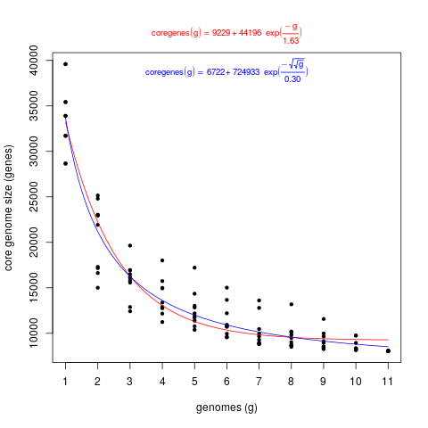
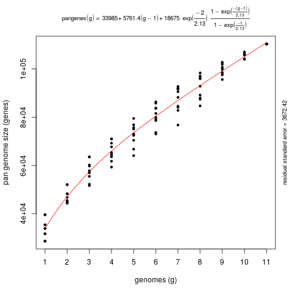
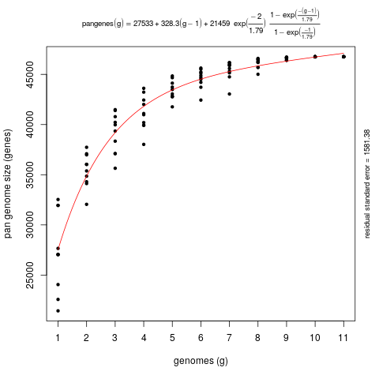
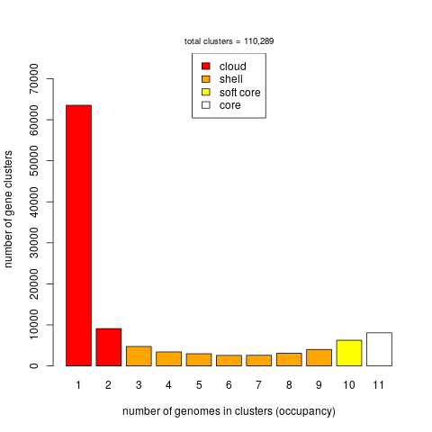

# Plant phylogenomics scripts

These scripts interrogate Ensembl Plants through [REST endpoints](https://rest.ensembl.org) 
and the FTP site to export data that might be useful for phylogenomic and pan-gene set studies.

These scripts were tested at the [CABANA workshop: Analysis of crop genomics data ](http://training.ensembl.org/events/2021/2021-03-01-CABANA).

## Documentation and examples

Run any of the scripts with argument -h to get instructions and examples.

## Dependencies

The following dependencies can be installed in the parent folder with:

    make install_REST

The scripts require the following non-core Perl modules:
* [HTTP::Tiny](https://metacpan.org/release/HTTP-Tiny)
* [JSON](https://metacpan.org/release/JSON)
* [DBI](https://metacpan.org/pod/DBI)
* [DBD::mysql](https://metacpan.org/pod/DBD::mysql)

which can be installed with: 
```
# install cpanminus installer, check more options at https://metacpan.org/pod/App::cpanminus
sudo cpan -i App::cpanminus  

# actually install modules
sudo apt-get install -y mysql-client libmysqlclient-dev
cpanm JSON JSON::XS HTTP::Tiny DBI DBD::mysql
```

In addition the scripts import module [PlantCompUtils.pm](./PlantCompUtils.pm), 
which is included in this folder.


### ens_single-copy_core_genes.pl

This script can be used to obtain single-copy core genes present within a clade.
Example calls include:

```
perl ens_single-copy_core_genes.pl -c Brassicaceae -f Brassicaceae
perl ens_single-copy_core_genes.pl -c Brassicaceae -f Brassicaceae -t cdna -o beta_vulgaris
perl ens_single-copy_core_genes.pl -f poaceae -c 4479 -r oryza_sativa -WGA 75
perl ens_single-copy_core_genes.pl -f all -c 33090 -m all -r physcomitrium_patens
```

Note option -f produces FASTA files of aligned peptide sequences, one per cluster. 
Such a task takes usually takes over an hour over the Ensembl REST API.


### ens_syntelogs.pl

This script is related to [ens_single-copy_core_genes.pl](ens_single-copy_core_genes.pl) but explicitely considers only orthogroups with Gene Order Conservation (GOC) score >= 75 by default. The output matrix contains also the genomic coordinates of genes of the reference genome:

```
perl ens_syntelogs.pl -c Brassicaceae -f Brassicaceae

```

A sample output matrix is available in [Brassicaceae.syntelogs.GOC75.tsv](./bench/Brassicaceae.syntelogs.GOC75.tsv). 
A benchmark is described in <https://github.com/Ensembl/plant_tools/tree/master/bench/synthelogs>.

Note option -f produces FASTA files of aligned peptide sequences, one per cluster. 
Such a task takes usually takes over an hour over the Ensembl REST API.

WARNING: not all species are included in the Compara gene-tree analysis. You can exclude them with -i.

### ens_sequences.pl

Produces a FASTA file with the canonical cds/pep sequences of species in a clade in Ensembl Plants:
```
perl ens_syntelogs.pl -c Brassicaceae -f Brassicaceae.fna

```


### ens_pangene_analysis.pl

This script can be used to analyse a clade-specific pan-gene set, with several options:

```
usage: ens_pangene_analysis.pl [options]

-c NCBI Taxonomy clade of interest         (required, example: -c Brassicaceae or -c 3700)
-f output folder                           (required, example: -f myfolder)
-r reference species_name to name clusters (required, example: -r arabidopsis_thaliana)
-l list supported species_names            (optional, example: -l)
-d Ensembl division                        (optional, default: -d Plants)
-o outgroup species_name                   (optional, example: -o brachypodium_distachyon)
-i ignore species_name(s)                  (optional, example: -i selaginella_moellendorffii -i ...)
-g do pangene set growth simulation        (optional, produces [core|pan_gene]*.tab files)
-L allow low-confidence orthologues        (optional, by default these are skipped)
-S skip singletons                         (optional, by default unclustered sequences are taken)
-p sort pangene clusters by chr position   (optional, requires regex to match chr names, example: -p '^\d+$';
                                            the example regular expression matches natural numbers,
                                            like the default chr names used in Ensembl Plants)
-b path to bedtools, useful with -M        (optional, if not in $PATH, example: -b /path/to/bedtools)
-v verbose                                 (optional, example: -v

The following options are only available for some clades:

-M parse multiple genome alignments        (optional, requires bedtools, example: -M 8_rice.epo)

-G min Gene Order Conservation [0:100]  (optional, example: -G 75)
   see modules/Bio/EnsEMBL/Compara/PipeConfig/EBI/Plants/ProteinTrees_conf.pm
   at https://github.com/Ensembl/ensembl-compara

-W min Whole Genome Align score [0:100] (optional, example: -W 75)
   see ensembl-compara/scripts/pipeline/compara_plants.xml
   at https://github.com/Ensembl/ensembl-compara

```
Read about GOC and WGA at https://www.ensembl.org/info/genome/compara/Ortholog_qc_manual.html

WARNING: not all species are included in the Compara gene-tree analysis. You can exclude them with flag -i. 


These are some example calls:
```
# Genus analysis
perl ens_pangene_analysis.pl -c Oryza -f Oryza -r oryza_sativa > Oryza.log

# Genes analysis leaving singletons out, with pangenome growth simulation
perl ens_pangene_analysis.pl -c Oryza -f Oryza -r oryza_sativa -g -S > Oryza.nosingletons.log

# Three species compared using chr-based gene order, with chromosomes matching -p regular expression,
# and considering only orthologous pairs supported by Whole Genome Alignments (-W)
perl ens_pangene_analysis.pl -r oryza_sativa -c oryza_sativa -o oryza_nivara -f Oryza_pangenes -W 75 -p '^\d{1,2}$' 

perl ens_pangene_analysis.pl -r arabidopsis_thaliana -c Brassicaceae -f Brassicaceae > Brassicaceae.log
```

A subset of the results produced by these examples can be found in folders 
[Brassicaceae](./Brassicaceae), [Oryza](./Oryza) and [Oryza_pangenes](./Oryza_pangenes) 
and produce the following log files: 
[Brassicaceae.log](./Brassicaceae.log), [Oryza.log](./Oryza.log) and 
[Oryza_pangenes.log](./Oryza_pangenes.log).

Output folders typically contain pan-genome gene clusters (pangene set), 
pangenome matrices in several formats and also a matrix of Percent Conserved Sequences (POCP), 
computed for the fraction of clusters shared by pairs of taxa being compared. 

These are the first few lines of file [pangenome_matrix_genes_chrpos_WGA75.tr.tab](./Oryza_pangenes/pangenome_matrix_genes_chrpos_WGA75.tr.tab),
with the first genes on chr6:

```
source:Oryza_pangenes/oryzasativa_plus_oryza_nivara_oryza_sativa_algEnsemblCompara_chrpos_WGA75	oryza_sativa	oryza_indica	oryza_nivara	
chr6	NA	NA	NA	
ONIVA06G26980.1.faa	-	-	ONIVA06G26980.1	
ONIVA06G26990.1.faa	-	-	ONIVA06G26990.1	
ONIVA06G27000.1.faa	-	-	ONIVA06G27000.1	
ONIVA06G27010.3.faa	-	-	ONIVA06G27010.3	
BGIOSGA028317-PA.faa	-	BGIOSGA028317-PA	ONIVA06G26950.1	
ONIVA06G26930.1.faa	-	-	ONIVA06G26930.1	
BGIOSGA028319-PA.faa	-	BGIOSGA028319-PA,BGIOSGA028320-PA	ONIVA06G26900.1	
ONIVA06G26850.1.faa	-	-	ONIVA06G26850.1	
```

This TSV file contains chr-sorted gene clusters that can be useful to define a common gene naming space.

If flag -g is used, files core_gene.tab and pan_gene.tab are generated, which can be used to produce pan-gene plots. 
The examples below use scripts from third-party [GET-HOMOLOGUES](https://github.com/eead-csic-compbio/get_homologues).

```
get_homologues/plot_pancore_matrix.pl -f core_both -i core_gene.tab

get_homologues/plot_pancore_matrix.pl -f pan -i pan_gene.tab
get_homologues/plot_pancore_matrix.pl -f pan -i pan_gene_nosingles.tab

get_homologues/plot_matrix_heatmap.sh -i POCP.matrix.tab -k "Percent Conserved Sequences (POCP)"

get_homologues/parse_pangenome_matrix.pl -m pangenome_matrix.tab -s
# matrix contains 110289 clusters and 11 taxa

# cloud size: 72627 list: pangenome_matrix__cloud_list.txt
# shell size: 23361 list: pangenome_matrix__shell_list.txt
# soft core size: 14301 list: pangenome_matrix__softcore_list.txt
# core size: 8052 (included in soft core) list: pangenome_matrix__core_list.txt
...
```



*Fig. 1. Core-gene plot of 11 Oryza species, generated with get_homologues/plot_pancore_matrix.pl*

All sequences | No singletons
:-------------------------:|:-------------------------:
 | 

*Fig. 2. Pan-gene plot of 11 Oryza species, generated with get_homologues/plot_pancore_matrix.pl. 
Left) all sequences; right) after excluding unclustered sequences (singletons).*



*Fig. 3. Occupancy of pan-gene clusters of 11 Oryza species, generated with get_homologues/parse_pangenome_matrix.pl*
