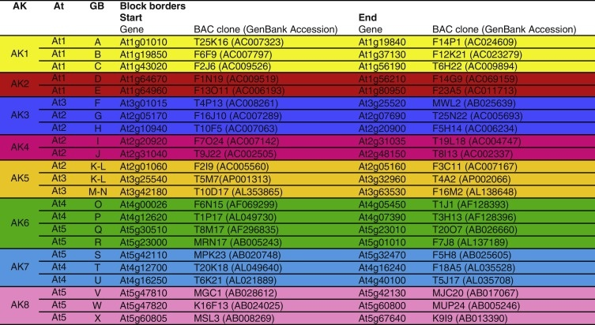

# Benchmark

This section summarizes a experiment carried out to evaluate GOC-based synthelogs.
These are obtained by i) computing [tree-based](https://www.ensembl.org/info/genome/compara/homology_method.html) orthologous genes and 
ii) filtering those with Gene Order Conservation (GOC) scores >= 75. 
GOC is computed on the four closest neighbours of a gene.

Our gold standard was a list of 22 genomic blocks building up the Ancestral Crucifer Karyotype (ACK), reported in https://europepmc.org/article/MED/26945766. Blocks are defined by *A. thaliana* intervals and the BAC clones that contain them. Those BAC clones were used to design chromosome painting probes used for comparative cytogenetics and define intervals that can be shorter than the gene-based intervals. Blocks are listed in file [Athaliana_blocks.uc.tsv](Athaliana_blocks.uc.tsv).



*22 genomic blocks building up the ACK, source: https://www.ncbi.nlm.nih.gov/pubmed/26945766*

The following commands were performed to complete the benchmark:

```
# retrieve synthelogs from Ensembl (GOC>=75), leaves out:
# Brassica napus for being allopolyploid,
# Arabidopsis halleri for not having GOC scores in release 47

perl ../ens_synthelogs.pl -c Brassicaceae -r arabidopsis_thaliana \
	-i brassica_napus -i arabidopsis_halleri \
	-a > Brassicaceae.synthelogs.GOC75.tsv

perl ../ens_synthelogs.pl -c Brassicaceae -r arabidopsis_thaliana i\
	-i brassica_napus -i arabidopsis_halleri \
	-a -G 50 > Brassicaceae.synthelogs.GOC50.tsv

# compare genes within pre-defined synthenic blocks with Ensembl synthelogs

perl _bench_blocks.pl Athaliana_blocks.uc.tsv \
	../downloads/Arabidopsis_thaliana.TAIR10.47.gtf.gz \
	Brassicaceae.synthelogs.GOC75.tsv > Athaliana_blocks.GOC75.report.tsv

perl _bench_blocks.pl Athaliana_blocks.uc.tsv \
    ../downloads/Arabidopsis_thaliana.TAIR10.47.gtf.gz \
    Brassicaceae.synthelogs.GOC50.tsv > Athaliana_blocks.GOC50.report.tsv
```

The final reports are [Athaliana_blocks.GOC50.report.tsv](Athaliana_blocks.GOC50.report.tsv)
and [Athaliana_blocks.GOC75.report.tsv](Athaliana_blocks.GOC75.report.tsv). The median percentage of Arabidopsis thaliana genes found to be synthenic in each block are:

```
cut -f 4 Athaliana_blocks.GOC75.report.tsv | grep -v synthelogs | \
	Rscript -e 'median(scan(file="stdin"),na.rm=T)'
Read 24 items
[1] 62.3

cut -f 4 Athaliana_blocks.GOC50.report.tsv | grep -v synthelogs | \
	Rscript -e 'median(scan(file="stdin"),na.rm=T)'
Read 24 items
[1] 66.1
```
