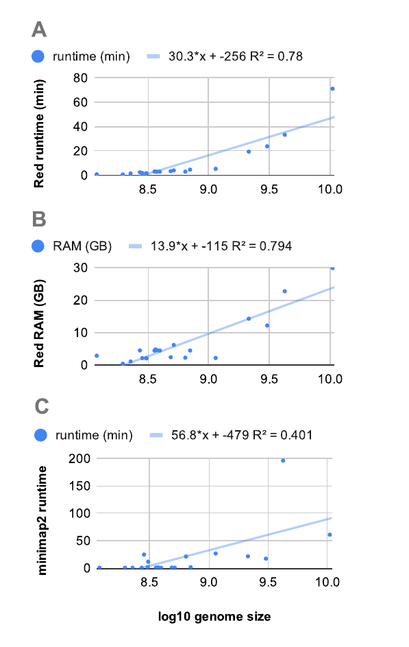

These scripts can be used to i) mask and ii) annotate repeated sequences in plants genomes using the 
[Repeat detector](https://bmcbioinformatics.biomedcentral.com/articles/10.1186/s12859-015-0654-5) (Red) 
and the curated library of repeats 
[nrTEplants](https://github.com/Ensembl/plant-scripts/releases/download/v0.3/nrTEplantsJune2020.fna.bz2),
described in full detail [here](https://github.com/Ensembl/plant_tools/tree/master/bench/repeat_libs). 

Optionally, repeats can be loaded into an Ensembl core db as an analysis with logic_name='repeatdetector'. 
Annotated repeats are imported with logic_name='repeatdetector_annotated'.

## Dependencies

The following dependencies can be installed in the parent folder with:

    make install_repeats

There are two binaries, for which the GNU C++ compiler v8 is needed (g++-8):

* A clone of Red from https://github.com/EnsemblGenomes/Red (the original repo is [here](https://github.com/BioinformaticsToolsmith/Red))
* A clone of minimap2 from https://github.com/lh3/minimap2

Plus:

* A copy of the [nrTEplants library](https://github.com/Ensembl/plant-scripts/releases/download/v0.3/nrTEplantsJune2020.fna.bz2)

And three Python3 modules:

* [sqlalchemy](https://pypi.org/project/SQLAlchemy)
* [sqlalchemy_utils](https://pypi.org/project/SQLAlchemy-Utils)
* [pymysql](https://pypi.org/project/PyMySQL)

Note that script [get_repeats_ensembl.sh](./get_repeats_ensembl.sh) has some more dependencies listed at its header.

## Examples

Note that the input FASTA file can be GZIP/BZIP2 compressed; 
for large genomes you will need 20-40 GB of RAM to run Red (see below).

### i) Masking

```
# test run, saves results in folder 'test_Atha_chr4' 
./Red2Ensembl.py ../files/Arabidopsis_thaliana.fna.gz test_Atha_chr4 --msk_file Atha.sm.fna 

# real example, with several chromosomes, taking 4 CPU cores 
./Red2Ensembl.py Brachypodium_distachyon_v3.0.dna.toplevel.fa Brachypodium_distachyon --cor 4 

# local run & loading repeats in core Ensembl db
./Red2Ensembl.py Brachypodium_distachyon_v3.0.dna.toplevel.fa Brachypodium_distachyon \
	--host pl1 --user xyz --pw XYZ --port 123 --db brachypodium_distachyon_core_49_102
```

### ii) Annotating masked repeated sequences

The repeats called by Red can be optionally annotated by similarity to sequences in an external FASTA file, 
such as the library **nrTEplants**. The script does not load the resulting annotations in a core db just yet:
```
# test run, re-uses folder 'test_Atha_chr4'
./AnnotRedRepeats.py ../files/nrTEplantsJune2020.fna test_Atha_chr4 --bed_file test.bed

# consider only repeats with length >= 200 bp
./AnnotRedRepeats.py ../files/nrTEplantsJune2020.fna Brachypodium_distachyon --cor 4 \
	--minlen 200

# add annotated repeats to Ensembl core db and use a different minimap2 binary
./AnnotRedRepeats.py ../files/nrTEplantsJune2020.fna Brachypodium_distachyon --exe /path/to/minimap2 --cor 4 \
    --host pl1 --user xyz --pw XYZ \
    --port 123 --db brachypodium_distachyon_core_49_102
```

Note that any FASTA file can be used to annotate the repeats. For instance, repeats annotated
in current species in Ensembl can be retrieved and used as well:
```
./get_repeats_ensembl.sh arabidopsis_thaliana

# This will produce file: arabidopsis_thaliana.repeats.nondeg.fasta

# Note this file can be highly redundant; redundancy can be eliminated with linclust,
# see https://github.com/soedinglab/MMseqs2

./AnnotRedRepeats.py arabidopsis_thaliana.repeats.nondeg.fasta test_Atha_chr4 --bed_file test.ensembl.bed
```


## Annotation summary 

If a library such as nrTEplants or any other RepBase-formatted is used, 
an annotation report like this is produced. These are valid examples of FASTA headers:

    >TEdenovo-B-R2315-Map11:repetDB.Mar2020#TIR @Brassica_rapa [S:]
	>AT1TE94285:TAIR10_TE#DNA/MuDR @Arabidopsis_thaliana [S:]

The repeat classification is then parse to produce a report like this:

```
# FASTA file with repeat sequences (length>90): Camelina_sativa/annot/Red_repeats.fna

# re-using previously formatted repeat library  Camelina_sativa/annot/repeat_lib.mmi
# running minimap
/path/to/minimap2 -K100M --score-N 0  -x map-ont  -t 4 Camelina_sativa/annot/repeat_lib.mmi Camelina_sativa/annot/Red_repeats.fna
# mapped repeats:  Camelina_sativa/annot/repeat_mappings.sort.paf
# Genome length: 641355730 Repeated content: 230739085 36.0% Annotated: 42633901 6.6%

class	bp
Crypton 580
DIRS    222132
DNA     456403
DNA/CACTA       312
DNA/En-Spm      729412
DNA/HAT 119922
DNA/Harbinger   56149
DNA/MuDR        598270
DNA/Pogo        243186
DNA/hAT 21260
Helitron        290418
Helitron/Helitron       1673
Helitron|TRIM   1432
LARD    239264
LINE    819243
LINE/L1 80920
LTR     4254019
LTR/Copia       5839801
LTR/Gypsy       18494851
MITE    312641
Maverick        1258
MobileElement   619
Mutator 122
Other   998
Other/Centromeric       194
Other/Simple    1503
RC/Helitron     312013
Retroelement    995
SINE    65415
SINE|LARD       8392
SINE|TRIM       282
TIR     5128793
TIR/Mutator     35807
TIR/PIF-Harbinger       379
TIR/hAT 8030
TRIM    1531956
Unassigned      75795
Unclassified    2676694
nonLTR  101
rRNA    2667
```

## Runtime and RAM requirements

These data were measured on a CentOS7.9 computer using 4 cores of a Xeon E5-2620 v4 (2.10GHz) CPU.



