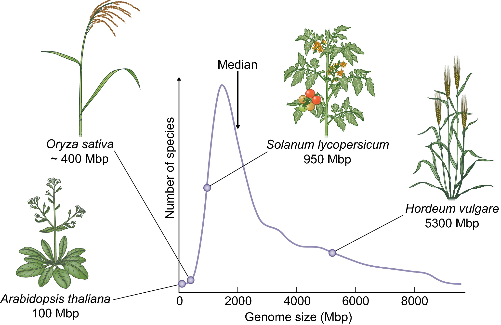

<!-- 2 pics (a sequencer instrument + a plant genome diagram?), 4-500 words, 2 pages -->

<!-- explain algae, landplants, flowering plant (angiosperms), monocot + dicots -->

DNA or deoxyribonucleic acid is an essential molecule for life. DNA molecules are long strings of beads called bases, which are written as A, C, G or T. They can be found in plant cells in the form of chromosomes both in the nucleous and inside chloroplasts, the tiny organulles where photosynthesis happens. The set of DNA molecules in a cell is what we call the genome. In a very real sense DNA, is information. It acts like a recipe holding the instructions for each organism, split in segments called genes. Genome sizes can be measured in the lab and are usually given as gametic nuclear DNA contents, C-values, in picograms.

Sequencing is a word that summarizes the complex chemical reactions that researchers carry out to read the nucleotides in a chromosome. The first plant genome sequenced was that of thale cress (Arabidopsis thaliana) in 2000. This was a massive international effort that took a long time, even though this is one of the smallest plant genomes. Thale cress was the first model plant of the genomic era. Model plants are useful to do research and solve problems which are much harder in other plants. However, current sequencing technologies are now being used to solve really large genomes, such as those of wheat or pine trees. 

Plant chromosomes are usually very long and can only be sequenced in smaller bits. That is why after sequencing a genome then needs to be assembled, or in other words, put together by matching sequenced fragments. The resulting assembled genome is frequently incomplete, and its length is given in megabases, where 1 Mbp is a a million base pairs. Due to the challenges of this process, assembly lenghts do not always match C values.

The exploration of plant genomes is providing insights to understand the diversity of plants, from algae to landplants, and provides plant breeders with detailed maps that allow them to produce improved cultivars faster than ever. The genomes is this trail, and many others, can be browsed at Ensembl Plants (http://plants.ensembl.org), a database developed at the European Bioinformatics Institute in Hinxton, near Cambridge. 

* Distribution of genome size for 6000 plant species. Data obtained from Kew [Plant C‐value database](https://cvalues.science.kew.org). 
Source: R Akakpo, MC Carpentier, YI Hsing, O Panaud https://doi.org/10.1111/nph.16356 *

* A researcher programming a DNA sequencing machine at the Wellcome Genome Campus *

<!-- Did you know that the first documented carrots root were yellow and purple in Central Asia approximately 1,100 years ago, with orange carrots not reported until the sixteenth century in Europe? What about the spikemoss Selaginella lepidophylla, the resurrection plant, that can dry out for  years and then it is able to resume normal life rehydration? 

Did you know that the first documented colours for domesticated carrot root (Daucus carota sp. Sativus) were yellow and purple in Central Asia approximately 1,100 years ago, with orange carrots not reliably reported until the sixteenth century in Europe? Or that there are species like the spikemoss Selaginella lepidophylla (also called “the resurrection plant”) that can be completely dry during years, but that are able to resume normal growth and activity upon rehydration?
There exists a lot of biodiversity within and between plants, and part of it can be understood by exploring their DNA (DNA is short for deoxyribonucleic acid), which is an essential molecule for life.  In a very real sense, DNA is information. It acts like a recipe holding the instructions for each organism. A genome is an organism’s complete set of DNA. -->

<!-- From tiny plants to record-breakers

At their most extreme, trees are examples of the plant kingdom at its most impressive. The tallest tree in the world, a Coastal Redwood (Sequoia sempervirens) nicknamed ‘Hyperion’, reaches 115m; the largest in diameter is a Baobab (Adansonia digitata) in South Africa, and a Norwegian Spruce (Picea abies) in Sweden has lived for 9,500 years. Yet trees can also be surprisingly delicate, as seen in the feathered edges of the leaves of Japanese Maple (Acer palmatum) or the quivering leaves of Quaking Aspen (Populus tremula). Worldwide, estimates suggest that there are around three trillion trees, of which around 15 billion are felled annually, and five billion planted.
Trees in the Garden

John Gilmour, Director of the Botanic Garden, in front of our Dawn Redwood in 1955.Trees are either deciduous, shedding leaves at the end of the growing season, or evergreen, having foliage that persists through the year. The foresight of previous CUBG Directors and Curators means we now have an extensive and mature tree collection here in the Garden. In the 1840s, under the direction of John Stevens Henslow (founder of the Garden on this site), Curator Andrew Murray planted trees in families. This facilitated botanical education based around similarities and differences between species within those families.

Many of the trees in the Garden have notable histories. Our Dawn Redwood (Metasequoia glyptostroboides) by the Lake is the first example of its species to be grown outside of its native China, and the Giant Redwood (Sequoiadendron giganteum) next to it is from the first batch of seed exported from America. The picture shows former Garden Director John Gilmour next to the Dawn Redwood in 1955.
A living collection

Pinus nigra on the Main WalkLike all specimens in the Garden, trees have a finite life. In wildlife reserves and forests, decaying wood provides a valuable habitat for numerous animals, plants and fungi, and so dying or dead trees are frequently left in place. However, a Botanic Garden exists as a resource of living plant material for use by researchers, so we usually remove damaged or dead trees and replace them with new specimens. An example of such replacement can be found on the Main Walk: on the north side of the crossroads stands a magnificent Cedar of Lebanon (Cedrus libani), which was formerly paired with a fine Atlantic Cedar (Cedrus atlantica) on the south side. In 2018, a long dry summer was followed by a wet autumn, and the crown of the tree split under the weight of the water it had absorbed. After the old tree had been removed, the Botanic Garden’s Director Beverley Glover planted an Atlantic Cedar sapling in its place. While dwarfed by its partner at present, we expect it to match its predecessor in stature in a century or two.

-->
